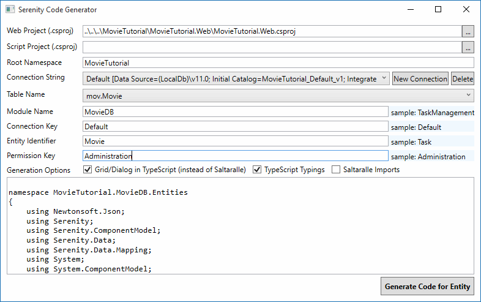
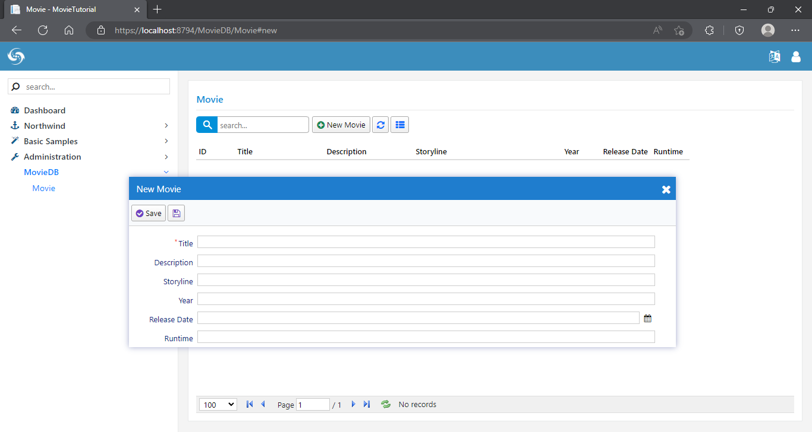

# 为影片（Movie）表生成代码

### Serenity 代码生成器

确保表存到数据库，我们将使用 Serenity 代码生成器（sergen.exe）生成初始的可编辑界面。

在 Visual Studio 中，通过点击 *视图* => *其它窗体* => *包管理器控制台* 打开 *包管理器控制台*。

输入 *sergen* 并按 Enter 键确认。

> 有时候包管理器控制台不能正确地设置路径，你可能会在执行 Sergen 的时候得到错误，重启 Visual Studio 可能解决该问题。

> 另一种解决方法是从资源管理器中打开 Sergen.exe。在解决方案资源管理器的 *MovieTutorial* 解决方案中右键，选择 *文件资源管理器中打开*，Sergen.exe 就在 *packages\\Serenity.CodeGenerator.X.Y.Z\\tools* 目录下面。

### 设置项目位置

当你第一次运行 Sergen，Web Project 字段默认为：

* ..\\..\\..\\MovieTutorial\\MovieTutorial.Web\\MovieTutorial.Web.csproj

如果你把该值修改为其他路径，并且生成你的第一个页面，再次使用时，将不需要再次设置。所有的设置将保存在解决方案目录下的 *Serenity.CodeGenerator.config* 。

该值是必填项，因为 Sergen 会借此把生成的文件自动包含到你的 WEB 项目。

> 对于仍包含 Saltaralle 编译器代码而不是 TypeScript 的 Serene 旧版本用户，在 v2.1+ 版本中，应该把 Script project 字段设置为空。

### Root Namespace 选项

你的 Root Namespace 选项设置为该解决方案使用的名称，如 *MovieTutorial*。如果你的项目名称为 MyProject.Web，你的 Root Namespace 则默认为 MyProject。

这是很关键的，所以确保你不能把它设置为其他值，因为默认情况下，Serene 模板期望所有生成的代码都在这个根命名空间下面。

该选项也被保存，因此下次使用时你将不用再次填写。

### 选择 Connection String

一旦设置 Web project 名称，Sergen 使用 web.congfig 的连接字符串中填充连接字符串下拉列表。我们这里有 *Default* 和 *Northwind*，选择 *Default*。

### 选择需要生成代码的表（Table Name）

Sergen 每次只为一张表生成代码。一旦我们选择了连接字符串，表下拉列表将会被所选数据库的表名填充。

选择 *Movie* 表

### 设置 Module Name

在 Serenity 术语中，一个模块（module）是一组逻辑页面（pages），共享同一个目标。

例如，在 Serene 模板中，所有与 *Northwind* 示例相关的页面都属于 *Northwind* 模块。

页面（Pages）是与网站的综合管理相关，如用户（users），角色（roles）等都属于 Administration 模块。

模块通常对应着数据库的 schema，或者单独的数据库，但没有什么可以阻止你在一个单独的数据库/schema 中使用多个模块，相反，多个数据库也可以使用一个模块。

本教程中，我们将为所有页面使用 MovieDB （类似于 IMDB）模块。

Module name 用于决定命名空间 和 生成页面的 url。

例如，我们的新页面会在 *MovieTutorial.MovieDB* 命名空间下，并使用 */MovieDB* 相对路径。

### ConnectionKey Parameter

Connection key 设置为选定 web.config 配置文件中连接字符串的连接键。你通常不需要更改它，让其保持默认值。

### Entity Identifier

这通常对应表名，但是有时候表名含有下划线或其他无效字符，所以需要你决定如何生成代码中的实体名称（一个有效的标识名称）。

我们的表名是 *Movie*，因此它是一个有效且不错的 C# 标识，所以我们把 *Movie* 作为实体标识。我们的实体类将被命名为 *MovieRow*。

该名称也被其他类使用。例如我们的页控制器（page controller）名称为 *MovieController*。

它还决定着页面的 url，在此示例中，我们的编辑页面的 URL 将为 */MovieDB/Movie*。

### Permission Key

Serenity 中，对资源（页、服务等）的访问控制都是由简单字符串组成的访问许可键（permission keys）控制。这些权限被授予用户（users）或角色（roles）。

我们的影片页面只有管理员用户（或者以后的内容编辑）可使用，因此，现在让我们把它设为 *Administration*，默认情况下，在 Serene 模板中只有 *admin* 用户有这个权限。 

### 生成第一个页面代码

在设置如图所示的参数（你只需要设置 Module Name，其他使用默认值）之后，单击 *Generate Code for Entity* 按钮。

Sergen 将生成几个文件并将它们包含进 MovieTutorial.Web 和 MovieTutorial.Script 项目。

现在你可以关闭 Sergen，并返回到 Visual Studio。

修改项目，Visual Studio 将询问你是否要重新加载更改，请单击加载所有。

*重新生成解决方案* ，然后按 *F5* 启动应用程序。

使用 *admin* 作为用户名，并以 *serenity* 作为密码登录系统。

当你看到控制面板页面时，你会发现左侧导航的底部有一个新的菜单 *MovieDB* 。

单击以展开它，然后单击 *Movie* ，打开使用 Sergen 生成的第一个页面。

现在尝试添加一个新影片，然后更新并删除它。

我们不用写一行代码，使用 Sergen 为我们的表生成代码就可以工作。

> 这并不意味着我就不喜欢写代码，相反地我爱写代码。其实我并不是大部分设计师和代码生成器的粉丝。他们生产的代码通常都是混乱难以管理的。

> Sergen 在这里仅是帮我们初始设置所需的分层结构和平台标准。我们将创建 10 个左右的文件，如实体（entity）、仓储（repository）、页面（page）、终结点（endpoint）、网格列表（grid）、表单（form）等，同时还需要在其他地方做一些设置。

> 即使我们从其他页面复制粘贴并替换代码，它也可能会出错，且至少需要 5-10 分钟。

> Sergen 生成的代码文件中含最基本的少量代码，这得多亏 Serenity 的基类，它处理了大部分逻辑。一旦我们为一些表生成代码，我们可能就不会再对此表使用 Sergen，我们将在后面章节看到如何修改生成的代码，使之变为我们需要的。