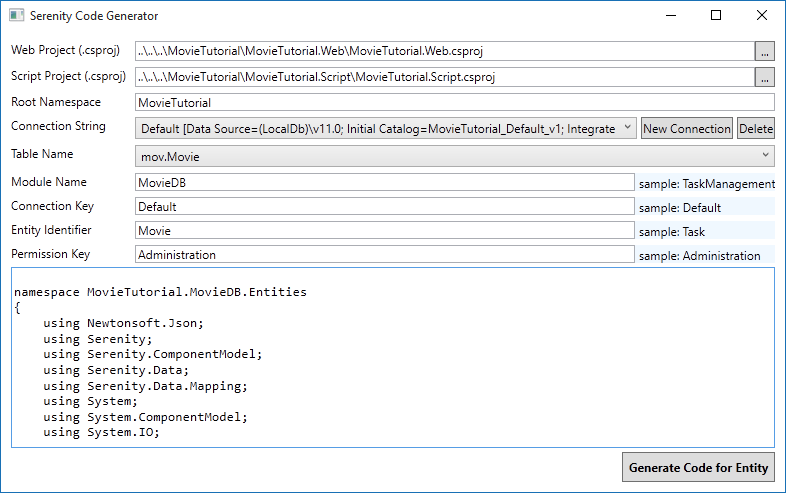
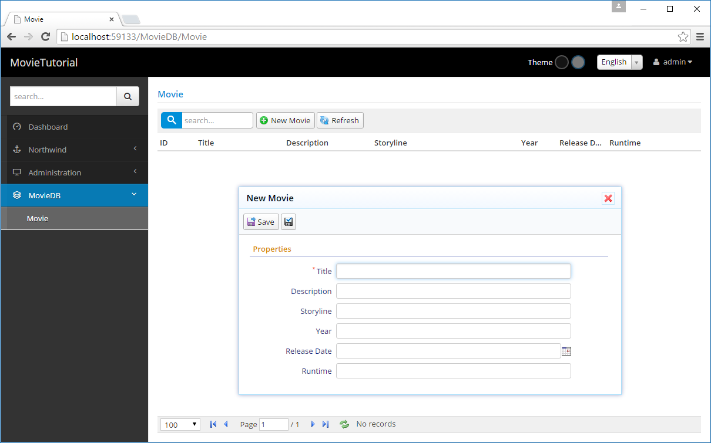

# Generating Code For Movie Table

### Serenity Code Generator

After making sure that our table exists in the database, we will use Serenity Code Generator (sergen.exe) to generate initial editing interface.

In Visual Studio, open *Package Manager Console* by clicking *View* => *Other Windows* => *Package Manager Console*.

Type *sergen* and press Enter.

> Sometimes package manager console can't set path correctly and you may get an error executing Sergen. Restarting Visual Studio might resolve the issue. 

> Another option is to open Sergen.exe from Windows Explorer. Right click on *MovieTutorial* solution in Solution Explorer, click *Open In File Explorer*. Sergen.exe is under *packages\Serenity.CodeGenerator.X.Y.Z\tools* directory.

### Setting Project Location

When you first run Sergen, Web Project and Script Project fields will be prefilled for you. If you are using an older version of Serene than 1.6.2, follow these steps:

Browse to your solution directory and locate web and script projects using "..." buttons.

Another option is to set them to values below:

* ..\\..\\..\\MovieTutorial\\MovieTutorial.Web\\MovieTutorial.Web.csproj
* ..\\..\\..\\MovieTutorial\\MovieTutorial.Script\\MovieTutorial.Script.csproj
 
> If you used another project name than *MovieTutorial*, e.g. *MyMovies*, replace *MovieTutorial* with it.

Once you set this values, and generate your first page, you won't have to set them again. This options will be saved in *Serenity.CodeGenerator.config* in your solution directory.

This values are required, as Sergen will include generated files to your project.

### Root Namespace Option

Set root namespace option to the Solution name you used, e.g. *MovieTutorial*. If your project names are MyProject.Web and MyProject.Script, your root namespace is MyProject by default. This is critical so make sure you don't set it to anything different, as by default, Serene template expects all generated code to be under this root namespace.

This option is also saved, so next time you won't have to fill it in.

### Choosing Connection String

Once you set Web project name, Sergen populates connection dropdown with connection strings from your web.config file. We have only one connection string in our web.config yet, so just select *Default*.

### Selecting Table To Generate Code For

Sergen generates code for one table at a time. Once we choose connection string, table dropdown is populated with table names from that database. 

Select *Movie* table.

### Setting Module Name

In Serenity terms, a module is a logical group of pages, sharing a common purpose. 

For example, in Serene template, all pages related to *Northwind* sample belongs to *Northwind* module. 

Pages that are related to general management of site, like users, roles etc. belongs to *Administration* module. 

A module usually corresponds to a database schema, or a single database but there is nothing that prevents you from using multiple modules in a single database / schema, or opposite, multiple databases in one module.

For this tutorial, we will use *MovieDB* (analogous to IMDB) for all pages.

Module name is used in determining namespace and url of generated pages.

For example, our new page will be under *MovieTutorial.MovieDB* namespace and will use */MovieDB* relative url.

### ConnectionKey Parameter 

Connection key is set to the connection key of selected connection string in web.config file. You usually don't have to change it, just leave default.

### Entity Identifier

This usually corresponds to the table name but sometimes table names might have underscores or other invalid characters, so you decide what to name your entity in generated code (a valid identifier name).

> Starting with Serene 1.6.2+ entity identifier is set automatically to a pascalized version of tablename.

Our table name is *Movie* so it is also a valid and fine C# identifier, so let's use *Movie* as the entity identifier.

This name is also used in other class names. For example our page controller will be named *MovieController*.
.
It also determines the page url, in this sample our editing page will be at URL */MovieDB/Movie*.

### Permission Key 

In Serenity, access control to resources (pages, services etc.) are controlled by permission keys which are simple strings. Users or roles are granted these permissions.

Our Movie page will be only used by administrative users (or maybe later content moderators) so let's set it to *Administration* for now. By default, in Serene template, only the *admin* user has this permission.

### Generating Code for First Page

After setting parameters as shown in the image above, click *Generate Code for Entity* button. Sergen will generate several files and include them in MovieTutorial.Web and MovieTutorial.Script projects.

Now you can close Sergen, and return to Visual Studio.

As projects are modified, Visual Studio will ask if you wan't to reload changes, click Reload All.

*REBUILD the Solution* and then press *F5* to launch application.

> Please make sure you REBUILD SOLUTION, by right clicking solution name and clicking rebuild. Some users reports they got an empty page after generating code. It's due to script project is not built properly. You should specially rebuild MovieTutorial.Script project. 

Use *admin* as username, and *serenity* as password to login.

When you are greeted with Dashboard page, you will notice that there is a new section, *MovieDB* on the bottom of left navigation. 

Click to expand it and click Movie to open our first generated page.

Now try adding a new movie, than try updating and deleting it.

Sergen generated code for our table, and it just works without writing a single line of code.

> This doesn't mean i don't like writing code. In contrast, i love it. Actually i'm not a fan of most designers and code generators. The code they produce is usually unmanagable mess. 

> Sergen just helped us here for initial setup which is required for layered architecture and platform standards. We would have to create about 10 files for entity, repository, page, endpoint, grid, form etc. Also we needed to do some setup in a few other places.

> Even if we did copy paste and replace code from some other page, it would be error prone and take about 5-10 mins.

> The code files Sergen generates has minimum code with the absolute basics. This is thanks to the base classes in Serenity that handles the most logic. Once we generate code for some table, we'll probably never use Sergen again (for this table), and modify this generated code to our needs. We'll see how.