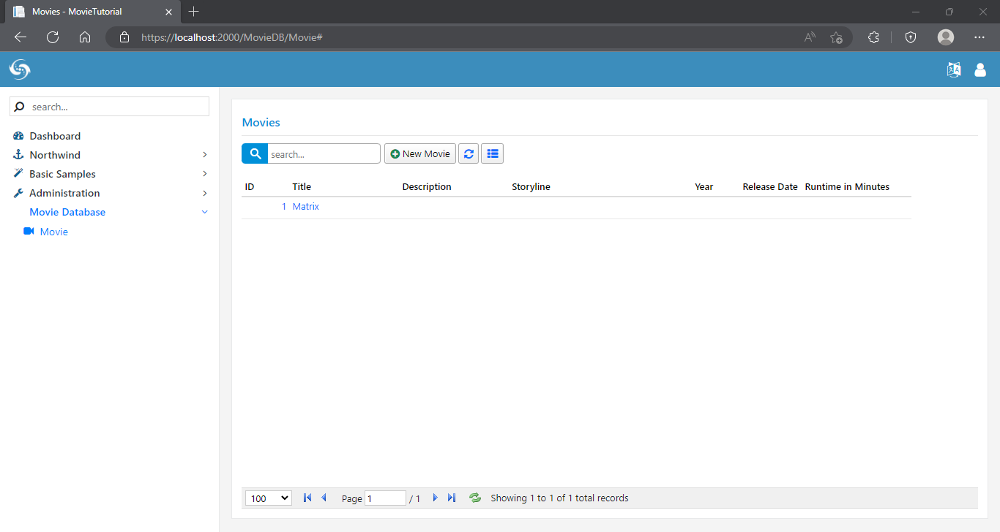
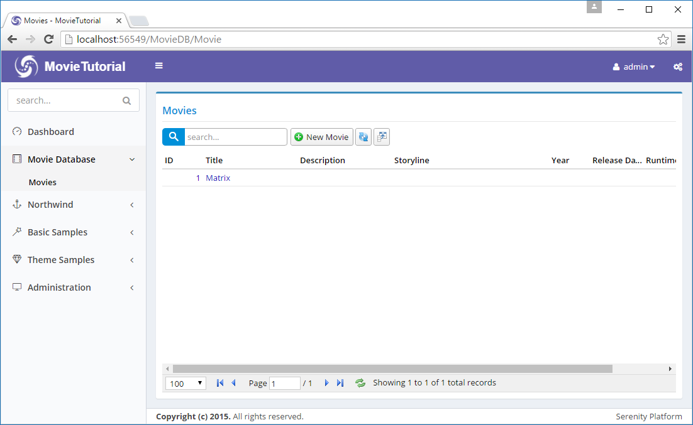

# Handling Movie Navigation

### Setting Navigation Item Title and Icon

When Sergen generated code for Movie table, it also created a navigation item entry. In Serene, navigation items are created with special assembly attributes.

Open _MovieDBNavigation.cs_ in the module folder.  In it you'll find this line:

```cs
[assembly: NavigationLink(int.MaxValue, "MovieDB/Movie", 
    typeof(MyPages.MovieController), icon: null)]
```

First argument to this attribute is display order for this navigation item. As we only have one navigation item in Movie category yet, we don't have to mess with ordering yet.

Second parameter is navigation title in "Section Title/Link Title" format. Section and navigation items are seperated with a slash \(/\).

Lets change it to _Movie Database/Movies_.

```cs
[assembly: NavigationLink(int.MaxValue, "Movie Database/Movie", 
    typeof(MyPages.MovieController), icon: "fa-video-camera")]
```



We also changed navigation item icon to _fa-video-camera_. Serene template has two sets of font icons, Simple Line Icons and Font Awesome. Here we used a glyph from Font Awesome icon set.

To see list of simple line icons and their css classes, visit link below:

[http://thesabbir.github.io/simple-line-icons/](http://thesabbir.github.io/simple-line-icons/)

FontAwesome is available here:

[https://fontawesome.com/v4.7.0/icons/](https://fontawesome.com/v4.7.0/icons/)

> There is also a page in Serene under _Theme Samples / UI Elements / Icons_ containing a list of these icon sets.

### Ordering Navigation Sections

As our _Movie Database_ section is auto generated last, it is displayed at the bottom of navigation menu.

We'll move it before Northwind menu.

As we saw recently, Sergen created a navigation item in _MovieDBNavigation.cs_. If navigation items are scattered through pages like this, it would be hard to see the big picture \(list of all navigation items\) and order them easily.

So we move it to our central location which is at _MovieTutorial.Web/Modules/Common/Navigation/NavigationItems.cs_.

Just cut the below lines from _MovieDBNavigation.cs_:

```cs
[assembly: NavigationLink(int.MaxValue, "Movie Database/Movies", 
    typeof(MyPages.MovieController), icon: "fa-video-camera")]
```

Move it into _NavigationItems.cs_ and modify it like this:

```cs
using Serenity.Navigation;
using MovieDB = MovieTutorial.MovieDB.Pages;

[assembly: NavigationLink(1000, "Dashboard", url: "~/", permission: "",
    icon: "fa-tachometer")]

[assembly: NavigationMenu(2000, "Movie Database", icon: "fa-film")]
[assembly: NavigationLink(2100, "Movie Database/Movies", 
    typeof(MovieDB.MovieController), icon: "fa-video-camera")]
```

Here we also declared a navigation menu \(Movie Database\) with _film_ icon. When you don't have an explicitly defined navigation menu, Serenity implicitly creates one, but in this case you can't order menu yourself, or set menu icon.

We assigned it a display order of _2000_ so this menu will display just after Dashboard link \(1000\) but before Northwind menu \(8000\).

We assigned our _Movies_ link a display order value of _2100_ but it doesn't matter right now, as we have only one navigation item under _Movie Database_ menu yet.

> First level links and navigation menus are sorted according to their display order first, then second level links among their siblings.

Here is how it looks like after these changes:



### Troubleshooting Some Issues with Visual Studio

In case you didn't notice already, Visual Studio doesn't let you modify code while your site is running. Also your site stops when you stop debugging, so you can't keep browser window open and refresh after rebuilding.

You may start without debugging by using Ctrl+F5. This lets you modify TypeScript code while your application is running and refresh.

If you modify CSHTML / CS files, you'll need to rerun application with Ctrl+F5.

Also, on your site, top blue progress bar \(which is a Pace.js animation\), keeps running all the time like it is still loading something. It is thanks to the _Browser Link_ feature of Visual Studio. To disable it, locate its button in Visual Studio toolbar that looks like a refresh button \(next to play icon with browser name like Chrome\), click dropdown and uncheck _Enable Browser Link_.
