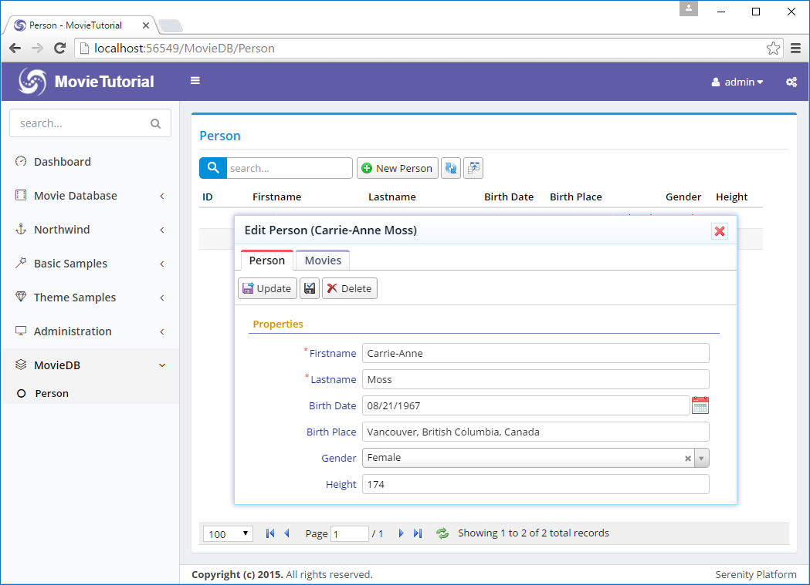
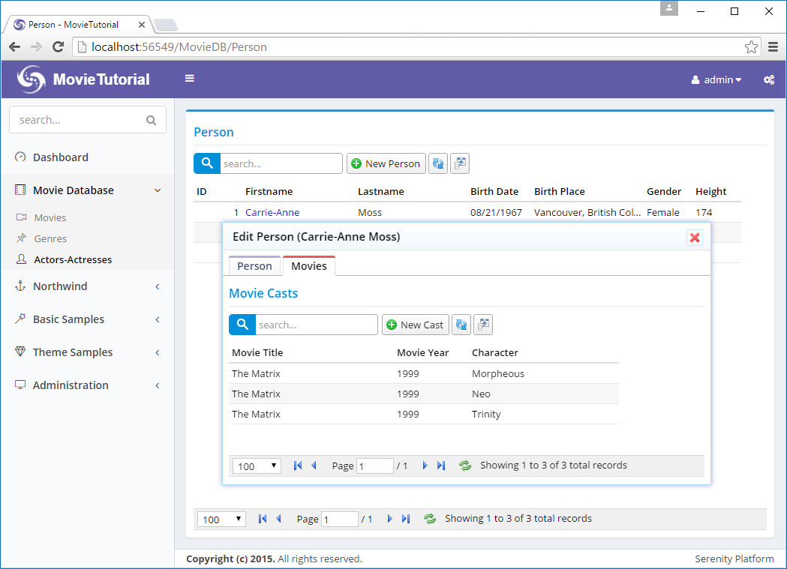
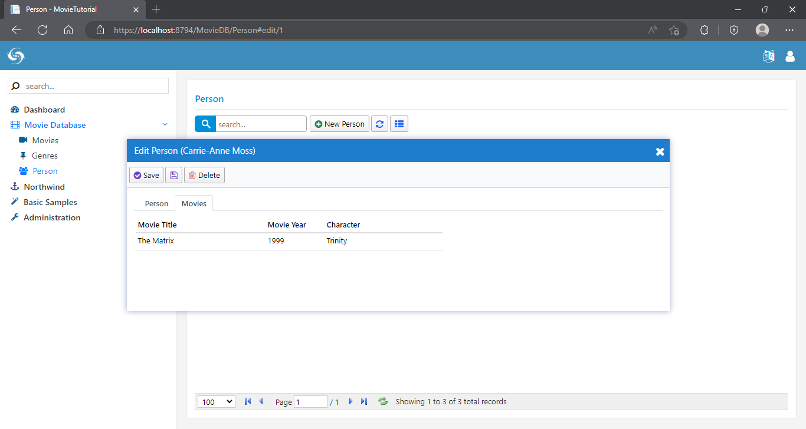

# 在人员对话框列出参演影片 Listing Movies in Person Dialog

为了显示人员参演的影片，我们将在 PersonDialog 添加一个选项卡To show list of movies a person acted in, we'll add a tab to PersonDialog.

By default all entity dialogs (ones we used so far, which derive from EntityDialog) uses *EntityDialog* template at *MovieTutorial.Web/Views/Templates/EntityDialog.Template.html*:

```html
<div class="s-DialogContent">
    <div id="~_Toolbar" class="s-DialogToolbar">
    </div>
    <div class="s-Form">
        <form id="~_Form" action="">
            <div class="fieldset ui-widget ui-widget-content ui-corner-all">
                <div id="~_PropertyGrid"></div>
                <div class="clear"></div>
            </div>
        </form> 
    </div>
</div>
```

This template contains a toolbar placeholder (*~_Toolbar*), form (*~_Form*) and PropertyGrid (*~_PropertyGrid).

> ~_ is a special prefix that is replaced with a unique dialog ID at runtime. This ensures that objects in two instances of a dialog won't have the same ID values.

EntityDialog template is shared by all dialogs, so we are not gonna modify it to add a tab to PersonDialog.

### Defining a Tabbed Template for PersonDialog

Create a new file, *MovieDB.PersonDialog.Template.html* under *Modules/MovieDB/Person/* folder with contents:


```html
<div id="~_Tabs" class="s-DialogContent">
    <ul>
        <li><a href="#~_TabInfo"><span>Person</span></a></li>
        <li><a href="#~_TabMovies"><span>Movies</span></a></li>
    </ul>
    <div id="~_TabInfo" class="tab-pane s-TabInfo">
        <div id="~_Toolbar" class="s-DialogToolbar">
        </div>
        <div class="s-Form">
            <form id="~_Form" action="">
                <div class="fieldset ui-widget ui-widget-content ui-corner-all">
                    <div id="~_PropertyGrid"></div>
                    <div class="clear"></div>
                </div>
            </form>
        </div>
    </div>
    <div id="~_TabMovies" class="tab-pane s-TabMovies">
        <div id="~_MoviesGrid">

        </div>
    </div>
</div>
```

The syntax we used here is specific to jQuery UI tabs widget. It needs an UL element with list of tab links pointing to tab pane divs (*.tab-pane*).

When *EntityDialog* finds a div with ID *~_Tabs* in its template, it automatically initializes a tabs widget on it.

Naming of the template file is important. It must end with *.Template.html* extension. All files with this extension are made available at client side through a dynamic script.

Folder of the template file is ignored, but templates must be under *Modules* or *Views/Template* directories.

By default, all templated widgets (EntityDialog also derives from TemplatedWidget class), looks for a template with their own classname. Thus, PersonDialog looks for a template with the name *MovieDB.PersonDialog.Template.html*, followed by *PersonDialog.Template.html*. 

> MovieDB comes from PersonDialog namespace with the root namespace (MovieTutorial) removed. You can also think of it as module name dot class name.

If a template with class name is not found, search continues to base classes and eventually a fallback template, *EntityDialog.Template.html* is used.

Now, we have a tab in PersonDialog:



> Meanwhile, i noticed Person link is still under MovieDB and we forgot to remove MovieCast link. I'm fixing them now...

### Creating PersonMovieGrid

Movie tab is empty for now. We need to define a grid with suitable columns and place it in that tab.

First, declare the columns we'll use with the grid, in file *PersonMovieColumns.cs* next to *PersonColumns.cs*:

```cs
namespace MovieTutorial.MovieDB.Columns
{
    using Serenity.ComponentModel;
    using System;

    [ColumnsScript("MovieDB.PersonMovie")]
    [BasedOnRow(typeof(Entities.MovieCastRow))]
    public class PersonMovieColumns
    {
        [Width(220)]
        public String MovieTitle { get; set; }
        [Width(100)]
        public Int32 MovieYear { get; set; }
        [Width(200)]
        public String Character { get; set; }
    }
}
```

Next define a *PersonMovieGrid* class, in file *PersonMovieGrid.ts* next to *PersonGrid.ts*:

```ts
namespace MovieTutorial.MovieDB {

    @Serenity.Decorators.registerClass()
    export class PersonMovieGrid extends Serenity.EntityGrid<MovieCastRow, any>
    {
        protected getColumnsKey() { return "MovieDB.PersonMovie"; }
        protected getIdProperty() { return MovieCastRow.idProperty; }
        protected getLocalTextPrefix() { return MovieCastRow.localTextPrefix; }
        protected getService() { return MovieCastService.baseUrl; }

        constructor(container: JQuery) {
            super(container);
        }
    }
}
```

We'll actually use MovieCast service, to list movies a person acted in.

Last step is to instantiate this grid in PersonDialog.ts:

```ts
@Serenity.Decorators.registerClass()
@Serenity.Decorators.responsive()
export class PersonDialog extends Serenity.EntityDialog<PersonRow, any> {
    protected getFormKey() { return PersonForm.formKey; }
    protected getIdProperty() { return PersonRow.idProperty; }
    protected getLocalTextPrefix() { return PersonRow.localTextPrefix; }
    protected getNameProperty() { return PersonRow.nameProperty; }
    protected getService() { return PersonService.baseUrl; }

    protected form = new PersonForm(this.idPrefix);

    private moviesGrid: PersonMovieGrid;

    constructor() {
        super();

        this.moviesGrid = new PersonMovieGrid(this.byId("MoviesGrid"));
        this.tabs.on('tabsactivate', (e, i) => {
            this.arrange();
        });
    }
}
```

Remember that in our template we had a div with id *~_MoviesGrid* under movies tab pane. We created PersonMovie grid on that div.

> this.ById("MoviesGrid") is a special method for templated widgets. *$('#MoviesGrid')* wouldn't work here, as that div actually has some ID like *PersonDialog17_MoviesGrid*. `~_` in templates are replaced with a unique container widget ID.

We also attached to OnActivate event of jQuery UI tabs, and called Arrange method of the dialog. This is to solve a problem with SlickGrid, when it is initially created in invisible tab. Arrange triggers relayout for SlickGrid to solve this problem.

OK, now we can see list of movies in Movies tab, but something is strange:



### Filtering Movies for the Person

No, Carrie-Anne Moss didn't act in three roles. This grid is showing all movie cast records for now, as we didn't tell what filter it should apply yet.

PersonMovieGrid should know the person it shows the movie cast records for. So, we add a *PersonID* property to this grid. This *PersonID* should be passed somehow to list service for filtering.

```ts
namespace MovieTutorial.MovieDB
{
    @Serenity.Decorators.registerClass()
    export class PersonMovieGrid extends Serenity.EntityGrid<MovieCastRow, any>
    {
        protected getColumnsKey() { return "MovieDB.PersonMovie"; }
        protected getIdProperty() { return MovieCastRow.idProperty; }
        protected getLocalTextPrefix() { return MovieCastRow.localTextPrefix; }
        protected getService() { return MovieCastService.baseUrl; }

        constructor(container: JQuery) {
            super(container);
        }

        protected getButtons() {
            return null;
        }

        protected getInitialTitle() {
            return null;
        }

        protected usePager() {
            return false;
        }

        protected getGridCanLoad() {
            return this.personID != null;
        }

        private _personID: number;

        get personID() {
            return this._personID;
        }

        set personID(value: number) {
            if (this._personID != value) {
                this._personID = value;
                this.setEquality(MovieCastRow.Fields.PersonId, value);
                this.refresh();
            }
        }
    }
}
```

> We are using ES5 (EcmaScript 5) property (get/set) features. It's pretty similar to C# properties.

We store the person ID in a private variable. When it changes, we also set a equality filter for PersonId field using SetEquality method (which will be sent to list service),
and refresh to see changes.

> Equality filter is the list request parameter that is also used by quick filter items.

Overriding GetGridCanLoad method allows us to control when grid can call list service. If we didn't override it, while creating a new Person, grid would load all movie cast records, as there is not a PersonID yet (it is null).

> List handler ignores an equality filter parameter if its value is null. Just like when a quick filter dropdown is empty, all records are shown.

We also did three cosmetic changes, by overriding three methods, first to remove all buttons from toolbar (*getButtons*), second to remove title from the grid (*getInitialTitle*) as tab title is enough), and third to remove paging functionality (*usePager*), a person can't have a million movies right?). 

### Setting PersonID of PersonMovieGrid in PersonDialog

If nobody sets grid's PersonID property, it will always be null, and no records will be loaded. We should set it in afterLoadEntity method of Person dialog:

```ts
namespace MovieTutorial.MovieDB
{
    // ...
    export class PersonDialog extends Serenity.EntityDialog<PersonRow>
    {
        // ...
        protected afterLoadEntity()
        {
            super.afterLoadEntity();

            moviesGrid.personID = this.entityId;
        }
    }
}
```

*afterLoadEntity* is called after an entity or a new entity is loaded into dialog.

> Please note that entity is loaded in a later phase, so it won't be available in dialog constructor.

*this.EntityId* refers to the identity value of the currently loaded entity. In new record mode, it is null.

> AfterLoadEntity and LoadEntity might be called several times during dialog lifetime, so avoid creating some child objects in these events, otherwise you will have multiple instances of created objects. Thats why we created the grid in dialog constructor.



### Fixing Movies Tab Size

You might have noticed that when you switch to Movies tab, dialog gets a bit less in height. This is because dialog is set to auto height and grids are 200px by default. When you switch to movies tab, form gets hidden, so dialog adjusts to movies grid height.

Edit *s-MovieDB-PersonDialog* css in site.less:

```css
.s-MovieDB-PersonDialog {
    > .size { width: 650px; }
    .caption { width: 150px; }
    .s-PersonMovieGrid > .grid-container { height: 287px; }
}
```


