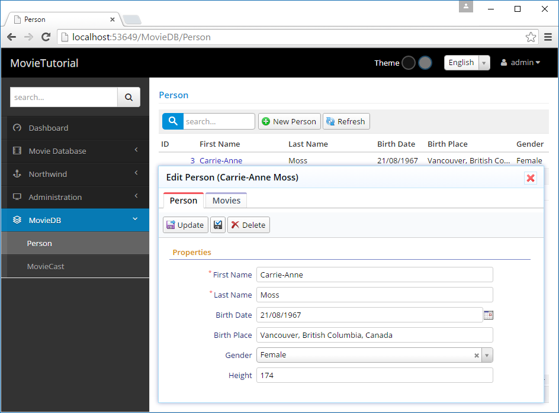
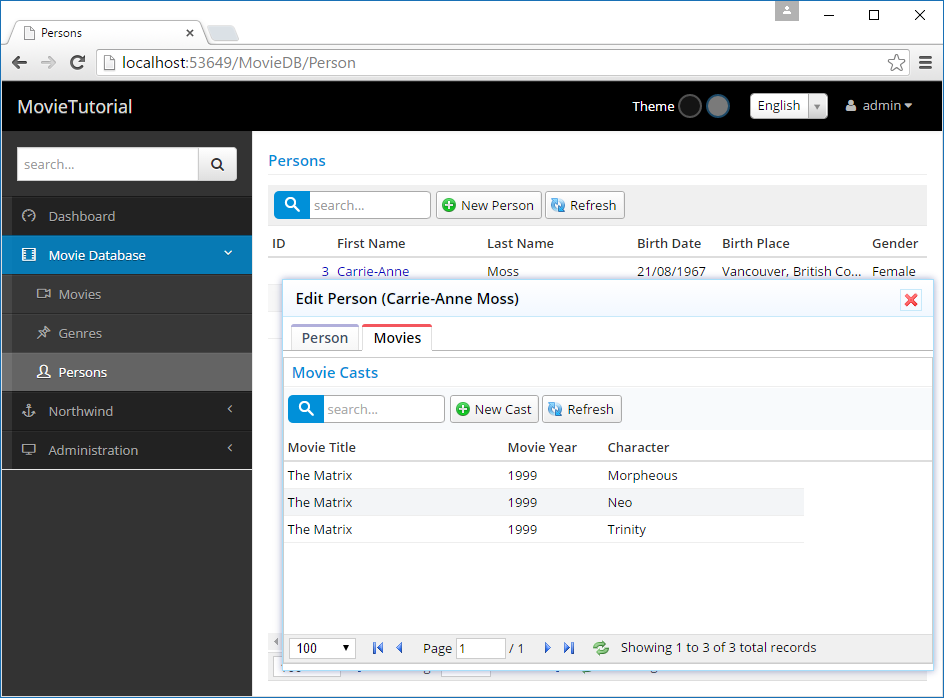

# Listing Movies in Person Dialog

To show list of movies a person acted in, we'll add a tab to PersonDialog.

By default all entity dialogs (ones we used so far, which derive from EntityDialog) uses *EntityDialog* template at *MovieTutorial.Web/Views/Templates/EntityDialog.Template.html*:

```html
<div class="s-DialogContent">
    <div id="~_Toolbar" class="s-DialogToolbar">
    </div>
    <div class="s-Form">
        <form id="~_Form" action="">
            <div class="fieldset ui-widget ui-widget-content ui-corner-all">
                <div id="~_PropertyGrid"></div>
                <div class="clear"></div>
            </div>
        </form> 
    </div>
</div>
```

This template contains a toolbar placeholder (*~_Toolbar*), form (*~_Form*) and PropertyGrid (*~_PropertyGrid).

> ~_ is a special prefix that is replaced with a unique dialog ID at runtime. This ensures that objects in two instances of a dialog won't have the same ID values.

EntityDialog template is shared by all dialogs, so we are not gonna modify it to add a tab to PersonDialog.

### Defining a Tabbed Template for PersonDialog

Create a new file, *Modules/MovieDB/Person/PersonDialog.Template.html* with contents:


```html
<div id="~_Tabs" class="s-DialogContent">
    <ul>
        <li><a href="#~_TabInfo"><span>Person</span></a></li>
        <li><a href="#~_TabOrders"><span>Movies</span></a></li>
    </ul>
    <div id="~_TabInfo" class="tab-pane s-TabInfo">
        <div id="~_Toolbar" class="s-DialogToolbar">
        </div>
        <div class="s-Form">
            <form id="~_Form" action="">
                <div class="fieldset ui-widget ui-widget-content ui-corner-all">
                    <div id="~_PropertyGrid"></div>
                    <div class="clear"></div>
                </div>
            </form>
        </div>
    </div>
    <div id="~_TabOrders" class="tab-pane s-TabOrders">
        <div id="~_OrdersGrid">

        </div>
    </div>
</div>
```

The syntax we used here is specific to jQuery UI tabs widget. It needs an UL element with list of tab links pointing to tab pane divs (*.tab-pane*).

When *EntityDialog* finds a div with ID *~_Tabs* in its template, it automatically initializes a tabs widget on it.

Naming of the template file is important. It must end with *.Template.html* extension. All files with this extension are made available at client side through a dynamic script.

Folder of the template file is ignored, but templates must be under *Modules* or *Views/Template* directories.

By default, all templated widgets (EntityDialog also derives from TemplatedWidget class), looks for a template with their own classname. Thus, PersonDialog looks for a template with the name *PersonDialog.Template.html*. But, as it didn't exist before, search continued to base classes and a fallback template, *EntityDialog.Template.html* was used.

Now, we have a tab in PersonDialog:



> Meanwhile, i noticed Person link is still under MovieDB and we forgot to remove MovieCast link. I'm fixing them now...

### Creating PersonMovieGrid

But movie tab is empty for now. We need to define a grid with suitable columns and place it in that tab.

First, declare the columns we'll use with the grid, in file *PersonMovieColumns.cs* next to *PersonColumns.cs*:

```cs

namespace MovieTutorial.MovieDB.Columns
{
    using Serenity.ComponentModel;
    using System;

    [ColumnsScript("MovieDB.PersonMovie")]
    [BasedOnRow(typeof(Entities.MovieCastRow))]
    public class PersonMovieColumns
    {
        [Width(220)]
        public String MovieTitle { get; set; }
        [Width(100)]
        public Int32 MovieYear { get; set; }
        [Width(200)]
        public String Character { get; set; }
    }
}
```

Next define a *PersonMovieGrid* class, in file *PersonMovieGrid.cs* next to *PersonGrid.cs*:

```cs
namespace MovieTutorial.MovieDB
{
    using jQueryApi;
    using Serenity;

    [ColumnsKey("MovieDB.PersonMovie"), IdProperty(MovieCastRow.IdProperty)]
    [LocalTextPrefix(MovieCastRow.LocalTextPrefix), Service(MovieCastService.BaseUrl)]
    public class PersonMovieGrid : EntityGrid<MovieCastRow>
    {
        public PersonMovieGrid(jQueryObject container)
            : base(container)
        {
        }
    }
}
```

We'll actually use MovieCast service, to list movies a person acted in.

Last step is to create this grid in PersonDialog.cs:

```cs

namespace MovieTutorial.MovieDB
{
    using jQueryApi;
    using Serenity;
    using System.Collections.Generic;

    [IdProperty(PersonRow.IdProperty), NameProperty(PersonRow.Fields.Fullname)]
    [FormKey(PersonForm.FormKey), LocalTextPrefix(PersonRow.LocalTextPrefix),
     Service(PersonService.BaseUrl)]
    public class PersonDialog : EntityDialog<PersonRow>
    {
        private PersonMovieGrid moviesGrid;

        public PersonDialog()
        {
            moviesGrid = new PersonMovieGrid(this.ById("MoviesGrid"));

            tabs.OnActivate += (e, i) => this.Arrange();
        }
    }
}
```

Remember that in our template we had a div with id *~_MoviesGrid* under movies tab pane. We created PersonMovie grid on that div.

> this.ById("MoviesGrid") is a special method for templated widgets. *$('#MoviesGrid')* wouldn't work here, as that div actually has some ID like *PersonDialog17_MoviesGrid*. `~_` in templates are replaced with a unique container widget ID.

We also attached to OnActivate event of jQuery UI tabs, and called Arrange method of the dialog. This is to solve a problem with SlickGrid, when it is initially created in invisible tab. Arrange triggers relayout for SlickGrid to solve this problem.

OK, now we can see list of movies in Movies tab, but something is strange:



### Filtering Movies for the Person

No, Carrie-Anne Moss didn't act in three roles. This grid is showing all movie cast records for now, as we didn't tell it which movie cast records we want yet.


