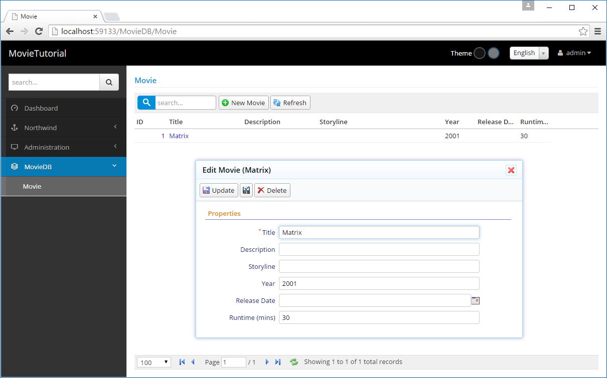
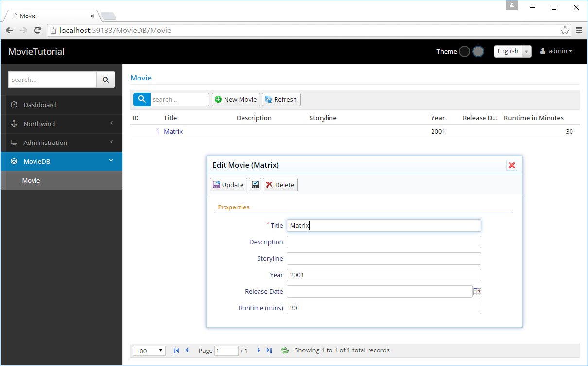
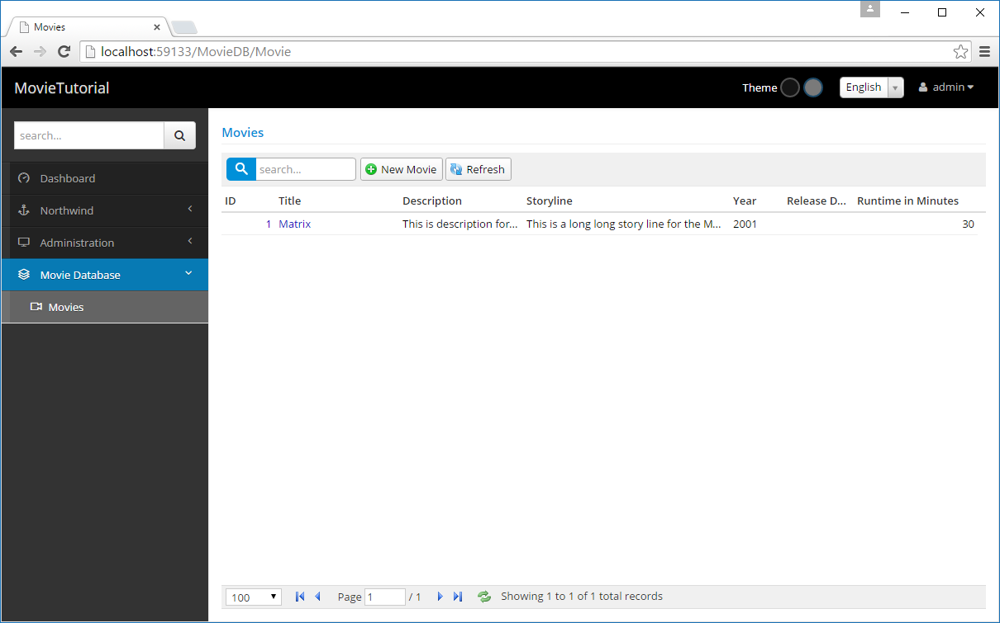

# Tutorial: Movie Database

Let's create editing interface for some site similar to IMDB with Serenity.

> You can find source code for this tutorial at: 

> https://github.com/volkanceylan/Serenity-Tutorials/tree/master/MovieTutorial


### Create a new project named *MovieTutorial*

In Visual Studio click File -> New Project. Make sure you choose *Serene* template. Type *MovieTutorial* as name and click *OK*.

In Solution explorer, you should see two projects with names *MovieTutorial.Web* and *MovieTutorial.Script*.

> Make sure *MovieTutorial.Web* is the startup project (it should be bold), if not right click on project name and click *Set As Startup Project*.


### What Are These Project Files?

Serenity applications usually has at least two projects. One for server side code plus static resources like css files, images etc. (MovieTutorial.Web) and one for client side code (MovieTutorial.Script).

MovieTutorial.Script looks like an ordinary C# class library but the code it contains is actualy compiled to Javascript using Saltarelle. 

> Its output (MovieTutorial.Script.js) will be copied to folder *Scripts/site/* under *MovieTutorial.Web*. So at runtime, only MovieTutorial.Web project is used.


### Creating *Movie* Table

To store list of movies we need a Movie table. We could create this table using old-school techniques like SQL Management Studio but we prefer creating it as a *migration* using *Fluent Migrator*:

> Fluent Migrator is a migration framework for .NET much like Ruby on Rails Migrations. Migrations are a structured way to alter your database schema and are an alternative to creating lots of sql scripts that have to be run manually by every developer involved. Migrations solve the problem of evolving a database schema for multiple databases (for example, the developer’s local database, the test database and the production database). Database schema changes are described in classes written in C# that can be checked into a version control system.

> See https://github.com/schambers/fluentmigrator for more information on FluentMigrator.

Using *Solution Explorer* navigate to *MovieTutorial.Web / Modules / Common / Migrations / DefaultDB*.


Here we already have three migrations. A migration is like a DML script that manipulates database structure.

*DefaultDB_20141103_140000_Initial.cs* contains our initial migration that created *Northwind* tables and *Users* table.

Create a new migration file in the same folder with name *DefaultDB_20150915_185137_Movie.cs*. You can copy and change one of the existing migration files, rename it and change contents.

> Migration file name / class name is actually not important but recommended for consistency and correct ordering.

*20150915_185137* corresponds to the time we are writing this migration in yyyyMMdd_HHmmss format. It will also act as a unique key for this migration.

Our migration file should look like below:

```cs
using FluentMigrator;
using System;

namespace MovieTutorial.Migrations.DefaultDB
{
    [Migration(20150915185137)]
    public class DefaultDB_20150915_185137_Movie : Migration
    {
        public override void Up()
        {
            Create.Schema("mov");

            Create.Table("Movie").InSchema("mov")
                .WithColumn("MovieId").AsInt32().Identity().PrimaryKey().NotNullable()
                .WithColumn("Title").AsString(200).NotNullable()
                .WithColumn("Description").AsString(1000).Nullable()
                .WithColumn("Storyline").AsString(Int32.MaxValue).Nullable()
                .WithColumn("Year").AsInt32().Nullable()
                .WithColumn("ReleaseDate").AsDateTime().Nullable()
                .WithColumn("Runtime").AsInt32().Nullable();    
        }

        public override void Down()
        {
        }
    }
}
```

> Make sure you use the namespace *MovieTutorial.Migrations.DefaultDB* as Serene template applies migrations only in this namespace to the default database.

In *Up()* method we specify that this migration, when applied, will create a schema named *mov*. We will use a separate schema for movie tables to avoid clashes with existing tables. It will also create a table named *Movie* with "MovieId, Title, Description..." fields on it.

We could implement *Down()* method to make it possible to undo this migration (drop movie table and mov schema etc), but for the scope of this sample, lets leave it empty.

> Inability to undo a migration might not hurt much, but deleting a table by mistake could do more damage.

On top of our class we applied a Migration attribute.

```cs
[Migration(20150915185137)]
```

This specifies a unique key for this migration. After a migration is applied to a database, its key is recorded in a special table specific to FluentMigrator ([dbo].[VersionInfo]), so same migration won't be applied again.

> Migration key should be in sync with class name (for consistency) but without underscore as migration keys are Int64 numbers.

> Migrations are executed in the key order, so using a sortable datetime pattern like yyyyMMdd for migration keys looks like a good idea.


### Running Migrations

By default, Serene template runs all migrations in *MovieTutorial.Migrations.DefaultDB* namespace. This happens on application start automatically. The code that runs migrations are in *App_Start/SiteInitialization.cs* file:

```cs

public static partial class SiteInitialization
{
    public static void ApplicationStart()
    {
        // ...
        EnsureDatabase();
    }

    private static void EnsureDatabase()
    {
        // ...
        RunMigrations();
    }

    private static void RunMigrations()
    {
        var defaultConnection = SqlConnections.GetConnectionString("Default");

        // safety check to ensure that we are not modifying another database
        if (defaultConnection.ConnectionString.IndexOf(
            typeof(SiteInitialization).Namespace + @"_Default_v1") < 0)
            return;

        using (var sw = new StringWriter())
        {
            //...
            var runner = new RunnerContext(announcer)
            {
                // ...
                Namespace = "MovieTutorial.Migrations.DefaultDB"
            };

            new TaskExecutor(runner).Execute();
        }
    }

```

> There is a safety check on database name to avoid running migrations on some arbitrary database other than the default Serene database (MovieTutorial_Default_v1). You can remove this check if you understand the risks. For example, if you change default connection in web.config to your own production database, migrations will run on it and you will have Northwind etc tables even if you didn't mean to.

Now press F5 to run your application and create Movie table in default database.


### Verifying That the Migration is Run

Using Sql Server Management Studio or Visual Studio -> Connection To Database, open a connection to MovieTutorial_Default_v1 database in server *(localdb)\v11.0*.

> (localdb)\v11.0 is a LocalDB instance created by SQL Server 2012 LocalDB. 

> If you didn't install LocalDB yet, download it from https://www.microsoft.com/en-us/download/details.aspx?id=29062.

> If you have SQL Server 2014 LocalDB, your server name would be (localdb)\v12.0, so change connection string in web.config file. 

> You could also use another SQL server instance, just change the connection string to target server and remove the migration safety check.

You should see *[mov].[Movies]* table in SQL object explorer.

Also when you view data in *[dbo].[VersionInfo]* table, Version column in the last row of the table should be *20150915185137*. This specifies that the migration with that version number (migration key) is already executed on this database.


### Serenity Code Generator

After making sure that our table exists in the database, we will use Serenity Code Generator (sergen.exe) to generate initial editing interface.

In Visual Studio, open *Package Manager Console* by clicking *View* => *Other Windows* => *Package Manager Console*.

Type *sergen* and press Enter.

> Sometimes package manager console can't set path correctly and you may get an error executing Sergen. Restarting Visual Studio might resolve the issue. 

> Another option is to open Sergen.exe from Windows Explorer. Right click on *MovieTutorial* solution in Solution Explorer, click *Open In File Explorer*. Sergen.exe is under *packages\Serenity.CodeGenerator.X.Y.Z\tools* directory.


### Setting Project Location

When you first run Sergen, Web Project and Script Project fields will be empty. Browse to your solution directory and locate web and script projects using "..." buttons.

Another option is to set them to values below:

* ..\\..\\..\\MovieTutorial\\MovieTutorial.Web\\MovieTutorial.Web.csproj
* ..\\..\\..\\MovieTutorial\\MovieTutorial.Script\\MovieTutorial.Script.csproj
 
> If you used another project name than *MovieTutorial*, e.g. *MyMovies*, replace *MovieTutorial* with it.

Once you set this values, and generate your first page, you won't have to set them again. This options will be saved in *Serenity.CodeGenerator.config* in your solution directory.

This values are required, as Sergen will include generated files to your project.

### Root Namespace Option

Set root namespace option to the Solution name you used, e.g. *MovieTutorial*. If your project names are MyProject.Web and MyProject.Script, your root namespace is MyProject by default. This is critical so make sure you don't set it to anything different, as by default, Serene template expects all generated code to be under this root namespace.

This option is also saved, so next time you won't have to fill it in.


### Choosing Connection String

Once you set Web project name, Sergen populates connection dropdown with connection strings from your web.config file. We have only one connection string in our web.config yet, so just select *Default*.


### Selecting Table To Generate Code For

Sergen generates code for one table at a time. Once we choose connection string, table dropdown is populated with table names from that database. 

Select *Movie* table.

### Setting Module Name

In Serenity terms, a module is a logical group of pages, sharing a common purpose. 

For example, in Serene template, all pages related to *Northwind* sample belongs to *Northwind* module. 

Pages that are related to general management of site, like users, roles etc. belongs to *Administration* module. 

A module usually corresponds to a database schema, or a single database but there is nothing that prevents you from using multiple modules in a single database / schema, or opposite, multiple databases in one module.

For this tutorial, we will use *MovieDB* (analogous to IMDB) for all pages.

Module name is used in determining namespace and url of generated pages.

For example, our new page will be under *MovieTutorial.MovieDB* namespace and will use */MovieDB* relative url.


### ConnectionKey Parameter 

Connection key is set to the connection key of selected connection string in web.config file. You usually don't have to change it, just leave default.


### Entity Identifier

This usually corresponds to the table name but sometimes table names might have underscores or other invalid characters, so you decide what to name your entity in generated code (a valid identifier name).

Our table name is *Movie* so it is also a valid and fine C# identifier, so let's use *Movie* as the entity identifier.

This name is also used in other class names. For example our page controller will be named *MovieController*.
.
It also determines the page url, in this sample our editing page will be at URL */MovieDB/Movie*.


### Permission Key 

In Serenity, access control to resources (pages, services etc.) are controlled by permission keys which are simple strings. Users or roles are granted these permissions.

Our Movie page will be only used by administrative users (or maybe later content moderators) so let's set it to *Administration* for now. By default, in Serene template, only the *admin* user has this permission.


### Generating Code for First Page

After setting parameters as shown in the image above, click *Generate Code for Entity* button. Sergen will generate several files and include them in MovieTutorial.Web and MovieTutorial.Script projects.

Now you can close Sergen, and return to Visual Studio.

As projects are modified, Visual Studio will ask if you wan't to reload changes, click Reload All.

*Rebuild the solution* and press *F5* to launch application.

Use *admin* as username, and *serenity* as password to login.

When you are greeted with Dashboard page, you will notice that there is a new section, *MovieDB* on the bottom of left navigation. 

Click to expand it and click Movie to open our first generated page.


Now try adding a new movie, than try updating and deleting it.

Sergen generated code for our table, and it just works without writing a single line of code.

> This doesn't mean i don't like writing code. In contrast, i love it. Actually i'm not a fan of most designers and code generators. The code they produce is usually unmanagable mess. 

> Sergen just helped us here for initial setup which is required for layered architecture and platform standards. We would have to create about 10 files for entity, repository, page, endpoint, grid, form etc. Also we needed to do some setup in a few other places.

> Even if we did copy paste and replace code from some other page, it would be error prone and take about 5-10 mins.

> The code files Sergen generates has minimum code with the absolute basics. This is thanks to the base classes in Serenity that handles the most logic. Once we generate code for some table, we'll probably never use Sergen again (for this table), and modify this generated code to our needs. We'll see how.


### Customizing Field Captions

In our movie grid and form, we have a field named *Runtime*. This field expects an integer number in *minutes*, but in its title there is no sign of this. Let's change its title to Runtime (mins).

There are several ways to do this. Our options include server side form definition, server side columns definition, from script grid code etc. But let's make this change in the central location, the entity itself, so its title changes everywhere.

When Sergen generated code for Movie table, it created a entity class named MovieRow. You can find it at  *MovieTutorial.Web/Modules/MovieDB/Movie/MovieRow.cs*.

Here is an excerpt from its source with our Runtime property:

```cs
namespace MovieTutorial.MovieDB.Entities
{
    // ...
    [ConnectionKey("Default"), DisplayName("Movie"), InstanceName("Movie"), TwoLevelCached]
    public sealed class MovieRow : Row, IIdRow, INameRow
    {
        // ...
        [DisplayName("Runtime")]
        public Int32? Runtime
        {
            get { return Fields.Runtime[this]; }
            set { Fields.Runtime[this] = value; }
        }
        //...
    }
}
```

We'll talk about entities (or rows) later, let's now focus on our target and change its DisplayName attribute value to *Runtime (mins)":

```cs
namespace MovieTutorial.MovieDB.Entities
{
    // ...
    [ConnectionKey("Default"), DisplayName("Movie"), InstanceName("Movie"), TwoLevelCached]
    public sealed class MovieRow : Row, IIdRow, INameRow
    {
        // ...
        [DisplayName("Runtime (mins)")]
        public Int32? Runtime
        {
            get { return Fields.Runtime[this]; }
            set { Fields.Runtime[this] = value; }
        }
        //...
    }
}
```

Now build solution and run application. You'll see that field title is changed in both grid and dialog. 

> Column title has "..." in it as column is not wide enough, though its hint shows the full title. We'll see how to handle this soon.




### Overriding Column Title and Width 


So far so good, what if we wanted to show another title in grid (columns) or dialog (form). We can override it corresponding definition file.

Let's do it on columns first. Next to *MovieRow.cs*, you can find a source file named *MovieColumns.cs*:

```cs
namespace MovieTutorial.MovieDB.Columns
{
    // ...

    [ColumnsScript("MovieDB.Movie")]
    [BasedOnRow(typeof(Entities.MovieRow))]
    public class MovieColumns
    {
        [EditLink, DisplayName("Db.Shared.RecordId"), AlignRight]
        public Int32 MovieId { get; set; }
        //...
        public Int32 Runtime { get; set; }
    }
}
```

You may notice that this columns definition is based on the Movie entity (BasedOnRow attribute).

Any attribute written here will override attributes defined in the entity class.

Let's add a DisplayName attribute to the *Runtime* property:

```cs
namespace MovieTutorial.MovieDB.Columns
{
    // ...

    [ColumnsScript("MovieDB.Movie")]
    [BasedOnRow(typeof(Entities.MovieRow))]
    public class MovieColumns
    {
        [EditLink, DisplayName("Db.Shared.RecordId"), AlignRight]
        public Int32 MovieId { get; set; }
        //...
        [DisplayName("Runtime in Minutes"), Width(150), AlignRight]
        public Int32 Runtime { get; set; }
    }
}
```

Now we set column caption to "Runtime in Minutes". 

We actually added two more attributes. 

One to override column width to 150px.

> Serenity applies an automatic width to columns based on field type and character length, unless you set the width explicitly.

And another one to align column to right (AlignCenter, AlignLeft is also available).

Let's build and run again, than we get: 



Form field title stayed same, while column title changed.

> If we wanted to override form field title instead, we would do similar steps in MovieForm.cs


### Changing Editor Type For Description and Storyline

Description and Storyline fields can be a bit longer compared to Title field, so lets change their editor types to a textarea.

Open *MovieForm.cs* in the same folder with *MovieColumns.cs* and *MovieRow.cs*.

```cs
namespace MovieTutorial.MovieDB.Forms
{
    //...
    [FormScript("MovieDB.Movie")]
    [BasedOnRow(typeof(Entities.MovieRow))]
    public class MovieForm
    {
        public String Title { get; set; }
        public String Description { get; set; }
        public String Storyline { get; set; }
        public Int32 Year { get; set; }
        public DateTime ReleaseDate { get; set; }
        public Int32 Runtime { get; set; }
    }
}
```

and add TextAreaEditor attributes to both:

```cs
namespace MovieTutorial.MovieDB.Forms
{
    //...
    [FormScript("MovieDB.Movie")]
    [BasedOnRow(typeof(Entities.MovieRow))]
    public class MovieForm
    {
        public String Title { get; set; }
        [TextAreaEditor(Rows = 3)]
        public String Description { get; set; }
        [TextAreaEditor(Rows = 8)]
        public String Storyline { get; set; }
        public Int32 Year { get; set; }
        public DateTime ReleaseDate { get; set; }
        public Int32 Runtime { get; set; }
    }
}
```

I left more editing rows for Storyline (8) compared to Description (3) as Storyline should be much longer.

After rebuild and run, we have this:


Serene has several editor types to choose from. Some are automatically picked based on field data type, while you need to explicitly set others.

> You can also develop your own editor types. You can take existing editor types as base classes, or develop your own from stratch. We'll see how in following chapters.

As editors became a bit higher, form height exceeded the default Serenity form height (which is set by Sergen to 260px) and now we have a vertical scroll bar. Let's remove it.

### Setting Initial Dialog Size With CSS (Less)

Sergen generated some CSS for our movie dialog in *MovieTutorial.Web/Content/site/site.less* file.

If you open it, and scroll to bottom, you will see this:

```cs
/* ------------------------------------------------------------------------- */
/* APPENDED BY CODE GENERATOR, MOVE TO CORRECT PLACE AND REMOVE THIS COMMENT */
/* ------------------------------------------------------------------------- */

.s-MovieDialog {
    > .size { .widthAndMin(650px); }
    .dialog-styles(@h: auto, @l: 150px, @e: 400px);
    .s-PropertyGrid .categories { height: 260px; }
}
```

You can safely remove the 3 comment lines (appended by code generator...). This is just a reminder for you to move them to a better place like a *site.movies.less* file specific to this module (recommended).

These rules are applied to elements with *.s-MovieDialog* class. Our Movie dialog has this class by default. 

In the second line it is specified that this dialog is 650px wide (and also its minimum width is 650px, this will get some meaning after we make this dialog resizable).

In third line, we specify that dialog height should be automatic (@h: auto), field labels should be 150px (@l: 150px) and editors should be 400px in width (@e: 400px).

We are using several less mixins here (widthAndMin and dialog-styles).

Our form height is controlled by *s-PropertyGrid .categories { height: 260px; }* line. Let's change it to 400px so it won't require a vertical scroll bar.

```css
.s-MovieDialog {
    > .size { .widthAndMin(650px); }
    .dialog-styles(@h: auto, @l: 150px, @e: 400px);
    .s-PropertyGrid .categories { height: 400px; }
}
```


### Changing Page Title

Our page has title of *Movie*. Let's change it to Movies. 

Open *MovieRow.cs* again. 

```cs
namespace MovieTutorial.MovieDB.Entities
{
    // ...
    [ConnectionKey("Default"), DisplayName("Movie"), InstanceName("Movie"), TwoLevelCached]
    public sealed class MovieRow : Row, IIdRow, INameRow
    {
        [DisplayName("Movie Id"), Identity]
        public Int32? MovieId
```

Change DisplayName attribute value to *Movies*. This is the name that is used when this table is referenced, and it is usually a plural name. This attribute is used for determining default page title. 

> It is also possible to override the page title in *MoviePage.Index.cshtml* file but as before, we prefer to do it from a central location so that this information can be reused in other places.

InstanceName corresponds to singular name and is used in New Record (New Movie) button of the grid and determines the dialog title (e.g. Edit Movie).

```cs
namespace MovieTutorial.MovieDB.Entities
{
    // ...
    [ConnectionKey("Default"), DisplayName("Movies"), InstanceName("Movie"), TwoLevelCached]
    public sealed class MovieRow : Row, IIdRow, INameRow
    {
        [DisplayName("Movie Id"), Identity]
        public Int32? MovieId
```


### Setting Navigation Item Title and Icon

When Sergen generated code for Movie table, it also created a navigation item entry. In Serene, navigation items are created with special assembly attributes.

Open *MoviePage.cs* in the same folder, on top of it you'll find this line:

```cs
[assembly:Serenity.Navigation.NavigationLink(int.MaxValue, "MovieDB/Movie", 
    typeof(MovieTutorial.MovieDB.Pages.MovieController))]

namespace MovieTutorial.MovieDB.Pages
{
    using Serenity;
    using Serenity.Web;

```

First argument to this attribute is display order for this navigation item. As we only have one navigation item in Movie category yet, we don't have to mess with ordering yet.

Second parameter is navigation title in "Section Title/Link Title" format. Section and navigation items are seperated with a slash (/).

Lets change it to *Movie Database/Movies*.

```cs
[assembly:Serenity.Navigation.NavigationLink(int.MaxValue, "Movie Database/Movies", 
    typeof(MovieTutorial.MovieDB.Pages.MovieController), icon: "icon-camcorder")]

namespace MovieTutorial.MovieDB.Pages
{

//..
```



We also changed navigation item icon to *icon-camcorder*. Serene template has two sets of font icons, Simple Line Icons and Font Awesome. Here we used a glyph from simple line icons set. 

To see list of simple line icons and their css classes, visit link below:

http://thesabbir.github.io/simple-line-icons/

FontAwesome is available here:

https://fortawesome.github.io/Font-Awesome/icons/


### Ordering Navigation Sections

As our *Movie Database* section is auto generated last, it is displayed at the bottom of navigation menu.

We'll move it before Northwind menu.

As we saw recently, Sergen created a navigation item in *MoviePage.cs*. If navigation items are scattered through pages like this, it would be hard to see the big picture (list of all navigation items) and order them easily.

So we move it to our central location which is at *MovieTutorial.Web/Modules/Common/Navigation/NavigationItems.cs*.

Just cut the below lines from *MoviePage.cs*:

```cs
[assembly:Serenity.Navigation.NavigationLink(int.MaxValue, "Movie Database/Movies", 
    typeof(MovieTutorial.MovieDB.Pages.MovieController), icon: "icon-camcorder")]
```

Move it into *NavigationItems.cs* and modify it like this:

```
using Serenity.Navigation;
using Northwind = MovieTutorial.Northwind.Pages;
using Administration = MovieTutorial.Administration.Pages;
using MovieDB = MovieTutorial.MovieDB.Pages;

[assembly: NavigationLink(1000, "Dashboard", url: "~/", permission: "", icon: "icon-speedometer")]

[assembly: NavigationMenu(2000, "Movie Database", icon: "icon-film")]
[assembly: NavigationLink(2100, "Movie Database/Movies", 
    typeof(MovieDB.MovieController), icon: "icon-camcorder")]

[assembly: NavigationMenu(8000, "Northwind", icon: "icon-anchor")]
[assembly: NavigationLink(8200, "Northwind/Customers", 
    typeof(Northwind.CustomerController), icon: "icon-wallet")]
[assembly: NavigationLink(8300, "Northwind/Products", 
    typeof(Northwind.ProductController), icon: "icon-present")]
// ...
```

Here we also declared a navigation menu (Movie Database) with *film* icon. When you don't have an explicitly defined navigation menu, Serenity implicitly creates one, but in this case you can't order menu yourself, or set menu icon.

We assigned it a display order of *2000* so this menu will display just after Dashboard link (1000) but before Northwind menu (8000).

We assigned our *Movies* link a display order value of *2100* but it doesn't matter right now, as we have only one navigation item under *Movie Database* menu yet.

> First level links and navigation menus are sorted according to their display order first, then second level links among their siblings.

Here is how it looks like after these changes:


### Troubleshooting Some Issues with Visual Studio

In case you didn't notice already, Visual Studio doesn't let you modify code while your site is running. Also your site stops when you stop debugging, so you can't keep browser window open and refresh after rebuilding.

To solve this issue, we need to disable *Edit And Continue* (have no idea why).

Right Click *MovieTutorial.Web* project, click *Properties*, in the Web tab, uncheck *Enable Edit And Continue* under *Debuggers*.

Also, on your site, top blue progress bar (which is a Pace.js animation), keeps running all the time like it is still loading something. It is thanks to the *Browser Link* feature of Visual Studio. To disable it, locate its button in Visual Studio toolbar that looks like a refresh button (next to play icon with browser name like Chrome), click dropdown and uncheck *Enable Browser Link*.

It's also possible to disable it with a web.config setting 

```xml
<appsettings>
    <add key="vs:EnableBrowserLink" value="false" />
</appsettings>
```

> Serene 1.5.4 and later will have this by default, so you may not have this issue


### Adding Several Movie Entries

For the following sections, we need some sample data. We can copy and paste some from IMDB.


