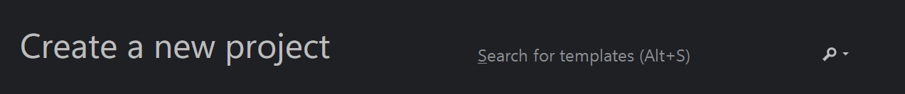
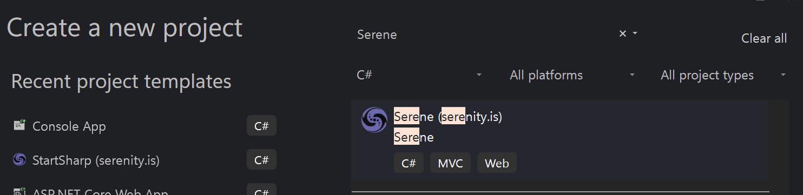
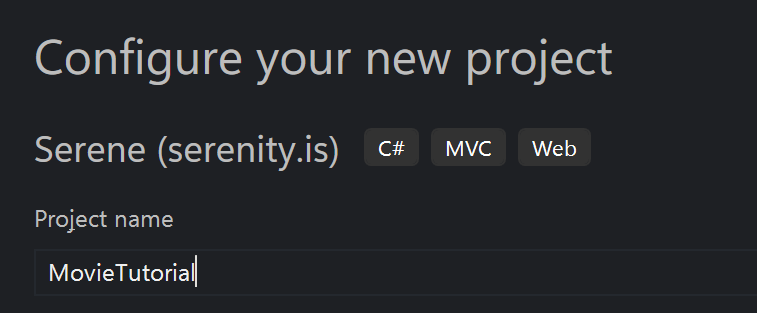
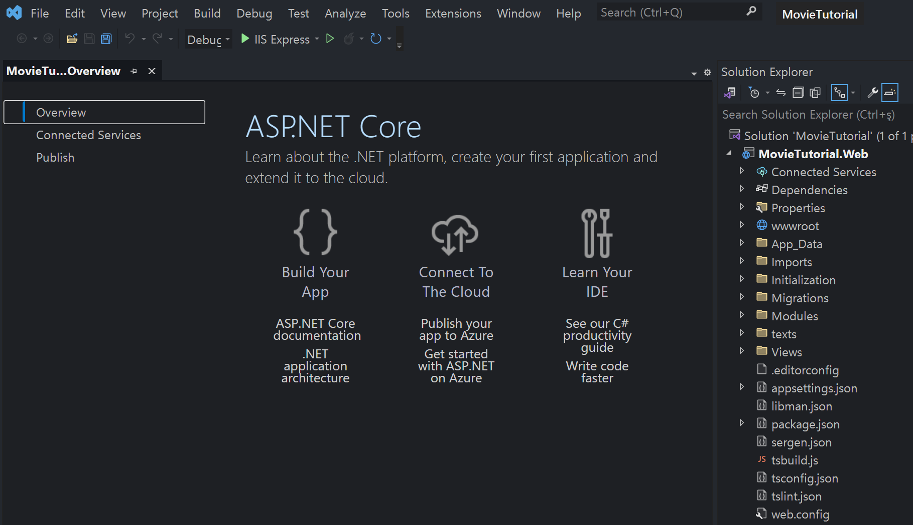

# Tutorial: Movie Database

In this tutorial, we will create an editing interface for a site similar to IMDB.

> Before starting, please ensure that you have the prerequisites. See the [Getting Started](../../getting_started/README.md) section for more information.

## Create a new project named *MovieTutorial*

To create a new project, start Visual Studio and click `Create a New Project` on the welcome screen.

If you are already in the IDE and not the welcome screen, close the current solution by clicking `File -> Close Solution`, then click `File -> New Project`.

On the `Create a New Project` dialog, type `Serene` in the search input:

Select the `Serene` template and click the `Next` button on the bottom right.

In the `Configure your new project` dialog, type `MovieTutorial` in the project name input and click the `Next` button again.

You will get an `Additional information` dialog. This is where you could exclude some demo modules, but for now, leave them as is and click the `Create` button to continue.

In Solution Explorer, you should see one project with the name `MovieTutorial.Web`.

MovieTutorial.Web is an ASP.NET Core project that contains server-side code plus static resources like CSS files, images, etc. 

It also has a tsconfig.json file at root, which specifies that it is also a TypeScript project.