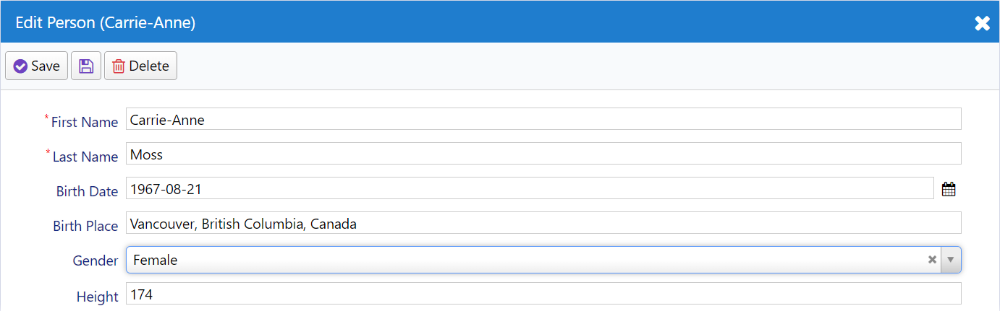
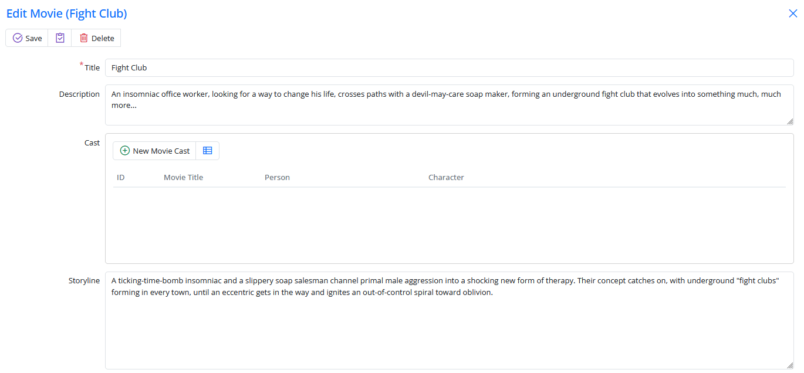
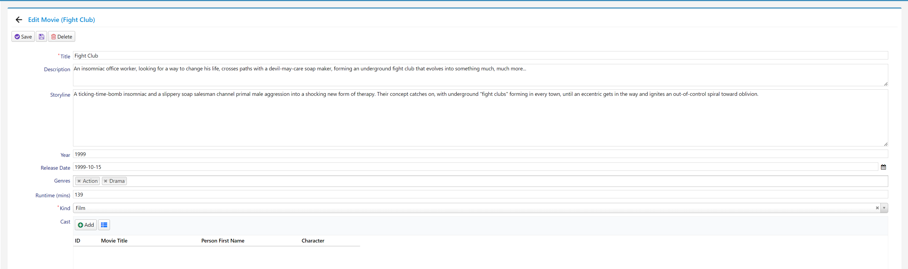
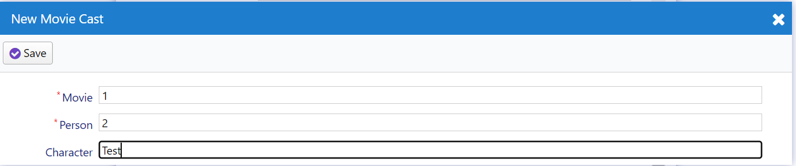
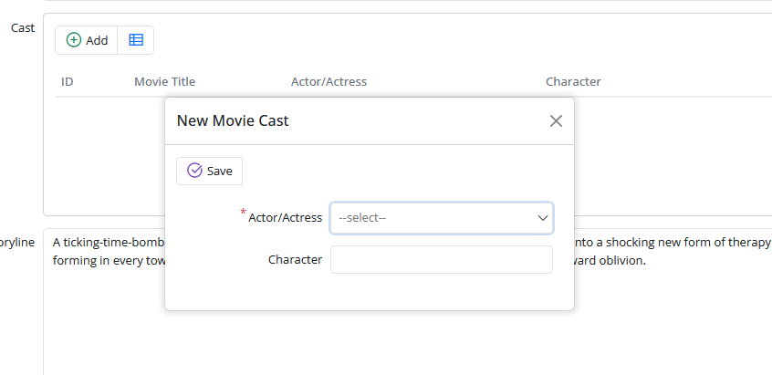
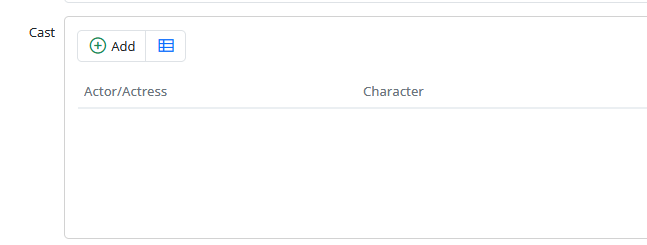
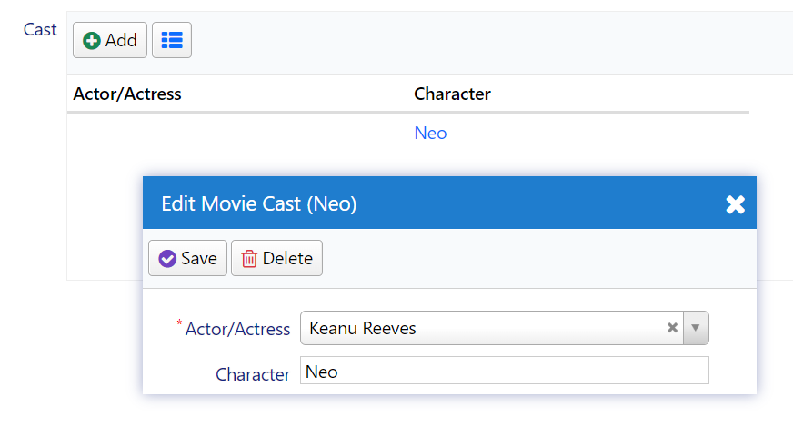

# Recording Actors and Their Roles

If we want to maintain a record of actors and the characters they portrayed, it might look something like this:

| Actor/Actress       | Character   |
|:--------------------|:------------|
| Keanu Reeves        | Neo         |
| Laurence Fishburne  | Morpheus    |
| Carrie-Anne Moss    | Trinity     |

For this purpose, we need a table named `MovieCast` with columns like:

| MovieCastId | MovieId    | PersonId               | Character |
|:------------|:-----------|:-----------------------|:----------|
| 11          | 2 (Matrix) | 77 (Keanu Reeves)      | Neo       |
| 12          | 2 (Matrix) | 99 (Laurence Fishburne)| Morpheus  |
| 13          | 2 (Matrix) | 30 (Carrie-Anne Moss)  | Trinity   |

Clearly, we also require a `Person` table to store actors/actresses, as they may take on different roles in the future. It's advisable to call it *Person* because actors/actresses may transition into roles such as directors or screenwriters in the future.

## Creating the Person and MovieCast Tables

Now, it's time to create a migration with two tables. Let's create a migration script named `DefaultDB_20221115_1612_PersonAndMovieCast.cs` in the `Migrations/DefaultDB` directory:

```csharp
using FluentMigrator;

namespace MovieTutorial.Migrations.DefaultDB;

[DefaultDB, Migration(20221115_1612)]
public class DefaultDB_20221115_1612_PersonAndMovieCast : AutoReversingMigration
{
    public override void Up()
    {
        Create.Table("Person").InSchema("mov")
            .WithColumn("PersonId").AsInt32().Identity()
                .PrimaryKey().NotNullable()
            .WithColumn("FirstName").AsString(50).NotNullable()
            .WithColumn("LastName").AsString(50).NotNullable()
            .WithColumn("BirthDate").AsDateTime().Nullable()
            .WithColumn("BirthPlace").AsString(100).Nullable()
            .WithColumn("Gender").AsInt32().Nullable()
            .WithColumn("Height").AsInt32().Nullable();

        Create.Table("MovieCast").InSchema("mov")
            .WithColumn("MovieCastId").AsInt32().Identity()
                .PrimaryKey().NotNullable()
            .WithColumn("MovieId").AsInt32().NotNullable()
                .ForeignKey("FK_MovieCast_MovieId", "mov", "Movie", "MovieId")
            .WithColumn("PersonId").AsInt32().NotNullable()
                .ForeignKey("FK_MovieCast_PersonId", "mov", "Person", "PersonId")
            .WithColumn("Character").AsString(50).Nullable();
    }
}
```

## Generating Code for the Person Table

First, generate code for the `Person` table:

- Connection Key: **Default**
- Table Name: **dbo.Person**
- Module Name: **MovieDB**
- Identifier: **Person**
- Permission: **Administration:General**
- What to Generate: **All**

Next, open *Modules/Movie/MovieDBNavigation.cs* and modify the navigation link for the `Person` page as shown below:

```csharp
[assembly: NavigationLink(6300, "Movie Database/People", typeof(MyPages.PersonPage), icon: "fa-users")]
```

These changes will help you set up the necessary database tables and generate code for the `Person` table within your application.

## Changing Gender to an Enumeration

In the `Person` table, the `Gender` column should be represented as an enumeration. To implement this change, follow the steps below:

### Step 1: Declare the Gender Enumeration

Create a new file named `Gender.cs` next to `PersonRow.cs`. In this file, define the `Gender` enumeration as follows:

```csharp
using Serenity.ComponentModel;
using System.ComponentModel;

namespace MovieTutorial.MovieDB
{
    public enum Gender
    {
        [Description("Male")]
        Male = 1,
        [Description("Female")]
        Female = 2
    }
}
```

### Step 2: Modify the Gender Property in PersonRow.cs

Update the declaration of the `Gender` property in `PersonRow.cs` and its field definition as shown below:

```csharp
[DisplayName("Gender")]
public Gender? Gender { get => fields.Gender[this]; set => fields.Gender[this] = value; }

//...

public class RowFields : RowFieldsBase
{
    //..
    public EnumField<Gender> Gender;
}
```

### Step 3: Update the Gender Property in PersonForm.cs and PersonColumns.cs

For consistency, change the data type of the `Gender` property in both `PersonForm.cs` and `PersonColumns.cs` from `int` to `Gender`:

In `PersonColumns.cs`:

```csharp
public class PersonColumns
{
    //...
    Gender Gender { get; set; }
}
```

In `PersonForm.cs`:

```csharp
public class PersonForm
{
    //...
    Gender Gender { get; set; }
}
```

### Step 4: Rebuild the Solution

Since we've declared a new enumeration and made these changes, rebuild the solution to allow for automatic transformation.

After launching your project, you should now be able to enter actors with their gender specified as an enumeration:



## Declaring FullName Field

In the title of the edit dialog, only the first name of the person (*Carrie-Anne*) is currently displayed. It would be more informative to display the full name and enable searching by the full name in the grid. To achieve this, we need to make some changes to our `PersonRow.cs` file:

```csharp
//...
public sealed class PersonRow : Row, IIdRow, INameRow
{
    //... Remove QuickSearch and NameProperty from FirstName
    [DisplayName("First Name"), Size(50), NotNull]
    public string FirstName { get => fields.FirstName[this]; set => fields.FirstName[this] = value; }

    [DisplayName("Full Name"), Concat("t0.FirstName", "' '", "t0.LastName"), QuickSearch, NameProperty]
    public string FullName { get => fields.FullName[this]; set => fields.FullName[this] = value; }

    public class RowFields : RowFieldsBase
    {
        //...
        public StringField FullName;
    }
}
```

In this code, we've specified the SQL expression `Concat("t0.FirstName", "' '", "t0.LastName")` for the `FullName` property, making it a server-side calculated field. Alternatively, you can add a custom query with `[Expression("(t0.FirstName + ' ' + t0.LastName)")]`. The `ConcatAttribute` is a convenient and database-agnostic way to concatenate values in an SQL query, and it handles NULL values by treating them as empty strings.

By adding the `QuickSearch` attribute to `FullName`, the grid will now default to searching by the `FullName` field.

However, the dialog may still display the first name in its title. To update this, we need to build and auto-transform to make it show the full name.

You might wonder why this is necessary, and the reason becomes clearer when you examine the `PersonDialog.ts` file:

```typescript
export class PersonDialog extends EntityDialog<PersonRow, any> {
    // ...
    protected getRowDefinition() { return PersonRow; }
}
```

In this TypeScript code, the `getRowDefinition()` method returns `PersonRow`. It's worth noting that `PersonRow` in TypeScript is generated in a file (`MovieDB.PersonRow.ts`) through Sergen transformations.

As a result, unless we build, the name property change made in `PersonRow.cs` won't be reflected in the corresponding `PersonRow.ts` file located under `Modules/ServerTypes/MovieDB/PersonRow.ts`:

```typescript
//...
export abstract class PersonRow {
    static readonly idProperty = 'PersonId';
    static readonly nameProperty = 'FullName';
    //...
}
```

This metadata, such as the name property of `PersonRow`, is transferred to TypeScript using a code file (`PersonRow.ts`) that is generated by Sergen.

Similarly, other properties like `idProperty`, `localTextPrefix`, and `Enum Types` are also generated under `ServerTypes`. Therefore, when you make a change that affects metadata in these generated files, you should build/transform to ensure that the information is transferred to TypeScript.

## Declaring PersonRow Lookup Script

Let's proceed by declaring a `LookupScript` for the Person table in `PersonRow.cs`:

```csharp
[LookupScript]
public sealed class PersonRow : Row, IIdRow, INameRow
```

This lookup script will be used later for editing Movie cast.

After building and auto-transforming again, you'll notice that `PersonRow.ts` now includes a `getLookup()` method along with a new `lookupKey` property:

```typescript
//...
export abstract class PersonRow {
    static readonly idProperty = 'PersonId';
    static readonly nameProperty = 'Fullname';
    static readonly localTextPrefix = 'MovieDB.Person';
    static readonly lookupKey = 'MovieDB.Person';

    /** @deprecated use getLookupAsync instead */
    static getLookup() { return getLookup<PersonRow>('MovieDB.Person') }
    static async getLookupAsync() { return getLookupAsync<PersonRow>('MovieDB.Person') }
    //...
}
```

It's worth noting that the `getLookup` method blocks the browser UI thread, so it is recommended to use the `getLookupAsync` method where possible.

## Generating Code For MovieCast Table

Next, you should generate code for the MovieCast table using `sergen` with the following parameters:

- Connection String: **Default**
- Tablename: **mov.MovieCast**
- Module Name: **MovieDB**
- Entity Identifier: **MovieCast**
- Permission Key: **Administration:General**
- What to Generate: **All**

After generating code, you may delete *MovieCastGrid.ts*, *MovieCastPage.cs*, *MovieCastPage.ts*, *MovieCastDialog.ts* files and the navigation entry for *Movie Cast* in *MovieDBNavigation.cs* as we won't have a separate page for editing cast.

Once again, ensure that you build and auto-transform the project.

## Master/Detail Editing Logic For MovieCast Table

Up to this point, we've created a page for each table, listing and editing its records on that page. Now, we're going to implement a different strategy.

We'll list the cast for a movie within the Movie dialog and enable editing alongside the movie details. The cast information will be saved together with the movie entity in one transaction. This approach allows in-memory editing for the cast, and when the user presses the save button in the Movie dialog, both the movie and its cast will be saved to the database in one shot (one transaction).

It's important to note that while it's possible to edit the cast independently, our focus here is to demonstrate how it can be done alongside the main record.

For certain types of master/detail records, such as order and its details, editing the details independently may not be allowed for consistency reasons. Serene already provides a sample for this type of editing in the Northwind/Order dialog.

## Creating an Editor For Movie Cast List

To implement an editor for the Movie Cast list, create a file named `MovieCastEditor.ts` next to `MovieCastRow.cs` with the following contents:

```typescript
import { Decorators } from "@serenity-is/corelib";
import { GridEditorBase } from "@serenity-is/extensions";
import { MovieCastColumns, MovieCastRow } from "@/ServerTypes/MovieDB";

@Decorators.registerEditor("MovieTutorial.MovieDB.MovieCastEditor")
export class MovieCastEditor extends GridEditorBase<MovieCastRow> {
    protected getColumnsKey() { return MovieCastColumns.columnsKey }
    protected getLocalTextPrefix() { return MovieCastRow.localTextPrefix; }

    constructor(container: JQuery) {
        super(container);
    }
}
```

This editor class extends the `GridEditorBase` class from the Extensions package, which is designed for in-memory editing. It also serves as the base class for Order Details editor used in the Order dialog.

To reference this new editor type from the server side, build the project and ensure that the auto-transform process is successful.

## Using MovieCastEditor in Movie Form

In order to use the `MovieCastEditor` in the `MovieForm`, open the `MovieForm.cs` file and add a `CastList` property between the `Description` and `Storyline` fields, like this:

```csharp
public class MovieForm
{
    //...
    [DisplayName("Cast"), MovieCastEditor, IgnoreName]
    public List<MovieCastRow> CastList { get; set; }
    //...
}
```

By applying the `[MovieCastEditor]` attribute to the `CastList` property, we specify that this property will be edited using our new `MovieCastEditor` type defined in TypeScript.

While you could also use `[EditorType("MovieDB.MovieCast")]`, it's generally preferred to avoid hard-coded strings.

The `[IgnoreName]` attribute is used to instruct the `CheckNames` attribute to skip checking if the `CastList` property exists on the `MovieRow`.

After making these changes, build and launch your application. When you open a movie dialog, you'll see our new editor:



Movie dialog is getting bigger, and we have a scrollbar again, so it's time to convert the dialog into a responsive panel. Edit `MovieDialog.ts` and add a `@Decorators.panel()` on top of the dialog class:

```typescript
@Decorators.panel()
@Decorators.registerClass('MovieTutorial.MovieDB.MovieDialog')
export class MovieDialog extends EntityDialog<MovieRow, any> {
```

Now the Movie dialog works in panel mode by default:



However, there's more work to be done. The "New Movie Cast" button doesn't work as a dialog needs to be defined for it, the grid columns may not be configured as desired, and the field and button titles could be made more user-friendly.

Additionally, you'll need to handle more plumbing tasks, such as loading and saving the cast list on the server side. We'll initially show the more manual approach, and then we'll explore how it can be made easier using a service behavior.

## Configuring MovieCastEditor to Use MovieCastEditDialog

To configure the `MovieCastEditor` to use the `MovieCastEditDialog`, create a `MovieCastEditDialog.ts` file next to `MovieCastEditor.ts` and modify it as follows:

```typescript
import { Decorators } from "@serenity-is/corelib";
import { GridEditorDialog } from "@serenity-is/extensions";
import { MovieCastForm, MovieCastRow } from "@/ServerTypes/MovieDB";

@Decorators.registerClass("MovieTutorial.MovieDB.MovieCastEditDialog")
export class MovieCastEditDialog extends GridEditorDialog<MovieCastRow> {
    protected getFormKey() { return MovieCastForm.formKey; }
    protected getNameProperty() { return MovieCastRow.nameProperty; }
    protected getLocalTextPrefix() { return MovieCastRow.localTextPrefix; }

    protected form: MovieCastForm = new MovieCastForm(this.idPrefix);
}
```

In this code, we're using the `GridEditorDialog` class from the Extensions package, which is also utilized by the `OrderDetailEditDialog`.

Now, open the `MovieCastEditor.ts` file again and add a `getDialogType` method and override the `getAddButtonCaption` method as shown below:

```typescript
import { Decorators } from "@serenity-is/corelib";
import { GridEditorBase } from "@serenity-is/extensions";
import { MovieCastRow } from "../../ServerTypes/MovieDB";
import { MovieCastEditDialog } from "./MovieCastEditDialog";

@Decorators.registerEditor("MovieTutorial.MovieDB.MovieCastEditor")
export class MovieCastEditor extends GridEditorBase<MovieCastRow> {
    //...
    protected getDialogType() { return MovieCastEditDialog; }

    protected getAddButtonCaption() {
        return "Add";
    }
}
```

With these modifications, we've specified that the `MovieCastEditor` should use the `MovieCastEditDialog` by default, and this dialog is also used when clicking the "Add" button.

Now, instead of an error, the "Add" button displays a dialog:



Please note that the appearance of this dialog may require some CSS formatting, and you'll want to address the issue where the movie title and person name fields accept integer inputs (as they are actually `MovieId` and `PersonId` fields).

## Editing MovieCastForm.cs

To make changes to the `MovieCastForm.cs` file, you can consider the following modifications:

```csharp
//...
public class MovieCastForm
{
    public int PersonId { get; set; }
    public string Character { get; set; }
}
```

In this code, the `MovieId` property has been removed from the `MovieCastForm` as this form is intended to be used in the `MovieCastEditDialog`. `MovieCast` entities will automatically inherit the `MovieId` of the movie currently being edited in the `MovieDialog`. This adjustment ensures that you cannot, for example, open the "Lord of the Rings" movie and add a cast entry for "The Matrix," which would not make sense.

Next, modify the `PersonId` property in `MovieCastRow.cs` as follows:

```csharp
//...
public sealed class MovieCastRow : Row<MovieCastRow.RowFields>, IIdRow, INameRow
{
    //...
    [DisplayName("Actor/Actress"), NotNull, ForeignKey(typeof(PersonRow))]
    [LeftJoin(jPerson), TextualField(nameof(PersonFirstName))]
    [LookupEditor(typeof(PersonRow))]
    public int? PersonId { get => fields.PersonId[this]; set => fields.PersonId[this] = value; }
```

In this code, we've set the editor type for the `PersonId` field to a lookup editor. As you've already added a `LookupScript` attribute to `PersonRow`, you can reuse that information to set the lookup key. Additionally, we've changed the `PersonId` display name to "Actor/Actress."

After making these changes, rebuild the solution and launch it. Now, the `MovieCastEditDialog` should provide a better editing experience, but you may still find that it's too wide and tall. Further CSS formatting adjustments can be made to adjust the size and appearance of the dialog to better suit your needs.

To update the style of the `MovieCastEditDialog`, you can create a new rule in the `wwwroot/Content/site/site.css` file:

```css
.s-MovieDB-MovieCastEditDialog > .size {
  width: 450px;
}
```

Serenity automatically assigns CSS classes to dialog elements by prefixing the type name with "s-". You can see this by inspecting the dialog in your browser's developer tools. The `MovieCastEditDialog` has CSS classes such as `s-MovieCastEditDialog`, `s-MovieDB-MovieCastEditDialog` and `s-MovieTutorial-MovieDB-MovieCastEditDialog` along with others like `ui-dialog`.

The `s-ModuleName-TypeName` CSS class format allows you to style individual dialog types, which is particularly helpful when two modules have types with the same name.

After adding this CSS rule, the `MovieCastEditDialog` will have an improved appearance:



This styling adjustment makes the dialog look better and more visually appealing.

## Fixing MovieCastEditor Columns

Currently, MovieCastEditor is utilizing columns defined in *MovieCastColumns.cs*, which are *MovieCastId*, *MovieId*, *PersonFirstName*, and *Character*.

To display the full name instead of the PersonFirstName, we will declare the `PersonFullName` field in MovieCastRow. To do that, replace the `PersonFirstName` column and its field in `MovieCastRow.cs` with `PersonFullName` as shown below:

```csharp
public sealed class MovieCastRow : Row<MovieCastRow.RowFields>, IIdRow, INameRow
{
    [DisplayName("Actor/Actress"), Origin(jPerson, nameof(PersonRow.FullName))]
    public string PersonFullName { get => fields.PersonFullName[this]; set => fields.PersonFullName[this] = value; }
    
    public class RowFields : RowFieldsBase
    {
        // ...
        public StringField PersonFullName;
    }
}
```

Also, change the `TextualField` attribute on the `PersonId` property to `TextualField(nameof(PersonFullName))`.

And modify MovieCastColumns.cs:

```csharp
//...
public class MovieCastColumns
{
    [EditLink, Width(250)]
    public string PersonFullName { get; set; }
    [EditLink, Width(250)]
    public string Character { get to; set; }
}
```

After rebuilding, the cast grid will have improved columns:



Now, try adding an actor/actress, for example, Keanu Reeves as Neo:



You might wonder why the Actor/Actress column is empty.

## Resolving the Empty Actor/Actress Column Problem

Keep in mind that we are editing in-memory, and there is no service call involved here. The grid displays whatever entity is sent back to it from the dialog.

When you click the save button, the dialog builds an entity to save like this:

```json
{
    "PersonId": 7,
    "Character": "Neo"
}
```

These fields correspond to the form fields you previously set in MovieCastForm.cs:

```csharp
public class MovieCastForm
{
    public int PersonId { get; set; }
    public string Character { get; set; }
}
```

But in the grid, we are showing these columns:

```csharp
public class MovieCastColumns
{
    public string PersonFullName { get; set; }
    public string Character { get; set; }
}
```

There is no `PersonFullName` field in this entity, so the grid can't display its value.

We need to set `PersonFullName` on our own. Edit `MovieCastEditor` to add a `validateEntity` method:

```typescript
import { Decorators } from "@serenity-is/corelib";
import { GridEditorBase } from "@serenity-is/extensions";
import { MovieCastRow, PersonRow } from "@/ServerTypes/MovieDB";
import { MovieCastEditDialog } from "./MovieCastEditDialog";

@Decorators.registerEditor("MovieTutorial.MovieDB.MovieCastEditor")
export class MovieCastEditor extends GridEditorBase<MovieCastRow> {
    //...
    protected validateEntity(row: MovieCastRow, id: number) {
        if (!super.validateEntity(row, id))
            return false;

        var itemId = id ?? row[this.getIdProperty()];
        PersonRow.getLookupAsync().then(x => {
            var item = this.view?.getItemById(itemId);
            if (item) {
                item.PersonFullName = x.itemById[row.PersonId].FullName;
                this.view.updateItem(itemId, item);
            }
        });

        return true;
    }
}
```

`validateEntity` is a method from our `GridEditorBase` class in `@serenity-is/extensions`. This method is called when the *Save* button is clicked to validate the entity, just before it is added to the grid. We are overriding it here for another purpose, setting the `PersonFullName` field value, rather than validation.

As we saw before, our entity has `PersonId` and `Character` fields filled in. We can use the value of the `PersonId` field to determine the person's full name.

For this, we need a dictionary that maps `PersonId` to their `FullName` values. Fortunately, the person lookup has such a dictionary. We can access the lookup for `PersonRow` through its `getLookupAsync` method. As it is an async method, the record will already be added to the editor grid when it returns, so we search for the item in the view and update its `FullName` afterward.

## Defining CastList in MovieRow

When you have a Movie dialog open and at least one cast in CastList, clicking the save button will result in the following error:


This error is raised from the Row deserializer (JsonRowConverter for JSON.NET) on the server side.

We've defined the CastList property in MovieForm but haven't declared a corresponding field in MovieRow. Consequently, the deserializer can't find where to write the *CastList* value received from the client side.

To understand this issue, open the developer tools with F12, click on the Network tab, and observe the AJAX request after clicking the Save button. You'll see a request payload like this:

```json
{
    "Entity": {
        "Title": "The Matrix",
        "Description": "A computer hacker...",
        "CastList": [
            {
                "Character": "Neo",
                "PersonFullname": "Keanu Reeves"
            }
        ],
        "Storyline": "Thomas A. Anderson is a man living two lives...",
        "Year": 1999,
        "ReleaseDate": "1999-03-31",
        "Runtime": 136,
        "GenreId": "",
        "Kind": "1",
        "MovieId": 1
    }
}
```

In this payload, the CastList property can't be deserialized on the server side. To resolve this issue, we need to declare it in MovieRow.cs:

```csharp
// ...
public sealed class MovieRow : Row, IIdRow, INameRow
{
    [DisplayName("Cast List"), NotMapped]
    public List<MovieCastRow> CastList { get => fields.CastList[this]; set => fields.CastList[this] = value; }

    public class RowFields : RowFieldsBase
    {
        // ...
        public RowListField<MovieCastRow> CastList;
    }
}
```

We've defined a CastList property that can accept a List of MovieCastRow objects. The type of Field class used for row list properties like this is RowListField.

By adding the [NotMapped] attribute, we've specified that this field is not directly available in the database table and can't be selected through simple SQL queries. It's similar to an unmapped field in other ORM systems.

Now, when you click the Save button, you will not encounter an error. However, if you reopen the Matrix entity you just saved, you'll notice that there is no cast entry there. What happened to Neo?

Since this is an unmapped field, the movie Save service simply ignored the CastList property.

You may recall that in a previous section, our GenreList was also an unmapped field, but it worked there. This was because we made use of a behavior, LinkedSetRelationBehavior, with that property. Here, we are exploring what would happen if we had no such service behavior.

## Handling Save for CastList

Open *Movie/RequestHandlers/MovieSaveHandler.cs*, modify the empty *MovieSaveHandler* class as below:

```csharp
public class MovieSaveHandler : SaveRequestHandler<MyRow, MyRequest, MyResponse>, IMovieSaveHandler
{
    private readonly IServiceResolver<IMovieCastDeleteHandler> movieCastDelete;
    private readonly IServiceResolver<IMovieCastSaveHandler> movieCastSave;

    public MovieSaveHandler(IRequestContext context,
        IServiceResolver<IMovieCastDeleteHandler> movieCastDelete,
        IServiceResolver<IMovieCastSaveHandler> movieCastSave) : base(context)
    {
        this.movieCastDelete = movieCastDelete ?? throw new ArgumentNullException(nameof(movieCastDelete));
        this.movieCastSave = movieCastSave ?? throw new ArgumentNullException(nameof(movieCastSave));
    }

    protected override void AfterSave()
    {
        base.AfterSave();

        if (Row.CastList == null)
            return;

        var mc = MovieCastRow.Fields;
        var oldList = IsCreate ? new List<MovieCastRow>() 
            : Connection.List<MovieCastRow>(mc.MovieId == Row.MovieId.Value);

        var oldById = oldList.ToDictionary(x => x.MovieCastId.Value);
        var newById = Row.CastList.ToLookup(x => x.MovieCastId);

        foreach (var row in oldList.Where(x => !newById.Contains(x.MovieCastId)))
        {
            movieCastDelete.Resolve().Delete(UnitOfWork, new() { EntityId = row.MovieCastId });
        }

        foreach (var row in Row.CastList)
        {
            var entity = row.Clone();
            entity.MovieId = Row.MovieId.Value;

            if (row.MovieCastId == null || !oldById.ContainsKey(row.MovieCastId.Value))
            {
                entity.MovieCastId = null;
                movieCastSave.Resolve().Create(UnitOfWork, new() { Entity = entity });
            }
            else
            {
                movieCastSave.Resolve().Update(UnitOfWork, new() { Entity = entity });
            }
        }
    }
}
```

The `MovieSaveHandler` class processes CREATE (insert) and UPDATE service requests for Movie rows. Most of its logic is handled by the base `SaveRequestHandler` class, so its class definition was empty before.

If this is a CREATE (insert) operation, as the `MovieId` is an IDENTITY field, its value will be available after inserting the movie record. Therefore, we insert/update movie cast records after the handler finishes saving.

Since we are editing the cast list in memory (client-side), this will be a batch update. We need to compare the old list of cast records for this movie to the new list of cast records and perform INSERT/UPDATE/DELETE operations accordingly.

For example, if we had cast records A, B, C, D in the database for movie X, and the user made modifications to the cast list, resulting in A, B, D, E, F, we need to update A, B, D (in case character/actor changed), delete C, and insert new records E and F.

To get a list of old records, we need to query the database if this is an UPDATE movie operation. If it's a CREATE movie operation, there shouldn't be any old cast records.

We are using the `Connection.List<MovieCastRow>` extension method. `Connection` here is a property of the `SaveRequestHandler` that returns the current connection used. `List` selects records that match the specified criteria (`mc.MovieId == Row.MovieId.Value`).

`Row` refers to the currently inserted/updated record (movie) with its new field values, so it contains the `MovieId` value (new or existing).

To update cast records, we are creating old cast lists, new cast lists, and a delegate to set the `MovieId` field value in a cast record. This is to link new cast records with the current movie.

`UnitOfWork` is a special object that wraps the current connection/transaction. All Serenity CREATE/UPDATE/DELETE handlers work with implicit transactions (IUnitOfWork).

## Handling Retrieve for CastList

When a Movie entity is clicked in the movie grid, the movie dialog loads the movie record by calling the movie *Retrieve* service. However, as CastList is an unmapped field, even if we saved it properly, it won't be loaded into the dialog.

To address this issue, we need to edit the `MovieRetrieveHandler` class in `Movie/RequestHandlers/MovieRetrieveHandler.cs`:

```csharp
public class MovieRetrieveHandler : RetrieveRequestHandler<MyRow, MyRequest, MyResponse>, IMovieRetrieveHandler
{
    public MovieRetrieveHandler(IRequestContext context)
            : base(context)
    {
    }

    protected override void OnReturn()
    {
        base.OnReturn();

        var mc = MovieCastRow.Fields;
        Row.CastList = Connection.List<MovieCastRow>(q => q
            .SelectTableFields()
            .Select(mc.PersonFullName)
            .Where(mc.MovieId == Row.MovieId.Value));
    }
}
```

In this code, we are overriding the `OnReturn` method to inject CastList into the movie row just before returning it from the retrieve service.

We're using a different overload of the `Connection.List` extension, which allows us to modify the select query. By default, `List` selects all table fields (not foreign view fields coming from other tables). However, to show the actor's name, we also need to select the `PersonFullName` field because it's an expression field and not in the table fields.

Now, after building the solution, you'll be able to list and edit the cast properly.

## Handling Delete for CastList

When you try to delete a Movie entity, you'll encounter foreign key errors. While you could use "CASCADE DELETE" for the foreign key relationship when creating the MovieCast table, we'll handle this at the request handler level:

```csharp
public class MovieDeleteHandler : DeleteRequestHandler<MyRow, MyRequest, MyResponse>, IMovieDeleteHandler
{
    public IServiceResolver<IMovieCastDeleteHandler> movieCastDelete;

    public MovieDeleteHandler(IRequestContext context, IServiceResolver<IMovieCastDeleteHandler> movieCastDelete)
        : base(context)
    {
        this.movieCastDelete = movieCastDelete ?? throw new ArgumentNullException(nameof(movieCastDelete));
    }

    protected override void OnBeforeDelete()
    {
        base.OnBeforeDelete();

        var mc = MovieCastRow.Fields;
        foreach (var detailID in Connection.Query<Int32>(
            new SqlQuery()
                .From(mc)
                .Select(mc.MovieCastId)
                .Where(mc.MovieId == Row.MovieId.Value)))
        {
            movieCastDelete.Resolve().Delete(this.UnitOfWork, new()
            {
                EntityId = detailID
            });
        }
    }
}
```

In this code, we address the issue of foreign key errors when deleting a Movie entity. Instead of relying on "CASCADE DELETE" at the database level, we handle this at the request handler level.

The `MovieDeleteHandler` class extends `DeleteRequestHandler` to handle the deletion of Movie entities. It also has a reference to `IMovieCastDeleteHandler` for handling related cast records.

In the `OnBeforeDelete` method, we first call the base class method, and then we retrieve and delete related MovieCast records. We use the `MovieCastDeleteHandler` to perform the deletion. This approach ensures that related cast records are properly deleted when a Movie entity is deleted.

This method provides more control and flexibility in handling the deletion process while avoiding foreign key errors.

Keep in mind that there is a more intuitive and integrated feature called `MasterDetailRelationAttribute` that simplifies master-detail handling. You can learn more about it in the following sections.

## Handling Save / Retrieve / Delete With a Behavior

Master/detail relations are an integrated feature on the server side, so instead of manually overriding Save / Retrieve and Delete handlers, we'll use an attribute called *MasterDetailRelation*.

Open `MovieRow.cs` and modify the `CastList` property as follows:

```csharp
[MasterDetailRelation(foreignKey: nameof(MovieCastRow.MovieId), ColumnsType = typeof(MovieCastColumns))]
[DisplayName("Cast List"), NotMapped]
public List<MovieCastRow> CastList { get => fields.CastList[this]; set => fields.CastList[this] = value; }
```

We specified that this field is a detail list of a master/detail relation, and the master ID field (foreignKey) of the detail table is *MovieId*.

Now, undo all the changes we made in the *MovieDB/Movie/RequestHandlers* folder:

*MovieSaveHandler.cs*:

```csharp
public class MovieSaveHandler : SaveRequestHandler<MyRow, MyRequest, MyResponse>, IMovieSaveHandler
{
    public MovieSaveHandler(IRequestContext context)
            : base(context)
    {
    }
}
```

*MovieRetrieveHandler.cs*:

```csharp
public class MovieRetrieveHandler : RetrieveRequestHandler<MyRow, MyRequest, MyResponse>, IMovieRetrieveHandler
{
    public MovieRetrieveHandler(IRequestContext context)
            : base(context)
    {
    }
}
```

*MovieDeleteHandler.cs*:

```csharp
public class MovieDeleteHandler : DeleteRequestHandler<MyRow, MyRequest, MyResponse>, IMovieDeleteHandler
{
    public MovieDeleteHandler(IRequestContext context)
            : base(context)
    {
    }
}
```

In our *MasterDetailRelation* attribute, we specified an extra property, *ColumnsType*:

```csharp
[MasterDetailRelation(foreignKey: nameof(MovieCastRow.MovieId), ColumnsType = typeof(MovieCastColumns))]
```

This ensures that the `PersonFullName` field on the cast list is selected on retrieve. Otherwise, it wouldn't be loaded, as only table fields are selected by default. When you open a movie dialog with an existing cast list, the full name would be empty.

Now build your project, and you'll see that the same functionality works with much less code.

The *MasterDetailRelationAttribute* triggers an intrinsic (automatic) behavior, *MasterDetailRelationBehavior*, which intercepts Retrieve/Save/Delete handlers and the methods we had overridden before and performs similar operations.

So we accomplished the same tasks, but this time declaratively, not imperatively, specifying what should be done, instead of how to do it.

- [Declarative Programming](https://en.wikipedia.org/wiki/Declarative_programming)

In the following chapters, we'll explore how to write your own request handler behaviors.