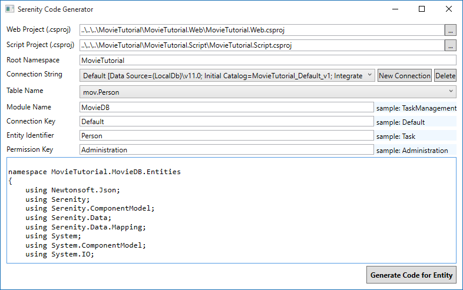
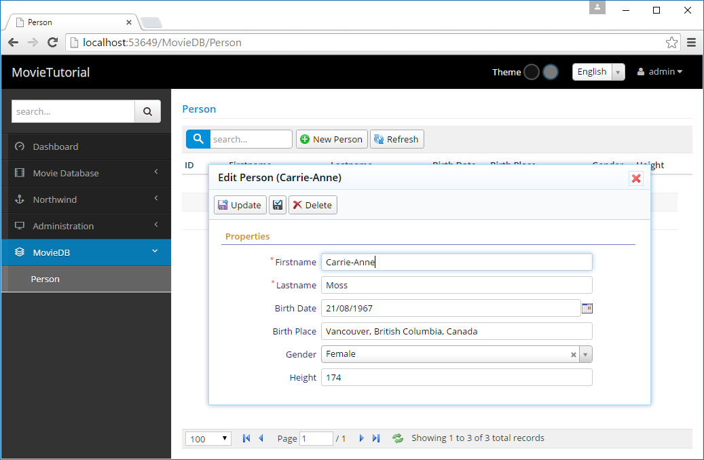
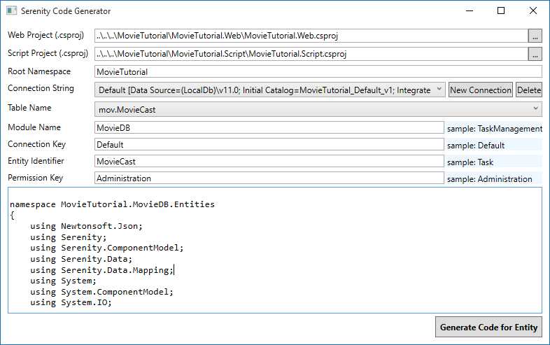
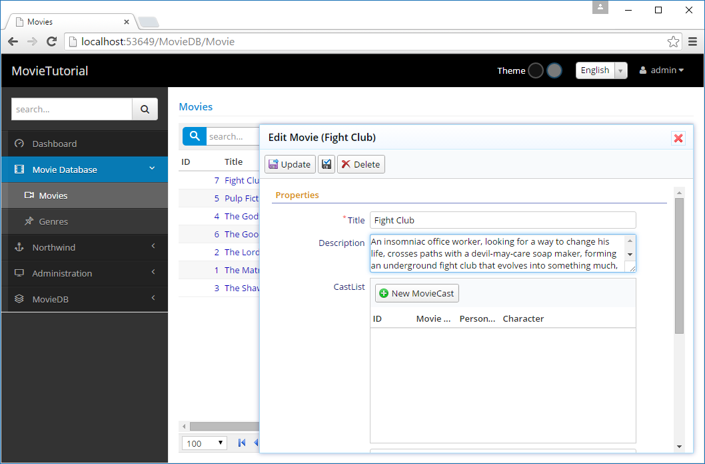
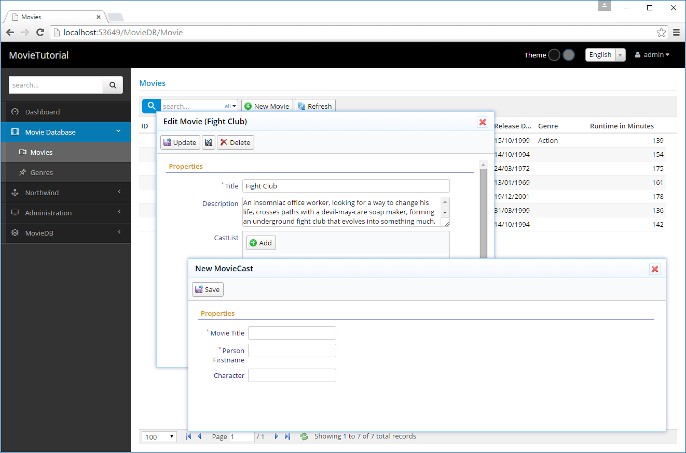
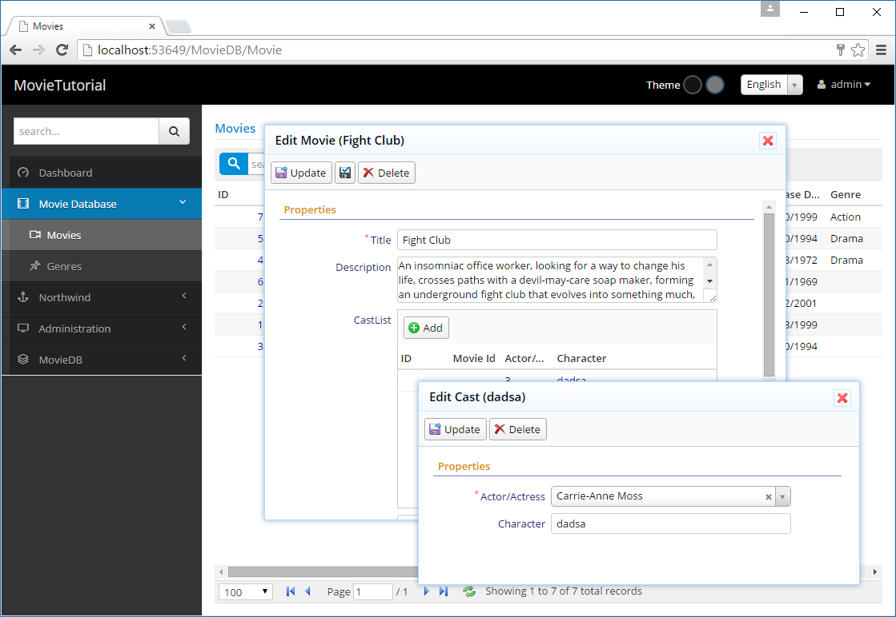

# The Cast and Characters They Played

If we wanted to keep a record of actors and the roles they played like this:

*Actor/Actress*|*Character *
--|--
Keanu Reeves|Neo       
Laurence Fishburne|Morpheus
Carrie-Anne Moss|Trinity

We need a table MovieCast with columns like:

*MovieCastId*|*MovieId*|*PersonId*|*Character*
--|--|--
...|...|...|...
11|2 (Matrix)|77 (Keanu Reeves)|Neo
12|2 (Matrix)|99 (Laurence Fisburne)|Morpheus
13|2 (Matrix)|30 (Carrie-Anne Moss)|Trinitity
...|...|...|...

It's clear that we also need a Person table as we'll keep actors/actresses by their ID.

> It's better to call it *Person* as actors/actresses might become directors, scenario writers and such later.


### Creating Person and MovieCast Tables

Now its time to create a migration with two tables:

MovieTutorial.Web/Modules/Common/Migrations/DefaultDB/DefaultDB_20151025_170200_PersonAndMovieCast.cs:

```cs
using FluentMigrator;
using System;

namespace MovieTutorial.Migrations.DefaultDB
{
    [Migration(20151025170200)]
    public class DefaultDB_20151025_170200_PersonAndMovieCast : Migration
    {
        public override void Up()
        {
            Create.Table("Person").InSchema("mov")
                .WithColumn("PersonId").AsInt32().Identity().PrimaryKey().NotNullable()
                .WithColumn("Firstname").AsString(50).NotNullable()
                .WithColumn("Lastname").AsString(50).NotNullable()
                .WithColumn("BirthDate").AsDateTime().Nullable()
                .WithColumn("BirthPlace").AsString(100).Nullable()
                .WithColumn("Gender").AsInt32().Nullable()
                .WithColumn("Height").AsInt32().Nullable();

            Create.Table("MovieCast").InSchema("mov")
                .WithColumn("MovieCastId").AsInt32().Identity().PrimaryKey().NotNullable()
                .WithColumn("MovieId").AsInt32().NotNullable()
                    .ForeignKey("FK_MovieCast_MovieId", "mov", "Movie", "MovieId")
                .WithColumn("PersonId").AsInt32().NotNullable()
                    .ForeignKey("FK_MovieCast_PersonId", "mov", "Person", "PersonId")
                .WithColumn("Character").AsString(50).Nullable();
        }
                
        public override void Down()
        {
        }
    }
}
```


### Generating Code For Person Table

First generate code for Person table:




### Changing Gender To Enumeration

Gender column in Person table should be an enumeration. Declare a Gender enumeration in *Gender.cs* next to *PersonRow.cs*:

```cs
using Serenity.ComponentModel;
using System.ComponentModel;

namespace MovieTutorial.MovieDB
{
    [EnumKey("MovieDB.Gender")]
    public enum Gender
    {
        [Description("Male")]
        Male = 1,
        [Description("Female")]
        Female = 2
    }
}
```

Change Gender property declaration in PersonRow.cs as below:

```cs
//...
        [DisplayName("Gender")]
        public Gender? Gender
        {
            get { return (Gender?)Fields.Gender[this]; }
            set { Fields.Gender[this] = (Int32?)value; }
        }
//...
```

For consistency, change type of Gender property in PersonForm.cs and PersonColumns.cs from Int32 to Gender.


### Rebuilding T4 Templates

As we declared a new enumeration and used it, we should rebuild solution, convert T4 templates

> If you are using a Serene version before 1.6.0, delete partial MovieRow declaration from MovieGrid.cs.

Now after launching your project, you should be able to enter actors:




### Declaring FullName Field

On the title of edit dialog, first name of the person is shown (*Carrie-Anne*). It would be nice to show full name. And also search with full name in grid.

So let's edit our PersonRow.cs:

```cs
namespace MovieTutorial.MovieDB.Entities
{
    //...
    public sealed class PersonRow : Row, IIdRow, INameRow
    {
        //... remove QuickSearch from FirstName
        [DisplayName("First Name"), Size(50), NotNull]
        public String Firstname
        {
            get { return Fields.Firstname[this]; }
            set { Fields.Firstname[this] = value; }
        }

        [DisplayName("Last Name"), Size(50), NotNull]
        public String Lastname
        {
            get { return Fields.Lastname[this]; }
            set { Fields.Lastname[this] = value; }
        }

        [DisplayName("Full Name"), Expression("(t0.Firstname + ' ' + t0.Lastname)"), QuickSearch]
        public String Fullname
        {
            get { return Fields.Fullname[this]; }
            set { Fields.Fullname[this] = value; }
        }
        
        //... change NameField to Fullname
        StringField INameRow.NameField
        {
            get { return Fields.Fullname; }
        }

        //...

        public class RowFields : RowFieldsBase
        {
            public readonly Int32Field PersonId;
            public readonly StringField Firstname;
            public readonly StringField Lastname;
            public readonly StringField Fullname;
            //...
        }
    }
}
```

We specified SQL expression *Expression("(t0.Firstname + ' ' + t0.Lastname)")* on top of Fullname property. Thus, it is a server side calculated field. 

By adding QuickSearch attribute to FullName, instead of Firstname, grid will now search by default on Fullname field.

But still dialog will show Firstname. For this, we need to make a change 

First transform templates, and then make change below in PersonDialog.cs:

```cs
namespace MovieTutorial.MovieDB
{
    using jQueryApi;
    using Serenity;
    using System.Collections.Generic;

    [IdProperty("PersonId"), NameProperty(PersonRow.Fields.Fullname)]
    [FormKey("MovieDB.Person"), LocalTextPrefix("MovieDB.Person"), Service("MovieDB/Person")]
    public class PersonDialog : EntityDialog<PersonRow>
    {
    }
}
```

For compile time checking, instead of writing *NameProperty("Fullname"), i used the field name generated by T4 templates.

We can also use similar information for other attributes:

```cs
namespace MovieTutorial.MovieDB
{
    using jQueryApi;
    using Serenity;
    using System.Collections.Generic;

    [IdProperty(PersonRow.IdProperty), NameProperty(PersonRow.NameProperty)]
    [FormKey(PersonForm.FormKey), LocalTextPrefix(PersonRow.LocalTextPrefix), Service(PersonService.BaseUrl)]
    public class PersonDialog : EntityDialog<PersonRow>
    {
    }
}
```

> PersonRow.NameProperty corresponds to NameField set at server side.

Now we have full name at the title of PersonDialog.

While we are still here, let's declare a LookupScript for Person table:

```cs
namespace MovieTutorial.MovieDB.Entities
{
    //...
    [LookupScript("MovieDB.Person")]
    public sealed class PersonRow : Row, IIdRow, INameRow
    //...
```

We'll use it for editing Movie cast later.

### Generating Code For MovieCast Table

Generate code for MovieCast table using *sergen*:




### Master/Detail Editing Logic For MovieCast Table

Up until now, we created a page for each table, and list and edit its records in that page. This time we are going to use a different strategy.

We'll list the cast for a movie in the Movie dialog and allow them to be edited along with the movie. Also, cast will be saved together with movie entity in one transaction.

Thus, cast editing will be in memory, and when user presses save button in Movie dialog, the movie and its cast will be saved to database in one shot.

> It would be possible to edit the cast independently, here we just want to show how it can be done. 

> For some types of master/detail records like order/detail, details shouldn't be allowed to be edited independently for consistency reasons. Serene already has a sample for this kind of editing in Northwind/Order dialog.


### Getting Required Base Classes From Serene Template 1.5.9

You will probably won't need this step, but as i started this tutorial before Order/Detail editing sample was in Serene, i have to take two classes from a recent template.

> This is just a sample on how to get new features from a more recent Serene template.

So i will create a new Serene application (NewApp), take these two files below from it:

```
NewApp.Script/Common/Helper/GridEditorBase.cs
NewApp.Script/Common/Helper/GridEditorDialog.cs
```

Copy them under 

```
MovieTutorial.Script/Common/Helper/GridEditorBase.cs
MovieTutorial.Script/Common/Helper/GridEditorDialog.cs
```

Include them in my project and replace *NewApp* text with *MovieTutorial*.

> Once these base classes are stable and flexible enough, they will be integrated to Serenity itself.


### Creating an Editor For Movie Cast List

Next to MovieCastGrid.cs (at MovieTutorial.Script/MovieDB/MovieCast/), create a file named *MovieCastEditor.cs* with contents below:

```cs
namespace MovieTutorial.MovieDB
{
    using Common;
    using jQueryApi;
    using Serenity;
    using System.Linq;

    [ColumnsKey("MovieDB.MovieCast"), LocalTextPrefix("MovieDB.MovieCast")]
    public class MovieCastEditor : GridEditorBase<MovieCastRow>
    {
        public MovieCastEditor(jQueryObject container)
            : base(container)
        {
        }
    }
}
```

To reference this new editor type from server side, rebuild solution, transform all templates and remove that useless MovieCastRow partial from MovieGrid.cs, and build again (i had to re-run templates)


### Using MovieCastEditor in Movie Form

Open MovieForm.cs, between *Description* and *Storyline* fields, add a CastList property like:

```cs
namespace MovieTutorial.MovieDB.Forms
{
    //...
    public class MovieForm
    {
        public String Title { get; set; }
        [TextAreaEditor(Rows = 3)]
        public String Description { get; set; }
        [MovieCastEditor]
        public List<Entities.MovieCastRow> CastList { get; set; }
        [TextAreaEditor(Rows = 8)]
        public String Storyline { get; set; }
        //...
    }
}
```

By putting *[MovieCastEditor]* attribute on top of CastList property, we specified that this property will be edited by our new MovieCastEditor type which is defined in script code.

> We could also write *[EditorType("MovieDB.MovieCast")]* but who really likes hard-coded strings? Not me...

Now build and launch your application. Open a movie dialog and you'll be greeted by our new editor:



OK, it looked easy, but i'll be honest, we are not even half the way. 

That *New MovieCast* button doesn't work, need to define a dialog for it, the grid columns are not  what i'd like them to be and the field and button titles are not so user friendly...

Also as this is not an integrated feature (yet), i have to handle a bit more plumbing like loading and saving cast list on server side.


### Configuring MovieCastEditor to Use MovieCastEditDialog

Get a copy of MovieCastDialog.cs as MovieCastEditDialog.cs and modify it like below:

```cs
namespace MovieTutorial.MovieDB
{
    using jQueryApi;
    using Common;
    using Serenity;
    using System.Collections.Generic;

    [NameProperty("Character"), FormKey("MovieDB.MovieCast"), LocalTextPrefix("MovieDB.MovieCast")]
    public class MovieCastEditDialog : GridEditorDialog<MovieCastRow>
    {
    }
}

```

Open MovieCastEditor.cs again and add a DialogType attribute and override GetAddButtonCaption:

```cs
namespace MovieTutorial.MovieDB
{
    //..
    [DialogType(typeof(MovieCastEditDialog))]
    public class MovieCastEditor : GridEditorBase<MovieCastRow>
    {
        public MovieCastEditor(jQueryObject container)
            : base(container)
        {
        }

        protected override string GetAddButtonCaption()
        {
            return "Add";
        }
    }
}
```

We specified that MovieCastEditor uses a MovieCastEditDialog by default which is also used by *Add* button. 

Now, instead of doing nothing, *Add* button shows a dialog.



This dialog needs some CSS formatting. Movie title and person name fields accepts integer inputs ( as they are actually MovieId and PersonId fields).

### Editing MovieCastForm.cs

We have *FormKey("MovieDB.MovieCast")* on top of our MovieCastEditDialog, so it uses MovieCastForm, which is also shared by MovieCastDialog.

It is possible to have multiple forms for one entity in Serenity. If i wanted to save *MovieCastForm* for *MovieCastDialog*, i would define a new form like *MovieCastEditForm*, but as i am going to eventually delete *MovieCastDialog* and *MovieCastGrid* classes, i don't mind.

Open MovieCastForm.cs and modify it:

```cs
namespace MovieTutorial.MovieDB.Forms
{
    using Serenity.ComponentModel;
    using System;

    [FormScript("MovieDB.MovieCast")]
    [BasedOnRow(typeof(Entities.MovieCastRow))]
    public class MovieCastForm
    {
        [LookupEditor(typeof(Entities.PersonRow))]
        public Int32 PersonId { get; set; }
        public String Character { get; set; }
    }
}
```

I have removed *MovieId* as this form is gonna be used in MovieDialog, so MovieCast entities will have the MovieId of the movie currently being edited in the MovieDialog automatically. Opening Lord of the Rings movie and adding a cast entry for the Matrix would be non-sense.

I have set editor type for PersonId field to a lookup editor and as i have already added a LookupScript attribute to MovieCastRow, i can reuse that information for setting the lookup key.

> We could have also written *[LookupEditor("MovieDB.Person")]*

Build solution, launch and now MovieCastEditDialog has a better editing experience. But still has a bad look and PersonId field has a title of *Person Id* (or Person Firstname with < 1.6.1), why?

> While writing this, a new Serene version (1.6.0) is out. I'm now updating Serenity packages to keep your tutorial experience up to date!

### Fixing the Look Of MovieCastEditDialog

Let's check *site.less* to understand why our MovieCastDialog is not styled.

```css
.s-MovieCastDialog {
    > .size { .widthAndMin(650px); }
    .dialog-styles(@h: auto, @l: 150px, @e: 400px);
    .s-PropertyGrid .categories { height: 260px; }
}
```

The CSS at the bottom of *site.less* is for the *MovieCastDialog*, not *MovieCastEditDialog*, because we defined this class ourselves, not with code generator.

We created a new dialog type, by copying MovieCastDialog and modifying it slightly, so now our new dialog has a CSS class of *s-MovieCastEditDialog*, but code generator only generated CSS rules for *s-MovieCastDialog*.

> Serenity dialogs automatically assigns CSS classes to dialog elements, by prefixing type name with *"s-"*. You can see this by inspecting the dialog in developer tools. MovieCastEditDialog has CSS classes of *s-MovieCastEditDialog* and *s-MovieDB-MovieCastEditDialog*, along with some like *ui-dialog*.

> *s-ModuleName-TypeName* CSS class helps with individual styling when two modules has a type with the same name.

As we are not gonna actually use MovieCastDialog (we'll delete it), let's rename the one in *site.less*:

```css
.s-MovieCastEditDialog {
    > .size { .widthAndMin(550px); }
    .dialog-styles(@h: auto, @l: 150px, @e: 300px);
    .s-PropertyGrid .categories { height: 160px; }
}
```

### Fixing the Dialog and PersonId Field Titles

Our dialog still has title *MovieCast*, we remember how to change it right?

Open *MovieCastRow.cs* and perform these modifications:

```cs
namespace MovieTutorial.MovieDB.Entities
{

    //..
    [ConnectionKey("Default"), DisplayName("Movie Casts"), InstanceName("Cast"), TwoLevelCached]
    //..
    public sealed class MovieCastRow : Row, IIdRow, INameRow
    {
        /...
        [DisplayName("Actor/Actress"), NotNull, 
            ForeignKey("[mov].Person", "PersonId"), LeftJoin("jPerson")]
        public Int32? PersonId
        {
            get { return Fields.PersonId[this]; }
            set { Fields.PersonId[this] = value; }
        }
    }
}

First, we changed DisplayName and InstanceName attributes to set dialog title. Also change PersonId field title to Actor/Actress. Now MovieCastEditDialog has a better look:




