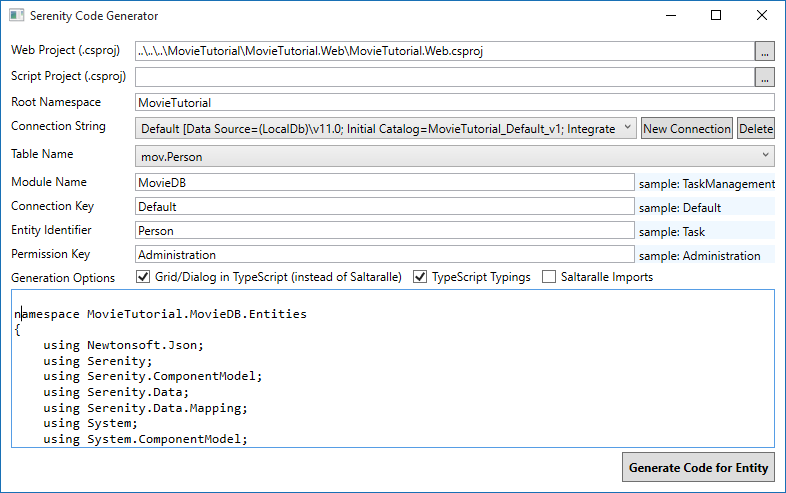
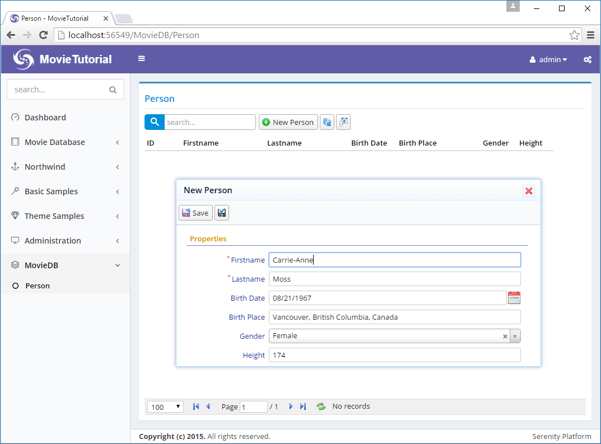
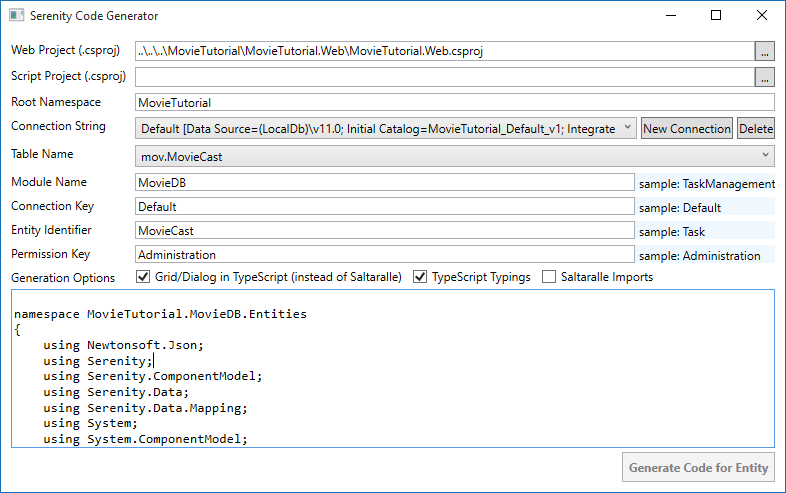
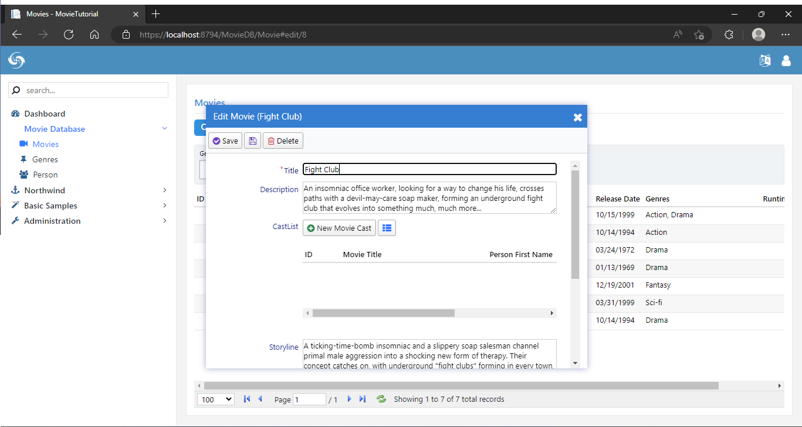
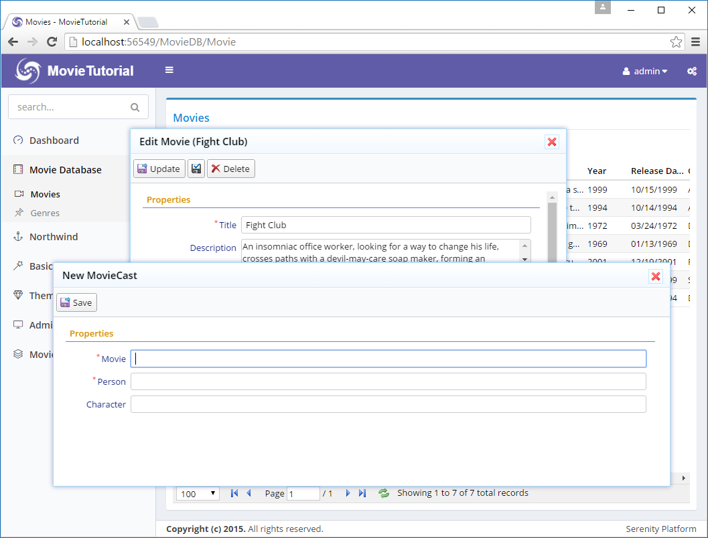
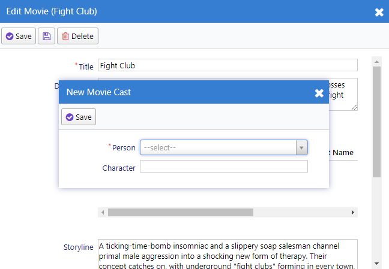
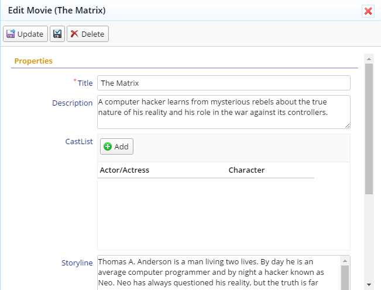
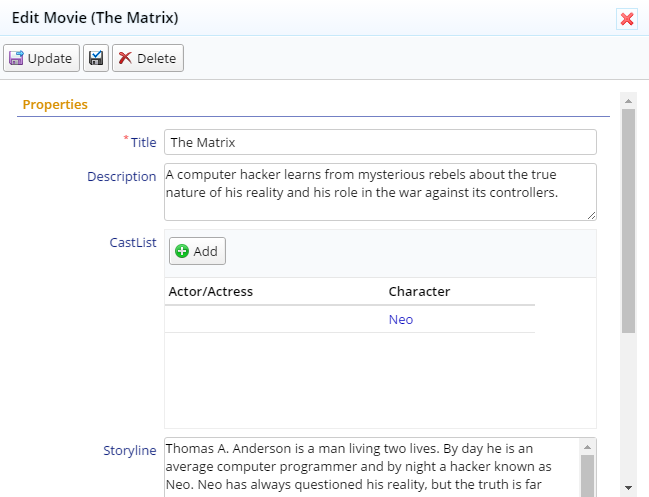
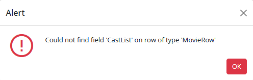

# The Cast and Characters They Played

If we wanted to keep a record of actors and the roles they played like this:

*Actor/Actress*|*Character *
--|--
Keanu Reeves|Neo       
Laurence Fishburne|Morpheus
Carrie-Anne Moss|Trinity

We need a table MovieCast with columns like:

*MovieCastId*|*MovieId*|*PersonId*|*Character*
--|--|--
...|...|...|...
11|2 (Matrix)|77 (Keanu Reeves)|Neo
12|2 (Matrix)|99 (Laurence Fisburne)|Morpheus
13|2 (Matrix)|30 (Carrie-Anne Moss)|Trinitity
...|...|...|...

It's clear that we also need a Person table as we'll keep actors/actresses by their ID.

> It's better to call it *Person* as actors/actresses might become directors, scenario writers and such later.


### Creating Person and MovieCast Tables

Now its time to create a migration with two tables:

MovieTutorial.Web/Modules/Common/Migrations/DefaultDB/ DefaultDB_20160528_141600_PersonAndMovieCast.cs:

```cs
using FluentMigrator;
using System;

namespace MovieTutorial.Migrations.DefaultDB
{
    [Migration(20160528141600)]
    public class DefaultDB_20160528_141600_PersonAndMovieCast : Migration
    {
        public override void Up()
        {
            Create.Table("Person").InSchema("mov")
                .WithColumn("PersonId").AsInt32().Identity()
                    .PrimaryKey().NotNullable()
                .WithColumn("Firstname").AsString(50).NotNullable()
                .WithColumn("Lastname").AsString(50).NotNullable()
                .WithColumn("BirthDate").AsDateTime().Nullable()
                .WithColumn("BirthPlace").AsString(100).Nullable()
                .WithColumn("Gender").AsInt32().Nullable()
                .WithColumn("Height").AsInt32().Nullable();

            Create.Table("MovieCast").InSchema("mov")
                .WithColumn("MovieCastId").AsInt32().Identity()
                    .PrimaryKey().NotNullable()
                .WithColumn("MovieId").AsInt32().NotNullable()
                    .ForeignKey("FK_MovieCast_MovieId", "mov", "Movie", "MovieId")
                .WithColumn("PersonId").AsInt32().NotNullable()
                    .ForeignKey("FK_MovieCast_PersonId", "mov", "Person", "PersonId")
                .WithColumn("Character").AsString(50).Nullable();
        }
                
        public override void Down()
        {
        }
    }
}
```


### Generating Code For Person Table

First generate code for Person table:




### Changing Gender To Enumeration

Gender column in Person table should be an enumeration. Declare a Gender enumeration in *Gender.cs* next to *PersonRow.cs*:

```cs
using Serenity.ComponentModel;
using System.ComponentModel;

namespace MovieTutorial.MovieDB
{
    [EnumKey("MovieDB.Gender")]
    public enum Gender
    {
        [Description("Male")]
        Male = 1,
        [Description("Female")]
        Female = 2
    }
}
```

Change Gender property declaration in PersonRow.cs as below:

```cs
//...
        [DisplayName("Gender")]
        public Gender? Gender
        {
            get { return (Gender?)Fields.Gender[this]; }
            set { Fields.Gender[this] = (Int32?)value; }
        }
//...
```

For consistency, change type of Gender property in PersonForm.cs and PersonColumns.cs from Int32 to Gender.


### Rebuilding T4 Templates

As we declared a new enumeration and used it, we should rebuild solution, convert T4 templates

Now after launching your project, you should be able to enter actors:




### Declaring FullName Field

On the title of edit dialog, first name of the person is shown (*Carrie-Anne*). It would be nice to show full name. And also search with full name in grid.

So let's edit our PersonRow.cs:

```cs
namespace MovieTutorial.MovieDB.Entities
{
    //...
    public sealed class PersonRow : Row, IIdRow, INameRow
    {
        //... remove QuickSearch from FirstName
        [DisplayName("First Name"), Size(50), NotNull]
        public String Firstname
        {
            get { return Fields.Firstname[this]; }
            set { Fields.Firstname[this] = value; }
        }

        [DisplayName("Last Name"), Size(50), NotNull]
        public String Lastname
        {
            get { return Fields.Lastname[this]; }
            set { Fields.Lastname[this] = value; }
        }

        [DisplayName("Full Name"), 
         Expression("(t0.Firstname + ' ' + t0.Lastname)"), QuickSearch]
        public String Fullname
        {
            get { return Fields.Fullname[this]; }
            set { Fields.Fullname[this] = value; }
        }
        
        //... change NameField to Fullname
        StringField INameRow.NameField
        {
            get { return Fields.Fullname; }
        }

        //...

        public class RowFields : RowFieldsBase
        {
            public readonly Int32Field PersonId;
            public readonly StringField Firstname;
            public readonly StringField Lastname;
            public readonly StringField Fullname;
            //...
        }
    }
}
```

We specified SQL expression *Expression("(t0.Firstname + ' ' + t0.Lastname)")* on top of Fullname property. Thus, it is a server side calculated field. 

By adding QuickSearch attribute to FullName, instead of Firstname, grid will now search by default on Fullname field.

But dialog will still show Firstname. We need to build and transform templates to make it show Fullname.

### Why Had to Transform Templates?

This will become more clear after looking at *PersonDialog.ts* file:

```ts
namespace MovieTutorial.MovieDB {
    
    @Serenity.Decorators.registerClass()
    @Serenity.Decorators.responsive()
    export class PersonDialog extends Serenity.EntityDialog<PersonRow, any> {
        protected getFormKey() { return PersonForm.formKey; }
        protected getIdProperty() { return PersonRow.idProperty; }
        protected getLocalTextPrefix() { return PersonRow.localTextPrefix; }
        protected getNameProperty() { return PersonRow.nameProperty; }
        protected getService() { return PersonService.baseUrl; }

        protected form = new PersonForm(this.idPrefix);
    }
}
```

Here we see that *getNameProperty()* method returns *PersonRow.nameProperty*. *PersonRow* typing in TypeScript is in a file (*MovieDB.PersonRow.ts*) generated by our T4 templates. 

Thus, unless we transform T4 templates, the name property change we did in *PersonRow.cs* won't be reflected in corresponding *MovieDB.PersonRow.ts* file under *Modules/Common/Imports/ServerTypings/ ServerTypings.tt":

```ts
namespace MovieTutorial.MovieDB {
    export interface PersonRow {
        PersonId?: number;
        Firstname?: string;
        Lastname?: string;
        Fullname?: string;
        //...
    }

    export namespace PersonRow {
        export const idProperty = 'PersonId';
        export const nameProperty = 'Fullname';
        export const localTextPrefix = 'MovieDB.Person';

        export namespace Fields {
            export declare const PersonId: string;
            //...
        }
        //...
    }
}
```

This metadata (name property of PersonRow) is transferred to TypeScript with a code file (MovieDB.PersonRow.ts) that is generated by ServerTypings.tt file. 

Similarly, *idProperty*, *localTextPrefix*, *Enum Types* etc. are also generated under *ServerTypings.tt*. Thus, when you make a change that affects a metadata in these generated files, you should transform T4 templates to transfer that information to TypeScript.

> You should always build before transforming, as T4 files uses output DLL of MovieTutorial.Web project. Otherwise you'll be generating code for an older version of your Web project.

### Declaring PersonRow Lookup Script
 
While we are still here, let's declare a LookupScript for Person table in PersonRow.cs:

```cs
namespace MovieTutorial.MovieDB.Entities
{
    //...
    [LookupScript("MovieDB.Person")]
    public sealed class PersonRow : Row, IIdRow, INameRow
    //...
```

We'll use it for editing Movie cast later.

Build and transform templates again, you'll see that *MovieDB.PersonRow.ts* now has a *getLookup()* method alongside with a new lookupKey property:

```ts
namespace MovieTutorial.MovieDB {
    export interface PersonRow {
        //...
    }

    export namespace PersonRow {
        export const idProperty = 'PersonId';
        export const nameProperty = 'Fullname';
        export const localTextPrefix = 'MovieDB.Person';
        export const lookupKey = 'MovieDB.Person';

        export function getLookup(): Q.Lookup<PersonRow> {
            return Q.getLookup<PersonRow>('MovieDB.Person');
        }

    //...
}
```

### Generating Code For MovieCast Table

Generate code for MovieCast table using *sergen*:



After generating code, as we don't need a separate page to edit movie cast table, you may delete files listed below:

```
MovieCastIndex.cshtml
MovieCastPage.cs
MovieDialog.ts
MovieGrid.ts
```

Again, build and transform templates.

### Master/Detail Editing Logic For MovieCast Table

Up until now, we created a page for each table, and list and edit its records in that page. This time we are going to use a different strategy.

We'll list the cast for a movie in the Movie dialog and allow them to be edited along with the movie. Also, cast will be saved together with movie entity in one transaction.

Thus, cast editing will be in memory, and when user presses save button in Movie dialog, the movie and its cast will be saved to database in one shot (one transaction).

> It would be possible to edit the cast independently, here we just want to show how it can be done. 

> For some types of master/detail records like order/detail, details shouldn't be allowed to be edited independently for consistency reasons. Serene already has a sample for this kind of editing in Northwind/Order dialog.


### Creating an Editor For Movie Cast List

Next to MovieCastRow.cs (at MovieTutorial.Web/Modules/MovieDB/MovieCast/), create a file named *MovieCastEditor.ts* with contents below:

```ts
/// <reference path="../../Common/Helpers/GridEditorBase.ts" />

namespace MovieTutorial.MovieDB {
    @Serenity.Decorators.registerEditor()
    export class MovieCastEditor 
          extends Common.GridEditorBase<MovieCastRow> {
        protected getColumnsKey() { return "MovieDB.MovieCast"; }
        protected getLocalTextPrefix() { return MovieCastRow.localTextPrefix; }

        constructor(container: JQuery) {
            super(container);
        }
    }
}   
```

This editor derives from *Common.GridEditorBase* class in Serene, which is a special grid type that is designed for in-memory editing. It is also the base class for Order Details editor used in Order dialog.

> The `<reference />` line at top of the file is important. TypeScript has ordering problems with input files. If we didn't put it there, TypeScript would sometimes output GridEditorBase after our MovieCastEditor, and we'd get runtime errors. 
> 
> As a rule of thumb, if you are deriving some class from another in your project (not Serenity classes), you should put a reference to file containing that base class.
>
> This helps TypeScript to convert GridEditorBase to javascript before other classes that might need it.

To reference this new editor type from server side, build and transform all templates.

> This base class might be integrated to Serenity in later versions. In that case, its namespace will become Serenity, instead of Serene or MovieTutorial.


### Using MovieCastEditor in Movie Form

Open MovieForm.cs, between *Description* and *Storyline* fields, add a CastList property like:

```cs
namespace MovieTutorial.MovieDB.Forms
{
    //...
    public class MovieForm
    {
        public String Title { get; set; }
        [TextAreaEditor(Rows = 3)]
        public String Description { get; set; }
        [MovieCastEditor]
        public List<Entities.MovieCastRow> CastList { get; set; }
        [TextAreaEditor(Rows = 8)]
        public String Storyline { get; set; }
        //...
    }
}
```

By putting *[MovieCastEditor]* attribute on top of CastList property, we specified that this property will be edited by our new MovieCastEditor type which is defined in TypeScript code.

> We could also write *[EditorType("MovieDB.MovieCast")]* but who really likes hard-coded strings? Not me...

Now build and launch your application. Open a movie dialog and you'll be greeted by our new editor:



OK, it looked easy, but i'll be honest, we are not even half the way. 

That *New MovieCast* button doesn't work, need to define a dialog for it. The grid columns are not what i'd like them to be and the field and button titles are not so user friendly...

Also we'll have to handle a bit more plumbing like loading and saving cast list on server side (we'll show the harder - manual way first, then we'll see how easy it can be using a service behavior).


### Configuring MovieCastEditor to Use MovieCastEditDialog

Create a *MovieCastEditDialog.ts* file next to *MovieCastEditor.ts* and modify it like below:

```ts
/// <reference path="../../Common/Helpers/GridEditorDialog.ts" />

namespace MovieTutorial.MovieDB {

    @Serenity.Decorators.registerClass()
    export class MovieCastEditDialog extends 
          Common.GridEditorDialog<MovieCastRow> {
        protected getFormKey() { return MovieCastForm.formKey; }
        protected getNameProperty() { return MovieCastRow.nameProperty; }
        protected getLocalTextPrefix() { return MovieCastRow.localTextPrefix; }

        protected form: MovieCastForm;

        constructor() {
            super();
            this.form = new MovieCastForm(this.idPrefix);
        }
    }
}
```

We are using another base class from Serene, *Common.GridEditorDialog* which is also used by OrderDetailEditDialog.

Open *MovieCastEditor.ts* again, add a getDialogType method and override getAddButtonCaption:

```ts
/// <reference path="../../Common/Helpers/GridEditorBase.ts" />

namespace MovieTutorial.MovieDB {
    @Serenity.Decorators.registerEditor()
    export class MovieCastEditor 
          extends Common.GridEditorBase<MovieCastRow> {
        protected getColumnsKey() { return "MovieDB.MovieCast"; }
        protected getDialogType() { return MovieCastEditDialog; }
        protected getLocalTextPrefix() { return MovieCastRow.localTextPrefix; }

        constructor(container: JQuery) {
            super(container);
        }

        protected getAddButtonCaption() {
            return "Add";
        }
    }
}
```

We specified that MovieCastEditor uses a MovieCastEditDialog by default which is also used by *Add* button. 

Now, instead of doing nothing, *Add* button shows a dialog.



This dialog needs some CSS formatting. Movie title and person name fields accepts integer inputs (as they are actually MovieId and PersonId fields).

### Editing MovieCastForm.cs

*getFormKey()* method of  *MovieCastEditDialog* returns *MovieCastForm.formKey*, so it currently uses *MovieCastForm.cs* generated by Sergen.

It is possible to have multiple forms for one entity in Serenity. If i wanted to save *MovieCastForm* for some other standalone dialog, e.g. *MovieCastDialog* (which we actually deleted), i would prefer to define a new form like *MovieCastEditForm*, but this is not the case.

Open MovieCastForm.cs and modify it:

```cs
namespace MovieTutorial.MovieDB.Forms
{
    using Serenity.ComponentModel;
    using System;
    using System.ComponentModel;

    [FormScript("MovieDB.MovieCast")]
    [BasedOnRow(typeof(Entities.MovieCastRow))]
    public class MovieCastForm
    {
        public Int32 PersonId { get; set; }
        public String Character { get; set; }
    }
}
```

I have removed *MovieId* as this form is going to be used in *MovieCastEditDialog*, so *MovieCast* entities will have the *MovieId* of the movie currently being edited in the *MovieDialog* automatically. Opening *Lord of the Rings* movie and adding a cast entry for *the Matrix* would be non-sense.

Next, edit MovieCastRow.cs:

```cs
    [ConnectionKey("Default"), TwoLevelCached]
    [DisplayName("Movie Casts"), InstanceName("Cast")]
    [ReadPermission("Administration")]
    [ModifyPermission("Administration")]
    public sealed class MovieCastRow : Row, IIdRow, INameRow
    {
        //...
        [DisplayName("Actor/Actress"), NotNull, ForeignKey("[mov].[Person]", "PersonId")]
        [LeftJoin("jPerson"), TextualField("PersonFirstname")]
        [LookupEditor(typeof(PersonRow))]
        public Int32? PersonId
        {
            get { return Fields.PersonId[this]; }
            set { Fields.PersonId[this] = value; }
        }
```

I have set editor type for PersonId field to a lookup editor and as i have already added a LookupScript attribute to *PersonRow*, i can reuse that information for setting the lookup key. 

> We could have also written *[LookupEditor("MovieDB.Person")]*

Changed *PersonId* display name to *Actor/Actress*.

Also changed *DisplayName* and *InstanceName* attributes for row to set dialog title. 

Build solution, launch and now MovieCastEditDialog has a better editing experience. But still too big in width and height.


### Fixing the Look Of MovieCastEditDialog

Let's check *site.less* to understand why our *MovieCastEditDialog* is not styled.

```css
.s-MovieDB-MovieCastDialog {
    > .size { width: 650px; }
    .caption { width: 150px; }
}
```

The CSS at the bottom of *site.less* is for the *MovieCastDialog*, not *MovieCastEditDialog*, because we defined this class ourselves, not with code generator.

We created a new dialog type *MovieCastEditDialog*, so now our new dialog has a CSS class of *s-MovieDB-MovieCastEditDialog*, but code generator only generated CSS rules for *s-MovieDB-MovieCastDialog*.

> Serenity dialogs automatically assigns CSS classes to dialog elements, by prefixing type name with *"s-"*. You can see this by inspecting the dialog in developer tools. MovieCastEditDialog has CSS classes of *s-MovieCastEditDialog* and *s-MovieDB-MovieCastEditDialog*, along with some other like *ui-dialog*.

> *s-ModuleName-TypeName* CSS class helps with individual styling when two modules has a type with the same name.

As we are not gonna actually use MovieCastDialog (we deleted it), let's rename the one in *site.less*:

```css
.s-MovieDB-MovieCastEditDialog {
    > .size { width: 450px; }
    .caption { width: 120px; }
    .s-PropertyGrid .categories { height: 120px; }
}
```

Now *MovieCastEditDialog* has a better look:




### Fixing MovieCastEditor Columns

MovieCastEditor is currently using columns defined in *MovieCastColumns.cs* (because it returns "MovieDB.MovieCast" in getColumnsKey() method.

We have MovieCastId, MovieId, PersonId (shown as Actor/Actress) and Character columns there. It is better to show only Actor/Actress and Character columns.

We want to show actors fullname instead of PersonId (integer value), so we'll declare this field in MovieCastRow.cs first:

```cs
namespace MovieTutorial.MovieDB.Entities
{
    //...
    public sealed class MovieCastRow : Row, IIdRow, INameRow
    {
        // ...
        
        [DisplayName("Person Firstname"), Expression("jPerson.Firstname")]
        public String PersonFirstname
        {
            get { return Fields.PersonFirstname[this]; }
            set { Fields.PersonFirstname[this] = value; }
        }

        [DisplayName("Person Lastname"), Expression("jPerson.Lastname")]
        public String PersonLastname
        {
            get { return Fields.PersonLastname[this]; }
            set { Fields.PersonLastname[this] = value; }
        }

        [DisplayName("Actor/Actress"), 
         Expression("(jPerson.Firstname + ' ' + jPerson.Lastname)")]
        public String PersonFullname
        {
            get { return Fields.PersonFullname[this]; }
            set { Fields.PersonFullname[this] = value; }
        }

        // ...
        
        public class RowFields : RowFieldsBase
        {
            // ...
            public readonly StringField PersonFirstname;
            public readonly StringField PersonLastname;
            public readonly StringField PersonFullname;
            // ...
        }
    }
}
```

and modify MovieCastColumns.cs:

```cs
namespace MovieTutorial.MovieDB.Columns
{
    using Serenity.ComponentModel;
    using System;

    [ColumnsScript("MovieDB.MovieCast")]
    [BasedOnRow(typeof(Entities.MovieCastRow))]
    public class MovieCastColumns
    {
        [EditLink, Width(220)]
        public String PersonFullname { get; set; }
        [EditLink, Width(150)]
        public String Character { get; set; }
    }
}
```

Rebuild and cast grid has better columns:



Now try adding an actor/actress, for example, Keanu Reeves / Neo:



Why Actor/Actress column is empty??

### Resolving Empty Actor/Actress Column Problem

Remember that we are editing in-memory. There is no service call involved here. So, grid is displaying whatever entity is sent back to it from the dialog.

When you click the save button, dialog builds an entity to save like this:

```json
{
    PersonId: 7,
    Character: 'Neo'
}
```

These fields corresponds to the form fields you previously set in MovieCastForm.cs:

```cs
public class MovieCastForm
{
    public Int32 PersonId { get; set; }
    public String Character { get; set; }
}
```

But in grid, we are showing these columns:

```cs
public class MovieCastColumns
{
    public String PersonFullname { get; set; }
    public String Character { get; set; }
}
```

There is no PersonFullname field in this entity, so grid can't display its value.

We need to set PersonFullname ourself. Let's first transform T4 templates to have access to PersonFullname field that we recently added, then edit MovieCastEditor.ts:

```ts
/// <reference path="../../Common/Helpers/GridEditorBase.ts" />

namespace MovieTutorial.MovieDB {
    @Serenity.Decorators.registerEditor()
    export class MovieCastEditor extends Common.GridEditorBase<MovieCastRow> {
        //...

        protected validateEntity(row: MovieCastRow, id: number) {
            if (!super.validateEntity(row, id))
                return false;        

            row.PersonFullname = PersonRow.getLookup()
                .itemById[row.PersonId].Fullname;
                
            return true;
        }        
    }
}   
```

ValidateEntity is a method from our GridEditorBase class in Serene. This method is called when Save button is clicked to validate the entity, just before it is going to be added to the grid. But we are overriding it here for another purpose (to set PersonFullname field value) rather than validation.

As we saw before, our entity has PersonId and Character fields filled in. We can use the value of PersonId field to determine the person fullname.

For this, we need a dictionary that maps PersonId to their Fullname values. Fortunately, person lookup has such a dictionary. We can access the lookup for PersonRow through its *getLookup* method.

> Another way to access person lookup is by *Q.getLookup('MovieDB.Person')*. The one in PersonRow is just a shortcut defined by T4 templates.

All lookups has a *itemById* dictionary that allows you to access an entity of that type by its ID.

> Lookups are a simple way to share server side data with client side. But they are only suitable for small sets of data. 

> If a table has hundreds of thousands of records, it wouldn't be reasonable to define a lookup for it. In that case, we would use a service request to query a record by its ID.


### Defining CastList in MovieRow

While having a Movie dialog open, and at least one cast in CastList, click save button, and you'll get such an error:



This error is raised from -> Row deserializer (JsonRowConverter for JSON.NET) at server side.

We defined CastList property in MovieForm, but have no corresponding field declaration in MovieRow. So deserializer can't find where to write *CastList* value that is received from client side.

If you open developer tools with F12, click Network tab, and watch AJAX request after clicking Save button, you'll see that it has such a request payload:

```json
{
    "Entity": {
        "Title": "The Matrix",
        "Description": "A computer hacker...",
        "CastList": [
            {
                "PersonId":"1",
                "Character":"Neo",
                "PersonFullname":"Keanu Reeves"
            }
        ],
        "Storyline":"Thomas A. Anderson is a man living two lives...",
        "Year":1999,
        "ReleaseDate":"1999-03-31",
        "Runtime":136,
        "GenreId":"",
        "Kind":"1",
        "MovieId":1
    }
}
```

Here, CastList property can't be deserialized at server side. So we need to declare it in MovieRow.cs:

```cs
namespace MovieTutorial.MovieDB.Entities
{
    // ...
    public sealed class MovieRow : Row, IIdRow, INameRow
    {
        [DisplayName("Cast List"), SetFieldFlags(FieldFlags.ClientSide)]
        public List<MovieCastRow> CastList
        {
            get { return Fields.CastList[this]; }
            set { Fields.CastList[this] = value; }
        }

        public class RowFields : RowFieldsBase
        {
            // ...
            public readonly RowListField<MovieCastRow> CastList;
            // ...
        }
    }
}
```

We defined a CastList property that will accept a *List* of MovieCastRow objects. The type of *Field* class that is used for such row list properties is *RowListField*.

By adding *[SetFieldFlags(FieldFlags.ClientSide)]* attribute, we specified that this field is not available directly in database table, thus can't be selected through simple SQL queries. It is analogous to an unmapped field in other ORM systems.

Now, when you click the Save button, you will not get an error.

But reopen the Matrix entity you just saved. There is no cast entry there. What happened to Neo?

As this is an unmapped field, so movie *Save* service just ignored the CastList property.

> If you remember that in prior section, our GenreList also was an unmapped field, but somehow it worked there. Thats because we made use of a behavior, LinkedSetRelationBehavior with that property. 
> 
> Here we are sampling what would happen if we had no such service behavior.


### Handling Save for CastList

Open *MovieRepository.cs*, find the empty *MySaveHandler* class, and modify it like below:

```cs
private class MySaveHandler : SaveRequestHandler<MyRow>
{
    protected override void AfterSave()
    {
        base.AfterSave();

        if (Row.CastList != null)
        {
            var mc = Entities.MovieCastRow.Fields;
            var oldList = IsCreate ? null :
                Connection.List<Entities.MovieCastRow>(
                    mc.MovieId == this.Row.MovieId.Value);

            new Common.DetailListSaveHandler<Entities.MovieCastRow>(
                oldList, Row.CastList,
                x => x.MovieId = Row.MovieId.Value).Process(this.UnitOfWork);
        }
    }
}
```

MySaveHandler, processes both CREATE (insert), and UPDATE service requests for Movie rows. As most of its logic is handled by base SaveRequestHandler class, its class definition was empty before.

We should first wait for Movie entity to be inserted / updated successfully, before inserting / updating the cast list. Thus, we are including our customized code by overriding the base *AfterSave* method.

> If this is CREATE (insert) operation, we need the MovieId field value to reuse in MovieCast records. As MovieId is an IDENTITY field, it is only available after inserting the movie record.

As we are editing cast list in memory (client-side), this will be a batch update. 

We need to compare old list of the cast records for this movie to the new list of cast records, and INSERT/UPDATE/DELETE them.

Let's say we had cast records A, B, C, D in database for movie X.

User did some modifications in edit dialogs to cast list, and now we have A, B, D, E, F.

So we need to update A, B, D (in case character / actor changed), delete C, and insert new records E and F.

Fortunately, DetailListSaveHandler class that is defined in Serene, handles all these comparisons and performs insert/update/delete operations automatically (by ID values). Otherwise we would have to write much more code here.

To get a list of old records, we need to query database if this is an UPDATE movie operation. If this is a CREATE movie operation there shouldn't be any old cast record.

We are using *Connection.List< Entities.MovieCastRow >* extension method. *Connection* here is a property of SaveRequestHandler that returns the current connection used. *List* selects records that matches the specified criteria (*mc.MovieId == this.Row.MovieId.Value*). 

*this.Row* refers to currently inserted / updated record (movie) with its new field values, so it contains the MovieId value (new or existing).

To update cast records, we are creating a *DetailListHandler* object, with old cast list, new cast list, and a delegate to set the MovieId field value in a cast record. This is to link new cast records with the current movie.

Then we call DetailListHandler.Process with current unit of work. UnitOfWork is a special object that wraps the current connection/transaction. 

> All Serenity CREATE/UPDATE/DELETE handlers works with implicit transactions (IUnitOfWork).

### Handling Retrieve for CastList

We are not done yet. When a Movie entity is clicked in movie grid, movie dialog loads the movie record by calling the movie *Retrieve* service. As CastList is an unmapped field, even if we saved them properly, they won't be loaded into the dialog.

We need to also edit *MyRetrieveHandler* class in MovieRepository.cs:

```cs
private class MyRetrieveHandler : RetrieveRequestHandler<MyRow>
{
    protected override void OnReturn()
    {
        base.OnReturn();

        var mc = Entities.MovieCastRow.Fields;
        Row.CastList = Connection.List<Entities.MovieCastRow>(q => q
            .SelectTableFields()
            .Select(mc.PersonFullname)
            .Where(mc.MovieId == Row.MovieId.Value));
    }
}
```

Here, we are overriding OnReturn method, to inject CastList into movie row just before returning the it from retrieve service.

I used a different overload of Connection.List extension, which allows me to modify the select query.

By default, List selects all table fields (not foreign view fields coming from other tables), but to show actor name, i needed to also select *PersonFullName* field.

Now build the solution, and we can finally list / edit the cast.


### Handling Delete for CastList

When you try to delete a Movie entity, you'll get foreign key errors. You could use a "CASCADE DELETE" foreign key while creating MovieCast table. But we'll handle this at repository level again:

```cs
private class MyDeleteHandler : DeleteRequestHandler<MyRow>
{
    protected override void OnBeforeDelete()
    {
        base.OnBeforeDelete();

        var mc = Entities.MovieCastRow.Fields;
        foreach (var detailID in Connection.Query<Int32>(
            new SqlQuery()
                .From(mc)
                .Select(mc.MovieCastId)
                .Where(mc.MovieId == Row.MovieId.Value)))
        {
            new DeleteRequestHandler<Entities.MovieCastRow>().Process(this.UnitOfWork,
                new DeleteRequest
                {
                    EntityId = detailID
                });
        }
    }
}
```


The way we implemented this master/detail handling is not very intuitive and included several manual steps at repository layer. Keep on reading to see how easily it could be done by using an integrated feature (MasterDetailRelationAttribute).


### Handling Save / Retrieve / Delete With a Behavior

Master/detail relations are an integrated feature (at least on server side), so instead of manually overriding Save / Retrieve and Delete handlers, i'll use an attribute, *MasterDetailRelation*.

Open MovieRow.cs and modify *CastList* property:

```cs
[MasterDetailRelation(foreignKey: "MovieId", IncludeColumns = "PersonFullname")]
[DisplayName("Cast List"), SetFieldFlags(FieldFlags.ClientSide)]
public List<MovieCastRow> CastList
{
    get { return Fields.CastList[this]; }
    set { Fields.CastList[this] = value; }
}
```

We specified that this field is a detail list of a master/detail relation and master ID field (foreignKey) of the detail table is *MovieId*.

Now undo all changes we made in MovieRepository.cs:

```cs
private class MySaveHandler : SaveRequestHandler<MyRow> { }
private class MyDeleteHandler : DeleteRequestHandler<MyRow> { }
private class MyRetrieveHandler : RetrieveRequestHandler<MyRow> { }
```

In our *MasterDetailRelation* attribute, we specified an extra property, *IncludeColumns*:

```
[MasterDetailRelation(foreignKey: "MovieId", IncludeColumns = "PersonFullname")]
```

This ensures that *PersonFullname* field on cast list is selected on retrieve. Otherwise, it wouldn't be loaded as only table fields are selected by default. When you open a movie dialog with existing cast list, full name would be empty.

> Make sure you add any view field you use in grid columns to IncludeColumns. Put comma between names of multiple fields, e.g. IncludeColumns = "FieldA, FieldB, FieldC".

Now build your project and you'll see that same functionality works with much less code.

*MasterDetailRelationAttribute* triggers an instrinsic (automatic) behavior, *MasterDetailRelationBehavior* which intercepts Retrieve/Save/Delete handlers and methods we had overriden before and performs similar operations.

So we did the same thing, but this time *declaratively*, not *imperatively* (what should be done, instead of how to do it)

> https://en.wikipedia.org/wiki/Declarative_programming

> We'll see how to write your own request handler behaviors in following chapters. 
