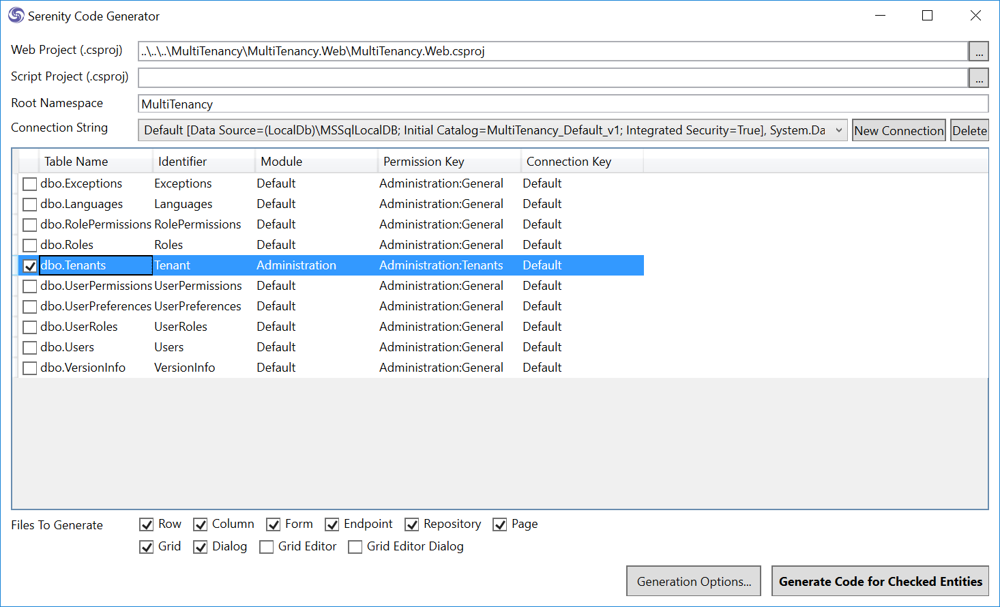

# Generating Code for Tenants Table

Launch *Sergen* and generate code for *Tenants* table in *Default* connection:



Next we'll define a lookup script in *TenantRow* and set DisplayName property to *Tenants*:

```csharp
namespace MultiTenancy.Administration.Entities
{
    //...
    [ConnectionKey("Default"), DisplayName("Tenants"), 
     InstanceName("Tenant"), TwoLevelCached]
    [LookupScript("Administration.Tenant")]
    public sealed class TenantRow : Row, IIdRow, INameRow
    {
        [DisplayName("Tenant Id"), Identity]
        public Int32? TenantId
        {
            get { return Fields.TenantId[this]; }
            set { Fields.TenantId[this] = value; }
        }

//...
```

Let's define a Administration:Tenants permission that only *admin* user will have (in AdministrationPermissionKeys.cs):

```csharp
namespace MultiTenancy.Administration
{
    public class PermissionKeys
    {
        public const string Security = "Administration:Security";
        public const string Translation = "Administration:Translation";
        public const string Tenants = "Administration:Tenants";
    }
}
```

And use it on TenantRow:

```csharp
[ConnectionKey("Default"), DisplayNahme("Tenants"), 
 InstanceName("Tenant"), TwoLevelCached]
[ReadPermission(PermissionKeys.Tenants)]
[ModifyPermission(PermissionKeys.Tenants)]
[LookupScript("Administration.Tenant")]
public sealed class TenantRow : Row, IIdRow, INameRow
{

```
