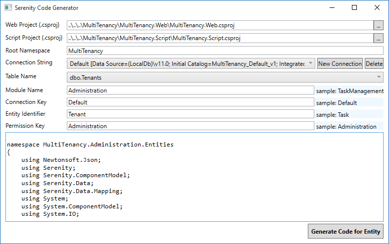

# Generating Code for Tenants Table

Launch *Sergen* and generate code for *Tenants* table in *Default* connection:



Next we'll define a lookup script in *TenantRow*:

```cs

namespace MultiTenancy.Administration.Entities
{
    //...
    [LookupScript("Administration.Tenant")]
    public sealed class TenantRow : Row, IIdRow, INameRow
    {
        [DisplayName("Tenant Id"), Identity]
        public Int32? TenantId
        {
            get { return Fields.TenantId[this]; }
            set { Fields.TenantId[this] = value; }
        }

//...
```

