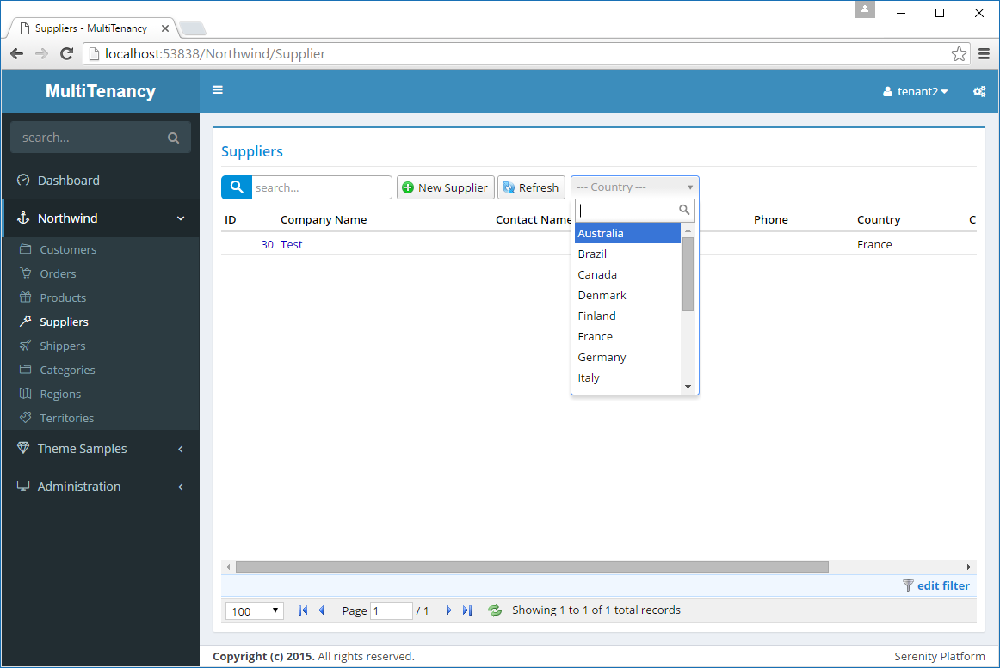

# Handling Lookup Scripts

If we open *Suppliers* page now, we'll see that *tenant2* can only see suppliers that belongs to its tenant. But on top right of the grid, in country dropdown, all countries are listed:



This data is feed to script side through a dynamic script. It doesn't load this data with *List* services we handled recently.

The lookup script that produces this dropdown is defined in *SupplierCountryLookup.cs*:

```cs
namespace MultiTenancy.Northwind.Scripts
{
    using Serenity.ComponentModel;
    using Serenity.Data;
    using Serenity.Web;

    [LookupScript("Northwind.SupplierCountry")]
    public class SupplierCountryLookup : 
        RowLookupScript<Entities.SupplierRow>
    {
        public SupplierCountryLookup()
        {
            IdField = TextField = "Country";
        }

        protected override void PrepareQuery(SqlQuery query)
        {
            var fld = Entities.SupplierRow.Fields;
            query.Distinct(true)
                .Select(fld.Country)
                .Where(
                    new Criteria(fld.Country) != "" &
                    new Criteria(fld.Country).IsNotNull());
        }

        protected override void ApplyOrder(SqlQuery query)
        {
        }
    }
}
```

> We couldn't use a simple [LookupScript] attribute on a row class here, because there is actually no country table in Northwind database. We are collecting country names from existing records in Supplier table using distinct.

We should filter its query by current tenant.

But this lookup class derives from *RowLookupScript* base class. Let's create a new base class, to prepare for other lookup scripts that we'll have to handle later.

```cs
namespace MultiTenancy.Northwind.Scripts
{
    using Administration;
    using Serenity;
    using Serenity.Data;
    using Serenity.Web;
    using System;

    public abstract class MultiTenantRowLookupScript<TRow> : 
        RowLookupScript<TRow>
        where TRow : Row, IMultiTenantRow, new()
    {
        public MultiTenantRowLookupScript()
        {
            Expiration = TimeSpan.FromDays(-1);
        }

        protected override void PrepareQuery(SqlQuery query)
        {
            base.PrepareQuery(query);
            AddTenantFilter(query);
        }

        protected void AddTenantFilter(SqlQuery query)
        {
            var r = new TRow();
            query.Where(r.TenantIdField ==
                ((UserDefinition)Authorization.UserDefinition).TenantId);
        }

        public override string GetScript()
        {
            return TwoLevelCache.GetLocalStoreOnly("MultiTenantLookup:" + 
                    this.ScriptName + ":" +
                    ((UserDefinition)Authorization.UserDefinition).TenantId, 
                    TimeSpan.FromHours(1),
                new TRow().GetFields().GenerationKey, () =>
                {
                    return base.GetScript();
                });
        }
    }
}
```

This will be our base class for multi-tenant lookup scripts.

We first set expiration to a negative timespan to disable caching. Why do we have to do this? Because dynamic script manager caches lookup scripts by their keys. But we'll have multiple versions of a lookup script based on TenantId values.

We'll turn off caching at dynamic script manager level and handle caching ourself in GetScript method. In *GetScript* method, we are using *TwoLevelCache.GetLocalStoreOnly* to call base method, that generates our lookup script, and cache its result with a cache key including *TenantId*.

> See relevant section for more info about TwoLevelCache class.


By overriding, *PrepareQuery* method, we are adding a filter by current *TenantId*, just like we did in list service handlers.

Now its time to rewrite our *SupplierCountryLookup* using this new base class:

```cs
namespace MultiTenancy.Northwind.Scripts
{
    using Serenity.ComponentModel;
    using Serenity.Data;
    using Serenity.Web;

    [LookupScript("Northwind.SupplierCountry")]
    public class SupplierCountryLookup : 
        MultiTenantRowLookupScript<Entities.SupplierRow>
    {
        public SupplierCountryLookup()
        {
            IdField = TextField = "Country";
        }

        protected override void PrepareQuery(SqlQuery query)
        {
            var fld = Entities.SupplierRow.Fields;
            query.Distinct(true)
                .Select(fld.Country)
                .Where(
                    new Criteria(fld.Country) != "" &
                    new Criteria(fld.Country).IsNotNull());

            AddTenantFilter(query);
        }

        protected override void ApplyOrder(SqlQuery query)
        {
        }
    }
}
```

We just called *AddTenantFilter* method manually, because we weren't calling base *PrepareQuery* method here (so it won't be called by base class).

> Please first delete *Northwind.DynamicScripts.cs* file, if you have it.

There are several more similar lookup scripts in *CustomerCountryLookup*, *CustomerCityLookup*,
*OrderShipCityLookup*, *OrderShipCountryLookup*. I'll do similar changes in them. Change base class to *MultiTenantRowLookupScript* and call *AddTenantFilter* in *PrepareQuery* method.

We now have one more problem to solve. If you open *Orders* page, you'll see that *Ship Via* and *Employee* filter dropdowns still lists records from other tenants. It is because we defined their lookup scripts by a [LookupScript] attribute on their rows.

Let's fix employee lookup first. Remove [LookupScript] attribute from *EmployeeRow*.

```cs
[ConnectionKey("Northwind"), DisplayName("Employees"), InstanceName("Employee"), TwoLevelCached]
[ReadPermission(Northwind.PermissionKeys.General)]
[ModifyPermission(Northwind.PermissionKeys.General)]
public sealed class EmployeeRow : Row, IIdRow, INameRow, IMultiTenantRow
{
    //...
```

And define a new lookup in file *EmployeeLookup* next to *EmployeeRow.cs*:

```cs

namespace MultiTenancy.Northwind.Scripts
{
    using Entities;
    using Serenity.ComponentModel;
    using Serenity.Web;

    [LookupScript("Northwind.Employee")]
    public class EmployeeLookup : MultiTenantRowLookupScript<EmployeeRow>
    {
    }
}
```

We don't have to override anything, as base class will handle everything for us. By default, *LookupScript* attribute on rows, defines a new automatic lookup script class by using *RowLookupScript* as base class. 

As there is no way to override this base class per row, we defined our lookup script class explicitly, and used *MultiTenantRowLookupScript* as base class.

Now if you build and run application, you'll have an error:

```
'MultiTenancy.Northwind.Entities.EmployeeRow' type doesn't have a 
[LookupScript] attribute, so it can't be used with a LookupEditor!
```

This is because we don't have a [LookupScript] attribute on top of our row class, but in some places like forms, we used [LookupEditor(typeof(EmployeeRow))].

Open *OrderRow.cs* and you'll see this attribute on top of *EmployeeID* property. Change it to *[LookupEditor("Northwind.Employee")]*.

We'll do similar for *ShipperRow*. Remove *LookupScript* attribute and define class below:

```cs

namespace MultiTenancy.Northwind.Scripts
{
    using Entities;
    using Serenity.ComponentModel;
    using Serenity.Web;

    [LookupScript("Northwind.Shipper")]
    public class ShipperLookup : 
        MultiTenantRowLookupScript<ShipperRow>
    {
    }
}
```