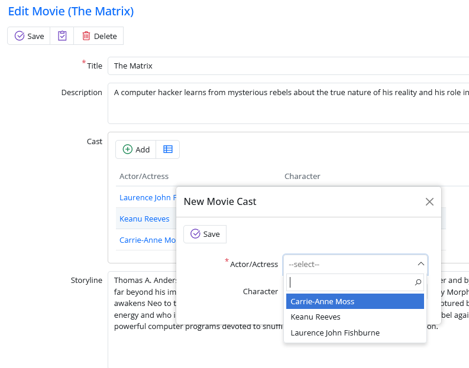

# Handling Lookup Scripts

If we open _Movie_ page now, we'll see that _tenant2_ can only see movies that belongs to its tenant. But when you try to add a cast to a movie, all persons are shown.:



This data is feed to script side through a dynamic script. It doesn't load this data with _List_ services we handled recently.

The lookup script that produces this dropdown is defined on _PersonRow.cs_:

```csharp
namespace MultiTenancy.MovieDB
{
    [ConnectionKey("Default"), Module("MovieDB"), TableName("[mov].[Person]")]
    [DisplayName("Person"), InstanceName("Person")]
    [ReadPermission("Administration:General")]
    [ModifyPermission("Administration:General")]
    [LookupScript("MovieDB.Person")] // <-- This is the definition
    public sealed class PersonRow : Row<PersonRow.RowFields>, IIdRow, INameRow, IMultiTenantRow
    {
        [DisplayName("Person Id"), Identity, IdProperty]
        public int? PersonId
        {
            get => fields.PersonId[this];
            set => fields.PersonId[this] = value;
        }

```

> Sometimes we need to use custom lookup scripts to customize data. For example the northwind sample *SupplierCountryLookup*. This lookup class derives from the _RowLookupScript_ base class. In that case we also need to handle this type of lookups.

We should filter the lookup query by current tenant. Let's create a new base class, to prepare for other lookup scripts that we'll have to handle later.

```csharp
using Serenity;
using Serenity.Abstractions;
using Serenity.Data;
using Serenity.Web;
using System;

namespace MultiTenancy
{
    public class MultiTenantRowLookupScript<TRow> :
            RowLookupScript<TRow>
            where TRow : class, IRow, IMultiTenantRow, new()
    {
        public ITwoLevelCache TwoLevelCache { get; }
        public IUserAccessor UserAccessor { get; }

        public MultiTenantRowLookupScript(ISqlConnections sqlConnections, ITwoLevelCache twoLevelCache, IUserAccessor userAccessor) : base(sqlConnections)
        {
            Expiration = TimeSpan.FromDays(-1);
            TwoLevelCache = twoLevelCache ?? throw new ArgumentNullException(nameof(twoLevelCache));
            UserAccessor = userAccessor ?? throw new ArgumentNullException(nameof(userAccessor));
        }

        protected override void PrepareQuery(SqlQuery query)
        {
            base.PrepareQuery(query);
            AddTenantFilter(query);
        }

        protected void AddTenantFilter(SqlQuery query)
        {
            var r = new TRow();
            query.Where(r.TenantIdField == UserAccessor.User.GetTenantId());
        }

        public override string GetScript()
        {
            return TwoLevelCache.GetLocalStoreOnly("MultiTenantLookup:" +
                    this.ScriptName + ":" +
                    UserAccessor.User.GetTenantId(),
                    TimeSpan.FromHours(1),
                new TRow().GetFields().GenerationKey, () =>
                {
                    return base.GetScript();
                });
        }
    }
}
```

This will be our base class for multi-tenant lookup scripts.

We first set expiration to a negative timespan to disable caching. Why do we have to do this? Because dynamic script manager caches lookup scripts by their keys. But we'll have multiple versions of a lookup script based on TenantId values.

We'll turn off caching at dynamic script manager level and handle caching ourself in GetScript method. In _GetScript_ method, we are using _TwoLevelCache.GetLocalStoreOnly_ to call base method, that generates our lookup script, and cache its result with a cache key including _TenantId_.

> See relevant section for more info about TwoLevelCache class.

By overriding, _PrepareQuery_ method, we are adding a filter by current _TenantId_, just like we did in list service handlers.

Now, lets see how we will implement the northwind sample lookup named _SupplierCountryLookup_ using this new base class:

```csharp
namespace MultiTenancy.Northwind.Scripts
{
    using Serenity.ComponentModel;
    using Serenity.Data;
    using Serenity.Web;

    [LookupScript("Northwind.SupplierCountry")]
    public class SupplierCountryLookup :
        MultiTenantRowLookupScript<SupplierRow>
    {
        public SupplierCountryLookup(ISqlConnections sqlConnections, ITwoLevelCache twoLevelCache, IUserAccessor userAccessor) : base(sqlConnections)
        {
            IdField = TextField = "Country";
        }

        protected override void PrepareQuery(SqlQuery query)
        {
            var fld = SupplierRow.Fields;
            query.Distinct(true)
                .Select(fld.Country)
                .Where(
                    new Criteria(fld.Country) != "" &
                    new Criteria(fld.Country).IsNotNull());

            AddTenantFilter(query);
        }

        protected override void ApplyOrder(SqlQuery query)
        {
        }
    }
}
```

We just called _AddTenantFilter_ method manually, because we weren't calling base _PrepareQuery_ method here \(so it won't be called by base class\).

## Lookup Script Declarations On Rows

We now have one more problem to solve. The \[LookupScript\] attribute on the rows.

By default, LookupScript generates a lookup instance based on `RowLookupScript<>` type. We need to change it to `MultiTenantRowLookupScript<>` for these multi-tenant rows.

Let's fix person lookup. Replace \[LookupScript\] attribute like below in _PersonRow_.

```csharp
[ConnectionKey("Default"), Module("MovieDB"), TableName("[mov].[Person]")]
[DisplayName("Person"), InstanceName("Person")]
[ReadPermission("Administration:General")]
[ModifyPermission("Administration:General")]
[LookupScript("MovieDB.Person", LookupType = typeof(MultiTenantRowLookupScript<>))]
public sealed class PersonRow : Row<PersonRow.RowFields>, IIdRow, INameRow, IMultiTenantRow
{
    //...
```

> Note that this requires Serenity 2.9.22+

Do similar (add LookupType) for _GenreRow_ row.

Now the MovieDB supports multi-tenancy.

> There might be some glitches i missed, report in Serenity Github repository if any.


