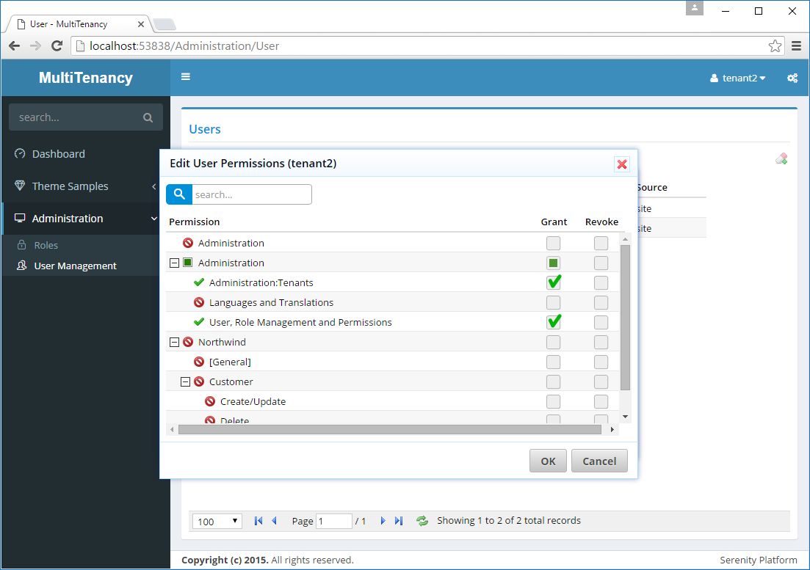

# Hiding the Tenant Administration Permission

We now have one little problem. User *tenant2* has permission *Administration:Security* so he can access user and role permission dialogs. Thus, he can grant himself *Administration:Tenants* permission using the permission UI.



Serenity scans your assemblies for attributes like *ReadPermission*, *WritePermission*, *PageAuthorize*, *ServiceAuthorize* etc. and lists these permissions in edit permissions dialog.

We should first remove it from this pre-populated list.

Find method, *ListPermissionKeys* in *UserPermissionRepository.cs*:

```
public ListResponse<string> ListPermissionKeys()
{
    return LocalCache.Get("Administration:PermissionKeys", TimeSpan.Zero, () =>
    {
        //...

        result.Remove(Administration.PermissionKeys.Tenants);
        result.Remove("*");
        result.Remove("?");
        
        //...
```

Now, this permission won't be listed in *Edit User Permissions* or *Edit Role Permissions* dialog.

But, still, he can grant this permission to himself, by some little hacking through *UserPermissionRepository.Update* or *RolePermissionRepository.Update* methods.

We should add some checks to prevent this:

```cs
public class UserPermissionRepository
{
    public ITypeSource TypeSource { get; }
    public UserPermissionRepository(IRequestContext context, ITypeSource typeSource)
            : base(context)
    {
        TypeSource = typeSource ?? throw new ArgumentNullException(nameof(typeSource));
    }
    
    public SaveResponse Update(IUnitOfWork uow, 
        UserPermissionUpdateRequest request)
    {
        //...
        var newList = new Dictionary<string, bool>(
            StringComparer.OrdinalIgnoreCase);
        foreach (var p in request.Permissions)
            newList[p.PermissionKey] = p.Grant ?? false;

        var allowedKeys = ListPermissionKeys(this.Cache.Memory, this.TypeSource);
        if (newList.Keys.Any(x => !allowedKeys.Contains(x)))
            throw new AccessViolationException();
        //...

```

```cs
//...
using Serenity.Abstractions;
//...

public class RolePermissionRepository
{
    public SaveResponse Update(IUnitOfWork uow, 
        RolePermissionUpdateRequest request)
    {
        //...
        var newList = new HashSet<string>(
            request.Permissions.ToList(),
            StringComparer.OrdinalIgnoreCase);

        var allowedKeys = UserPermissionRepository
            .ListPermissionKeys(this.Cache.Memory, this.TypeSource);
        if (newList.Any(x => !allowedKeys.Contains(x)))
            throw new AccessViolationException();
        //...
```

Here we check if any of the new permission keys that are tried to be granted, are not listed in permission dialog. If so, this is probably a hack attempt.

> Actually this check should be the default, even without multi-tenant systems, but usually we trust administrative users. Here, administrators will be only managing their own tenants, so we certainly need this check.

After add this new `ITypeSource` interface to the constructor, we need to update the endpoints as well for the inject `ITypeSource` to the related repositories.

*RolePermissionEndpoint.cs*

```cs
//...
using Serenity.Abstractions;
//...

[HttpPost, AuthorizeUpdate(typeof(MyRow))]
public SaveResponse Update(IUnitOfWork uow, RolePermissionUpdateRequest request,
    [FromServices] ITypeSource typeSource)
{
    return new MyRepository(Context, typeSource).Update(uow, request);
}

public RolePermissionListResponse List(IDbConnection connection, RolePermissionListRequest request,
    [FromServices] ITypeSource typeSource)
{
    return new MyRepository(Context, typeSource).List(connection, request);
}
```

*UserPermissionEndpoint.cs*

```cs
//...
using Serenity.Abstractions;
//...

[HttpPost, AuthorizeUpdate(typeof(MyRow))]
public SaveResponse Update(IUnitOfWork uow, UserPermissionUpdateRequest request,
    [FromServices] ITypeSource typeSource)
{
    return new MyRepository(Context, typeSource).Update(uow, request);
}

public ListResponse<MyRow> List(IDbConnection connection, UserPermissionListRequest request,
    [FromServices] ITypeSource typeSource)
{
    return new MyRepository(Context, typeSource).List(connection, request);
}

public ListResponse<string> ListRolePermissions(IDbConnection connection, UserPermissionListRequest request,
    [FromServices] ITypeSource typeSource)
{
    return new MyRepository(Context, typeSource).ListRolePermissions(connection, request);
}
```