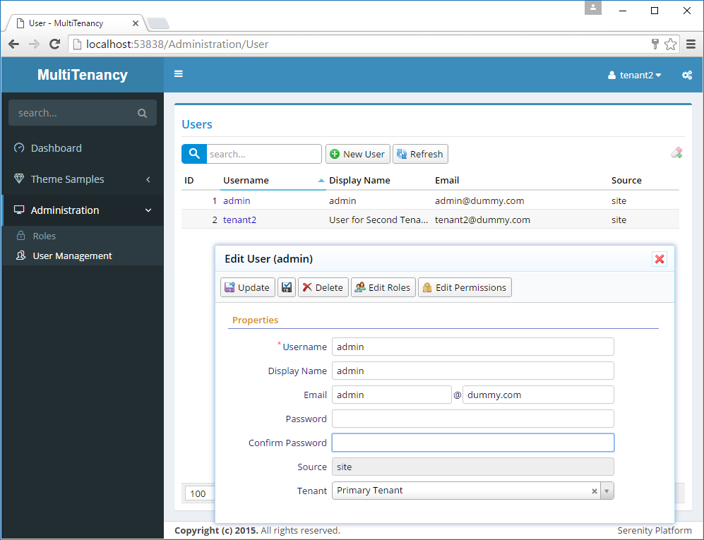
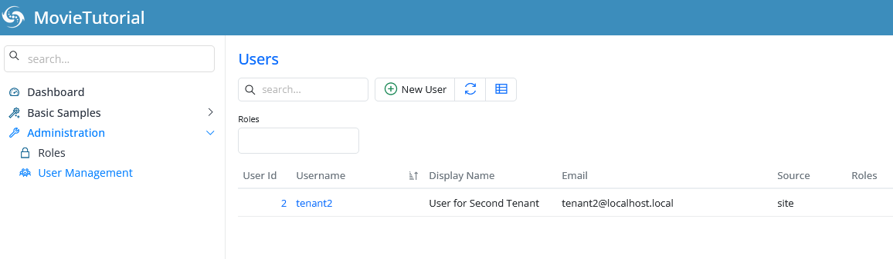

# Securing Tenant Selection

Now signout and login with user *tenant2*.

When you open *User Management* page, you'll see that user can see and edit *admin* user, in addition to his own *tenant2* user. He can even see and edit his tenant in user dialog.



This is not what we wanted.

Let's prevent him seeing users of other tenants.

## Loading TenantId to Cached UserDefinition

We first need to load and cache user tenant information in UserDefinition.

Open *UserDefinition.cs* under *Multitenancy.Web/ Modules/ Administration/ User/ Authentication* and add a *TenantId* property.

```cs
namespace MultiTenancy.Administration
{
    using Serenity;
    using System;

    [Serializable]
    public class UserDefinition : IUserDefinition
    {
        public string Id { get { return UserId.ToInvariant(); } }
        public string DisplayName { get; set; }
        public string Email { get; set; }
        public short IsActive { get; set; }
        public int UserId { get; set; }
        public string Username { get; set; }
        public string PasswordHash { get; set; }
        public string PasswordSalt { get; set; }
        public string Source { get; set; }
        public DateTime? UpdateDate { get; set; }
        public DateTime? LastDirectoryUpdate { get; set; }
        public int TenantId { get; set; }
    }
}
```

This is the class that is returned when you ask for current user through *Authorization.UserDefinition*.

We also need to modify the code wher this class is loaded. In the same folder, edit *UserRetrieveService.cs* and change *GetFirst* method like below:

```cs
private UserDefinition GetFirst(IDbConnection connection, BaseCriteria criteria)
{
    var user = connection.TrySingle<Entities.UserRow>(criteria);
    if (user != null)
        return new UserDefinition
        {
            UserId = user.UserId.Value,
            Username = user.Username,
            Email = user.Email,
            DisplayName = user.DisplayName,
            IsActive = user.IsActive.Value,
            Source = user.Source,
            PasswordHash = user.PasswordHash,
            PasswordSalt = user.PasswordSalt,
            UpdateDate = user.UpdateDate,
            LastDirectoryUpdate = user.LastDirectoryUpdate,
            TenantId = user.TenantId.Value
        };

    return null;
}

```

## Filtering Users By TenantId

Now, it's time to filter listed users by *TenantId*. Open *UserRepository.cs*, locate *MyListHandler* class and modify it like this:

```cs
private class MyListHandler : ListRequestHandler<MyRow>
{
    protected override void ApplyFilters(SqlQuery query)
    {
        base.ApplyFilters(query);

        var user = (UserDefinition)Authorization.UserDefinition;
        if (!Authorization.HasPermission(PermissionKeys.Tenants))
            query.Where(fld.TenantId == user.TenantId);
    }
}
```

Here, we first get a reference to cached user definition of currently logged user.

We check if he has tenant administration permission, which only *admin* will have in the end. If not, we filter listed records by *TenantId*.

## Resolving Tenant Lookup Problem

After you rebuild, and launch, now user page will be like this:



Yes, he can't see admin user anymore, but something is wrong. When you click *tenant2*, nothing will happen and you'll get an error *"Can't load script data: Lookup.Administration.Tenant*":

This error is not related to our recent filtering at repository level. It can't load this lookup script, because current user has no permission to *Tenants* table. But how did he see it last time? 
He could see it, because we first logged in as *admin* and when we open edit dialog for user, we loaded this lookup script. Browser cached it, so when we logged in with *tenant2* and open edit dialog, it loaded tenants from browser cache. 

But this time, as we rebuild project, browser tried to load it from server, and we got this error, as *tenant2* doesn't have this permission. It's ok, we don't want him to have this permission, but how to avoid this error?

We need to remove *Tenant* field from the user form. But we need that field for *admin* user, so we can't simply delete it from *UserForm.cs*. Thus, we need to do it conditionally.

Transform all T4 files, then open *UserDialog.cs* and override *GetPropertyItems* method like below:

```cs
namespace MultiTenancy.Administration
{
    using jQueryApi;
    using Serenity;
    using System.Collections.Generic;
    using System.Linq;

    //...
    public class UserDialog : EntityDialog<UserRow>
    {
        //...
        protected override List<PropertyItem> GetPropertyItems()
        {
            var items = base.GetPropertyItems();

            if (!Authorization.HasPermission("Administration:Tenants"))
                items = items.Where(x => x.Name != UserRow.Fields.TenantId).ToList();

            return items;
        }
    }
}
```

*GetPropertyItems* is the method, dialog gets its list of form fields, from server side form definition. Here fields are read from *UserForm* we defined server side.

If user doesn't have tenant administration permission, we remove the *TenantId* field from form definition at client side.

This doesn't modify the actual form definition, it just removes *TenantId* field for this dialog instance.

Now it is possible to edit tenant2 user by himself.

## Securing the Tenant Selection Server Side

When you log in with *tenant2* user and open its edit form, *Tenant* selection dropdown is not displayed, so he can't change his *tenant* right? 

Wrong!

If he is an ordinary user, he can't. But if he has some knowledge of how Serenity and its services work, he could.

When you are working with web, you got to take security much more seriously. 

It's very easy to create security holes in web applications unless you handle validations both at client side and server side.

Let's demonstrate it. Open Chrome console, while logged in with user *tenant2*.

Copy and paste this into console:

```js
Q.serviceCall({ 
    service: 'Administration/User/Update', 
    request: { 
        EntityId: 2, 
        Entity: { 
            UserId: 2, 
            TenantId: 1 
        }
    }
});
```

Now refresh the user management page, you'll see that *tenant2* can see admin user now!

We called *User Update* service with javascript, and changed *tenant2* user *TenaNntId* to *1 (Primary Tenant)*.

Let's revert it back to *Second Tenant (2)* first, then we'll fix this security hole:

```js
Q.serviceCall({ 
    service: 'Administration/User/Update', 
    request: { 
        EntityId: 2, 
        Entity: { 
            UserId: 2, 
            TenantId: 2 
        }
    }
});
```

Open *UserRepository.cs*, locate *MySaveHandler* class and modify its *GetEditableFields* method like this:


```cs
protected override void GetEditableFields(HashSet<Field> editable)
{
    base.GetEditableFields(editable);

    if (!Authorization.HasPermission(Administration.PermissionKeys.Security))
    {
        editable.Remove(fld.Source);
        editable.Remove(fld.IsActive);
    }

    if (!Authorization.HasPermission(Administration.PermissionKeys.Tenants))
    {
        editable.Remove(fld.TenantId);
    }
}
```

Build your project, then try typing this into console again:

```js
Q.serviceCall({ 
    service: 'Administration/User/Update', 
    request: { 
        EntityId: 2, 
        Entity: { 
            UserId: 2, 
            TenantId: 1 
        }
    }
});
```

You will now get this error:

```
Tenant field is read only!
```

*GetEditableField* is a method that SaveRequestHandler calls to determine which fields are editable, thus updatable by user. By default, these fields are determined by looking at *Updatable* and *Insertable* attributes of row properties. 

> Unless otherwise specified, all fields are insertable and updatable.

If user doesn't have tenant administration permission, we remove *TenantId* from the list of auto-determined editable fields.

## Letting Tenant2 User Create a New User in His Tenant

While logged in with Tenant2, try to create a new user, *User2*.

You won't get any error but by suprise, you won't see the newly created user in list. What happened to User2?

As we set, default value for *TenantId* to *1* in migrations, now *User2* has *1* as *TenantId* and is a member of *Primary Tenant*.

We have to set new users *TenantId* to same value with logged in user.

Modify *SetInternalFields* method of *UserRepository* like below:

```cs
protected override void SetInternalFields()
{
    base.SetInternalFields();

    if (IsCreate)
    {
        Row.Source = "site";
        Row.IsActive = Row.IsActive ?? 1;
        if (!Authorization.HasPermission(Administration.PermissionKeys.Tenants) ||
            Row.TenantId == null)
        {
            Row.TenantId = ((UserDefinition)Authorization.UserDefinition)
                .TenantId;
        }
    }

    if (IsCreate || !Row.Password.IsEmptyOrNull())
    {
        string salt = null;
        Row.PasswordHash = GenerateHash(password, ref salt);
        Row.PasswordSalt = salt;
    }
}
```

Here, we set *TenantId* to the same value with current user, unless he has tenant administration permission.

Now try to create a new user *User2b* and this time you'll see him on the list.

