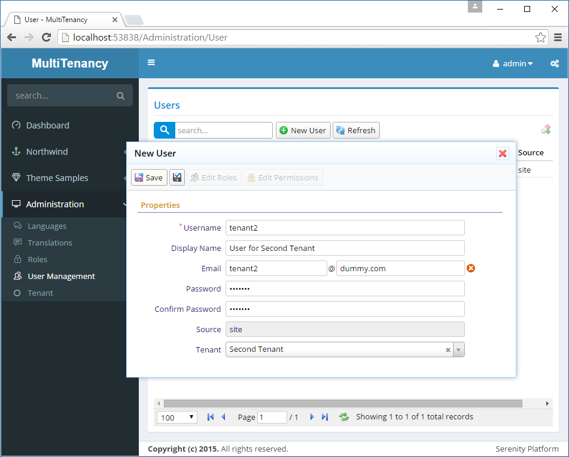
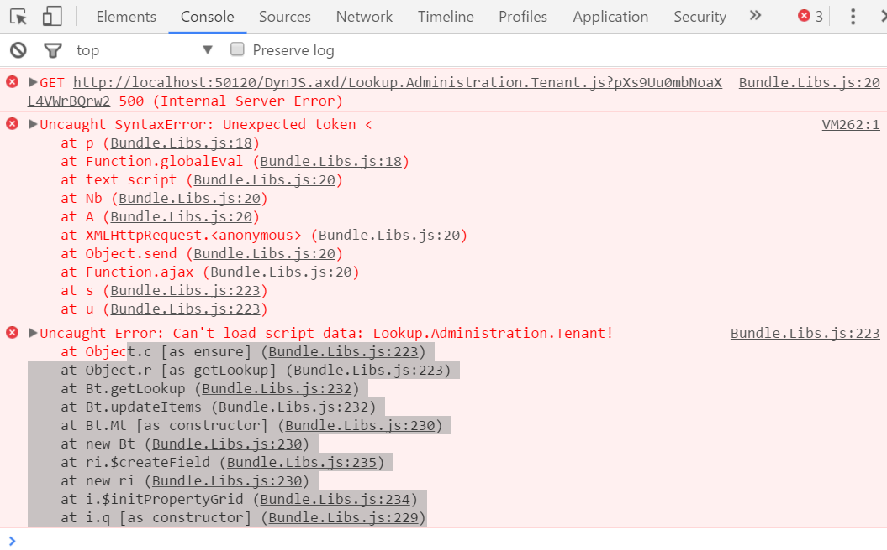

# Tenant Selection in User Dialog

We added a *TenantId* field to *Users* table, but it's not defined in UserRow, and not visible in user dialog.

This field, should only be seen and edited by *admin* user. Other users, even if we give them access to users page to manage their tenant users, shouldn't be able to see or change this information.

Let's first add it to *UserRow.cs*:

```cs
namespace MultiTenancy.Administration.Entities
{
    //...
    public sealed class UserRow : LoggingRow, IIdRow, INameRow
    {
        //...
        [DisplayName("Last Directory Update"), Insertable(false), Updatable(false)]
        public DateTime? LastDirectoryUpdate
        {
            get { return Fields.LastDirectoryUpdate[this]; }
            set { Fields.LastDirectoryUpdate[this] = value; }
        }

        [DisplayName("Tenant"), ForeignKey("Tenants", "TenantId"), LeftJoin("tnt")]
        [LookupEditor(typeof(TenantRow))]
        public Int32? TenantId
        {
            get { return Fields.TenantId[this]; }
            set { Fields.TenantId[this] = value; }
        }

        [DisplayName("Tenant"), Expression("tnt.TenantName")]
        public String TenantName
        {
            get { return Fields.TenantName[this]; }
            set { Fields.TenantName[this] = value; }
        }

        //...
        public class RowFields : LoggingRowFields
        {
            //...
            public readonly DateTimeField LastDirectoryUpdate;
            public readonly Int32Field TenantId;
            public readonly StringField TenantName;
            //...
        }
    }
}

```

To edit it, we need to add it to *UserForm.cs*:

```cs
namespace MultiTenancy.Administration.Forms
{
    using Serenity;
    using Serenity.ComponentModel;
    using System;
    using System.ComponentModel;

    [FormScript("Administration.User")]
    [BasedOnRow(typeof(Entities.UserRow))]
    public class UserForm
    {
        public String Username { get; set; }
        public String DisplayName { get; set; }
        [EmailEditor]
        public String Email { get; set; }
        [PasswordEditor]
        public String Password { get; set; }
        [PasswordEditor, OneWay]
        public String PasswordConfirm { get; set; }
        [OneWay]
        public string Source { get; set; }
        public Int32? TenantId { get; set; }
    }
}
```

Need to also increase size of user dialog a bit, in *site.administration.less* to make space for tenant selection:

```less
.s-Administration-UserDialog {
    > .size { width: 650px; }
    .caption { width: 150px; }
    .s-PropertyGrid .categories { height: 470px; }
}
```

Now open *User Management* page and create a user *tenant2* that belongs to *Second Tenant*.



After creating this user, edit its permissions and grant him *User, Role Management and Permissions* permission as this will be our administrative user for *Second Tenant*.

## Logging In With Tenant2

Signout and login with user *tenant2*.

When you open *User Management* page, there may be two different cases you may experience.

In first case, *tenant2* might be able to open user dialog and change his and any users tenant. This happens if your browser cached the *tenant* lookup.

In the second case, you'll see that *tenant2* can't open User dialog. When you click a user nothing happens.

If you check browser console (whenever such a thing occurs, you should first check browser console for errors), you'll see an error like this:



This is because, our TenantRow has _Administration:Tenants_ read permission which is inherited by lookup script. 

We could change read permission for tenant lookup script to something else to resolve this error, but in that case _Tenant2_ would be able to see and change tenant of himself and any other user including _admin_.

This is not what we wanted.

Let's first prevent him seeing users of other tenants.
